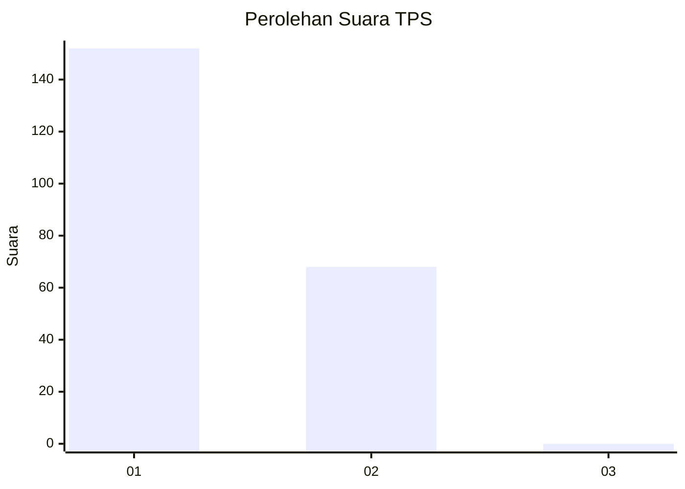
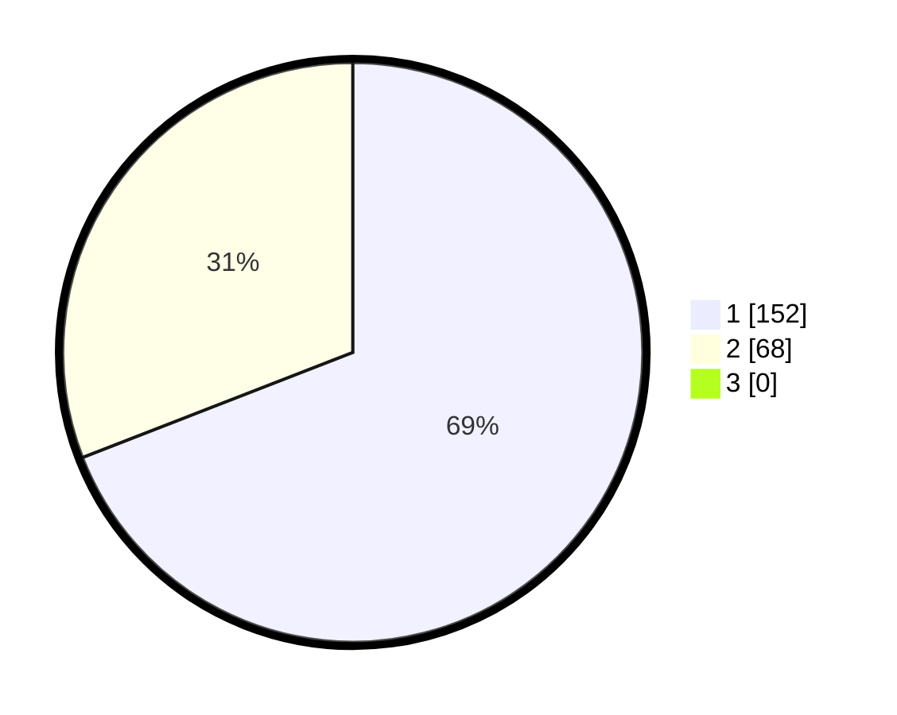

# Hasil

## Grafik

## Tabel

| No. | Nama Paslon    | Suara | Suara (raw) | Persentase |
|:--- |:-------------- | -----:| -----------:| ----------:|
| 1   | ANIES MUHAIMIN | 152   | [152][p-1]  | 69,09      |
| 2   | PRABOWO GIBRAN | 68    | [68][p-2]   | 30,91      |
| 3   | GANJAR MAHFUD  | 0     | [0][p-3]    | 0,00       |

[p-1]: https://github.com/gigit-pemilu/pemilu-2024-12-sumatera-utara/blob/main/pilpres/hitung-suara/sub/12-sumatera-utara/sub/13-mandailing-natal/sub/01-panyabungan/sub/1022-pasar-hilir/sub/002-tps/sub/paslon-1.txt
[p-2]: https://github.com/gigit-pemilu/pemilu-2024-12-sumatera-utara/blob/main/pilpres/hitung-suara/sub/12-sumatera-utara/sub/13-mandailing-natal/sub/01-panyabungan/sub/1022-pasar-hilir/sub/002-tps/sub/paslon-2.txt
[p-3]: https://github.com/gigit-pemilu/pemilu-2024-12-sumatera-utara/blob/main/pilpres/hitung-suara/sub/12-sumatera-utara/sub/13-mandailing-natal/sub/01-panyabungan/sub/1022-pasar-hilir/sub/002-tps/sub/paslon-3.txt

## Foto C Plano

https://sirekap-obj-formc.kpu.go.id/3ad7/pemilu/ppwp/12/13/01/10/22/1213011022002-20240217-152832--918e5f2a-915b-421a-953a-d472498cb3e5.jpg

https://sirekap-obj-formc.kpu.go.id/3ad7/pemilu/ppwp/12/13/01/10/22/1213011022002-20240217-155044--91afeba3-32d5-40bf-b646-d3191863e9e3.jpg

https://sirekap-obj-formc.kpu.go.id/3ad7/pemilu/ppwp/12/13/01/10/22/1213011022002-20240217-155247--179fd056-f1ed-49ea-894b-f531b7881d0b.jpg

## Metadata

| Key        | Value               |
| ---------- | ------------------- |
| Time Stamp | 2024-02-25 15:00:00 |

