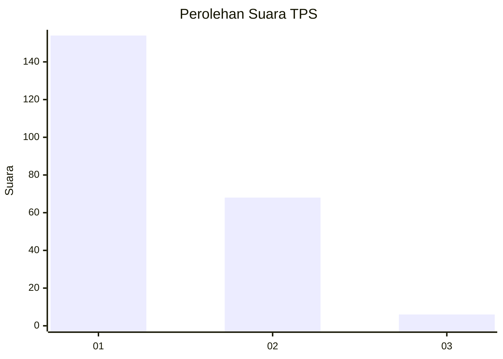
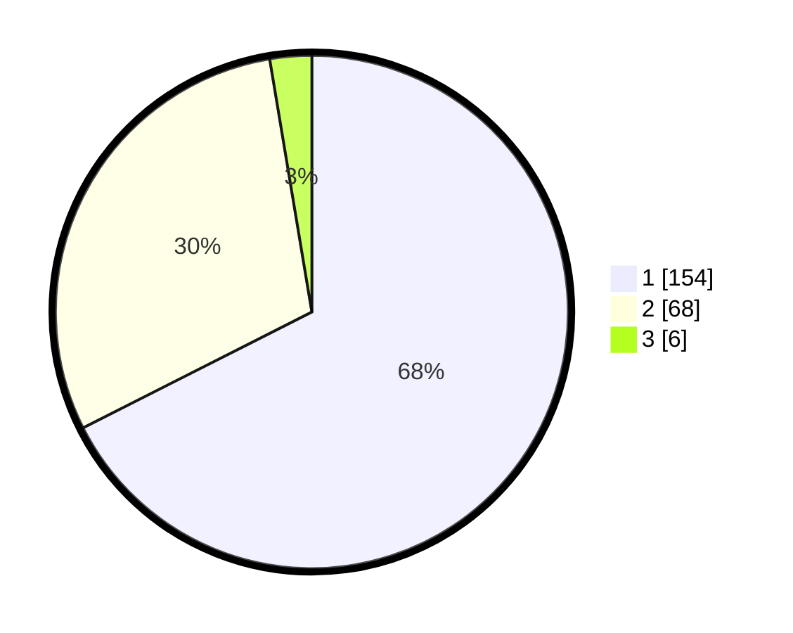

# Hasil

## Grafik

## Tabel

| No. | Nama Paslon    | Suara | Suara (raw) | Persentase |
|:--- |:-------------- | -----:| -----------:| ----------:|
| 1   | ANIES MUHAIMIN | 154   | [154][p-1]  | 67,54      |
| 2   | PRABOWO GIBRAN | 68    | [68][p-2]   | 29,82      |
| 3   | GANJAR MAHFUD  | 6     | [6][p-3]    | 2,63       |

[p-1]: https://github.com/gigit-pemilu/pemilu-2024/blob/main/pilpres/hitung-suara/sub/12-sumatera-utara/sub/13-mandailing-natal/sub/01-panyabungan/sub/1022-pasar-hilir/sub/003-tps/sub/paslon-1.txt
[p-2]: https://github.com/gigit-pemilu/pemilu-2024/blob/main/pilpres/hitung-suara/sub/12-sumatera-utara/sub/13-mandailing-natal/sub/01-panyabungan/sub/1022-pasar-hilir/sub/003-tps/sub/paslon-2.txt
[p-3]: https://github.com/gigit-pemilu/pemilu-2024/blob/main/pilpres/hitung-suara/sub/12-sumatera-utara/sub/13-mandailing-natal/sub/01-panyabungan/sub/1022-pasar-hilir/sub/003-tps/sub/paslon-3.txt

## Foto C Plano

https://sirekap-obj-formc.kpu.go.id/b000/pemilu/ppwp/12/13/01/10/22/1213011022003-20240218-130524--6ef644b8-a30f-4664-9ed2-094e10d25681.jpg

https://sirekap-obj-formc.kpu.go.id/b000/pemilu/ppwp/12/13/01/10/22/1213011022003-20240217-144502--4a6c345d-cb70-4779-9026-696b718f080f.jpg

https://sirekap-obj-formc.kpu.go.id/b000/pemilu/ppwp/12/13/01/10/22/1213011022003-20240217-144605--28a49ed5-9edb-48a5-808c-0d3ba85bb1bf.jpg

## Metadata

| Key        | Value               |
| ---------- | ------------------- |
| Time Stamp | 2024-02-19 06:16:00 |

