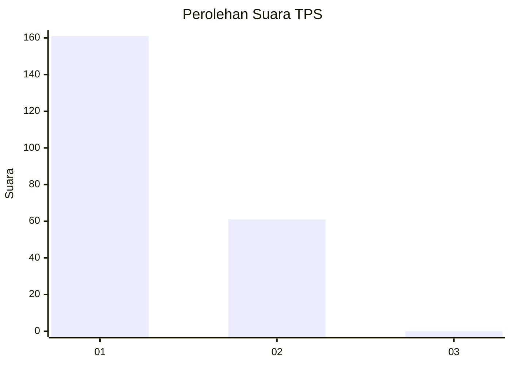
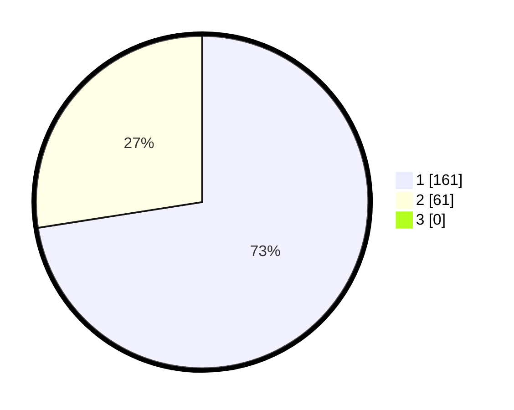

# Hasil

## Grafik

## Tabel

| No. | Nama Paslon    | Suara | Suara (raw) | Persentase |
|:--- |:-------------- | -----:| -----------:| ----------:|
| 1   | ANIES MUHAIMIN | 161   | [161][p-1]  | 72,52      |
| 2   | PRABOWO GIBRAN | 61    | [61][p-2]   | 27,48      |
| 3   | GANJAR MAHFUD  | 0     | [0][p-3]    | 0,00       |

[p-1]: https://github.com/gigit-pemilu/pemilu-2024/blob/main/pilpres/hitung-suara/sub/12-sumatera-utara/sub/13-mandailing-natal/sub/01-panyabungan/sub/1023-pidoli-dolok/sub/002-tps/sub/paslon-1.txt
[p-2]: https://github.com/gigit-pemilu/pemilu-2024/blob/main/pilpres/hitung-suara/sub/12-sumatera-utara/sub/13-mandailing-natal/sub/01-panyabungan/sub/1023-pidoli-dolok/sub/002-tps/sub/paslon-2.txt
[p-3]: https://github.com/gigit-pemilu/pemilu-2024/blob/main/pilpres/hitung-suara/sub/12-sumatera-utara/sub/13-mandailing-natal/sub/01-panyabungan/sub/1023-pidoli-dolok/sub/002-tps/sub/paslon-3.txt

## Foto C Plano

https://sirekap-obj-formc.kpu.go.id/91f6/pemilu/ppwp/12/13/01/10/23/1213011023002-20240223-223825--4751e0ae-177c-4ab0-bd6d-d61d08db055c.jpg

https://sirekap-obj-formc.kpu.go.id/91f6/pemilu/ppwp/12/13/01/10/23/1213011023002-20240223-223924--e113883d-f60b-473f-bde1-cf948fc1d1f8.jpg

https://sirekap-obj-formc.kpu.go.id/91f6/pemilu/ppwp/12/13/01/10/23/1213011023002-20240223-224028--2ba1ec67-d4d5-4cb5-a6b0-ee6d7f81831b.jpg

## Metadata

| Key        | Value               |
| ---------- | ------------------- |
| Time Stamp | 2024-02-25 13:00:00 |

