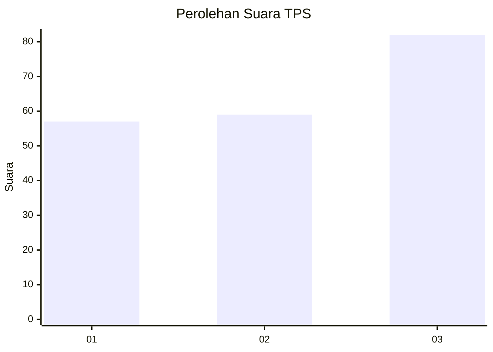
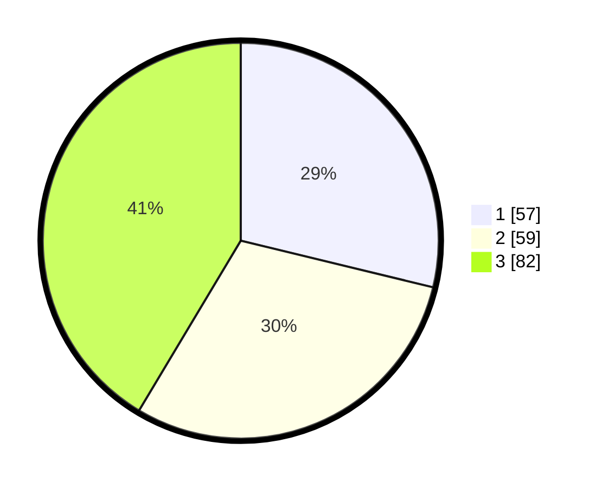

# Hasil

## Grafik

## Tabel

| No. | Nama Paslon    | Suara | Suara (raw) | Persentase |
|:--- |:-------------- | -----:| -----------:| ----------:|
| 1   | ANIES MUHAIMIN | 57    | [57][p-1]   | 28,79      |
| 2   | PRABOWO GIBRAN | 59    | [59][p-2]   | 29,80      |
| 3   | GANJAR MAHFUD  | 82    | [82][p-3]   | 41,41      |

[p-1]: https://github.com/gigit-pemilu/pemilu-2024-12-sumatera-utara/blob/main/pilpres/hitung-suara/sub/12-sumatera-utara/sub/13-mandailing-natal/sub/01-panyabungan/sub/1023-pidoli-dolok/sub/003-tps/sub/paslon-1.txt
[p-2]: https://github.com/gigit-pemilu/pemilu-2024-12-sumatera-utara/blob/main/pilpres/hitung-suara/sub/12-sumatera-utara/sub/13-mandailing-natal/sub/01-panyabungan/sub/1023-pidoli-dolok/sub/003-tps/sub/paslon-2.txt
[p-3]: https://github.com/gigit-pemilu/pemilu-2024-12-sumatera-utara/blob/main/pilpres/hitung-suara/sub/12-sumatera-utara/sub/13-mandailing-natal/sub/01-panyabungan/sub/1023-pidoli-dolok/sub/003-tps/sub/paslon-3.txt

## Foto C Plano

https://sirekap-obj-formc.kpu.go.id/9473/pemilu/ppwp/12/13/01/10/23/1213011023003-20240223-163822--356637eb-f7a4-4938-a34a-0c9891cc20c7.jpg

https://sirekap-obj-formc.kpu.go.id/9473/pemilu/ppwp/12/13/01/10/23/1213011023003-20240223-164243--51a171e6-1146-4bc2-92f4-3b9a6ca7c966.jpg

https://sirekap-obj-formc.kpu.go.id/9473/pemilu/ppwp/12/13/01/10/23/1213011023003-20240223-164057--063a8515-b7c7-4e0f-9add-71fa2cd12e40.jpg

## Metadata

| Key        | Value               |
| ---------- | ------------------- |
| Time Stamp | 2024-02-24 22:31:28 |

## DATA PEMILIH TETAP

Jumlah pemilih dalam DPT: **284**.
 * L: **436**.
 * P: **440**.

## DATA PENGGUNA HAK PILIH

Jumlah pengguna hak pilih dalam DPT: **218**.
 * L: **899**.
 * P: **532**.

Jumlah pengguna hak pilih dalam DPTb: **805**.
 * L: **3**.
 * P: **2**.

Jumlah pengguna hak pilih dalam DPK: **202**.
 * L: **222**.
 * P: **822**.

Jumlah pengguna hak pilih: **225**.
 * L: **3**.
 * P: **426**.

## JUMLAH SUARA SAH DAN TIDAK SAH

JUMLAH SELURUH SUARA SAH: **268**.

JUMLAH SUARA TIDAK SAH: **6**.

JUMLAH SELURUH SUARA SAH DAN SUARA TIDAK SAH: **225**.

