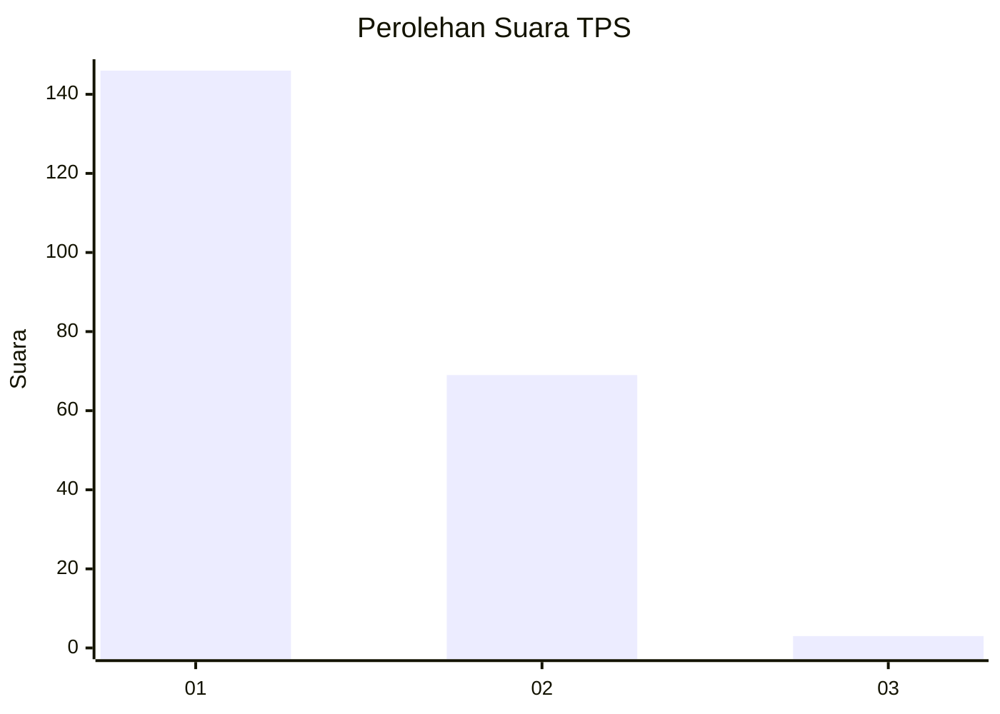
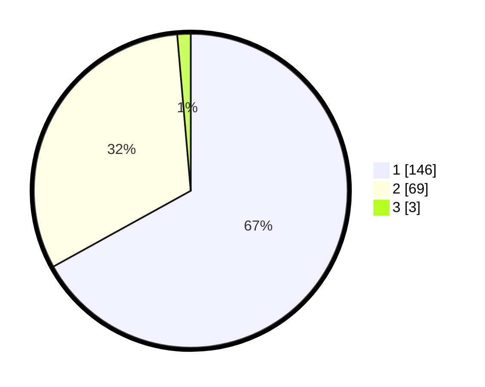

# Hasil

## Grafik

## Tabel

| No. | Nama Paslon    | Suara | Suara (raw) | Persentase |
|:--- |:-------------- | -----:| -----------:| ----------:|
| 1   | ANIES MUHAIMIN | 146   | [146][p-1]  | 66,97      |
| 2   | PRABOWO GIBRAN | 69    | [69][p-2]   | 31,65      |
| 3   | GANJAR MAHFUD  | 3     | [3][p-3]    | 1,38       |

[p-1]: https://github.com/gigit-pemilu/pemilu-2024/blob/main/pilpres/hitung-suara/sub/12-sumatera-utara/sub/13-mandailing-natal/sub/01-panyabungan/sub/1023-pidoli-dolok/sub/004-tps/sub/paslon-1.txt
[p-2]: https://github.com/gigit-pemilu/pemilu-2024/blob/main/pilpres/hitung-suara/sub/12-sumatera-utara/sub/13-mandailing-natal/sub/01-panyabungan/sub/1023-pidoli-dolok/sub/004-tps/sub/paslon-2.txt
[p-3]: https://github.com/gigit-pemilu/pemilu-2024/blob/main/pilpres/hitung-suara/sub/12-sumatera-utara/sub/13-mandailing-natal/sub/01-panyabungan/sub/1023-pidoli-dolok/sub/004-tps/sub/paslon-3.txt

## Foto C Plano

https://sirekap-obj-formc.kpu.go.id/c41e/pemilu/ppwp/12/13/01/10/23/1213011023004-20240223-171630--30825625-1859-4d9b-a4fc-5be2169ffe18.jpg

https://sirekap-obj-formc.kpu.go.id/c41e/pemilu/ppwp/12/13/01/10/23/1213011023004-20240214-231655--d580536d-7a12-4f62-a75f-1bf534e32b8d.jpg

https://sirekap-obj-formc.kpu.go.id/c41e/pemilu/ppwp/12/13/01/10/23/1213011023004-20240214-231926--a6e6bea4-09b5-4d3a-94a9-bea39b5f1869.jpg

## Metadata

| Key        | Value               |
| ---------- | ------------------- |
| Time Stamp | 2024-02-24 22:31:28 |

