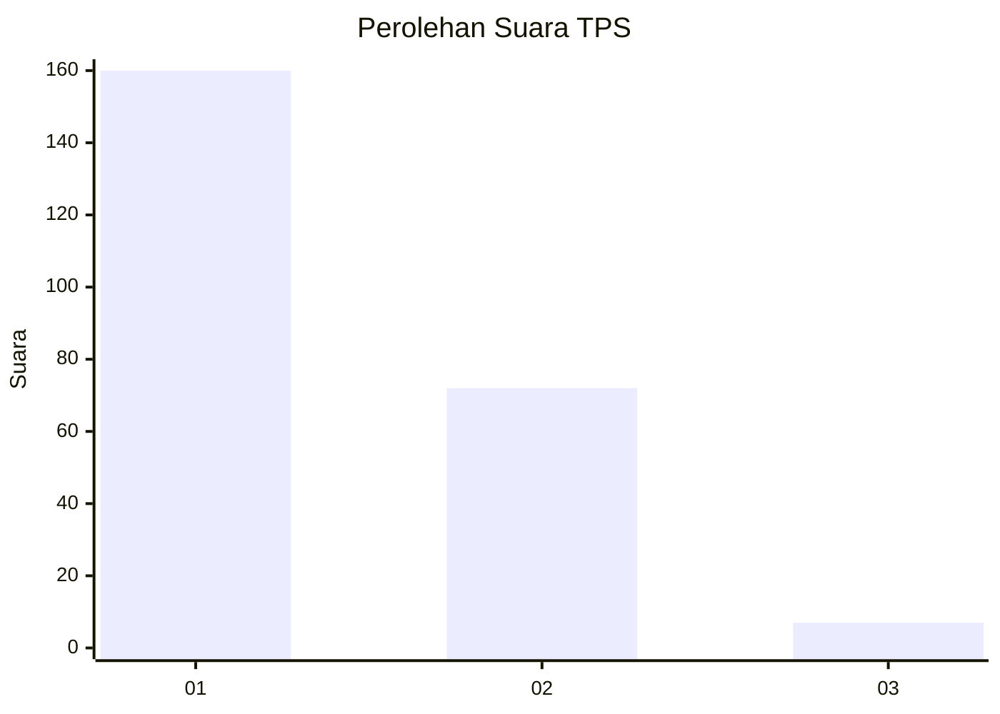
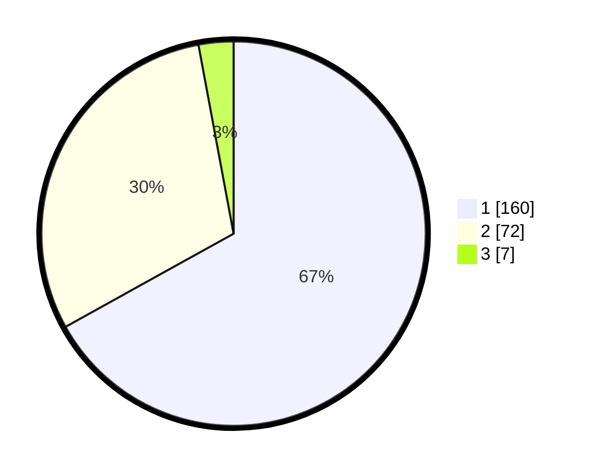

# Hasil

## Grafik

## Tabel

| No. | Nama Paslon    | Suara | Suara (raw) | Persentase |
|:--- |:-------------- | -----:| -----------:| ----------:|
| 1   | ANIES MUHAIMIN | 160   | [160][p-1]  | 66,95      |
| 2   | PRABOWO GIBRAN | 72    | [72][p-2]   | 30,13      |
| 3   | GANJAR MAHFUD  | 7     | [7][p-3]    | 2,93       |

[p-1]: https://github.com/gigit-pemilu/pemilu-2024-12-sumatera-utara/blob/main/pilpres/hitung-suara/sub/12-sumatera-utara/sub/13-mandailing-natal/sub/01-panyabungan/sub/1031-panyabungan-ii/sub/001-tps/sub/paslon-1.txt
[p-2]: https://github.com/gigit-pemilu/pemilu-2024-12-sumatera-utara/blob/main/pilpres/hitung-suara/sub/12-sumatera-utara/sub/13-mandailing-natal/sub/01-panyabungan/sub/1031-panyabungan-ii/sub/001-tps/sub/paslon-2.txt
[p-3]: https://github.com/gigit-pemilu/pemilu-2024-12-sumatera-utara/blob/main/pilpres/hitung-suara/sub/12-sumatera-utara/sub/13-mandailing-natal/sub/01-panyabungan/sub/1031-panyabungan-ii/sub/001-tps/sub/paslon-3.txt

## Foto C Plano

https://sirekap-obj-formc.kpu.go.id/f5b2/pemilu/ppwp/12/13/01/10/31/1213011031001-20240215-100428--853b0e84-918e-48c5-8e83-9a481428b6ca.jpg

https://sirekap-obj-formc.kpu.go.id/f5b2/pemilu/ppwp/12/13/01/10/31/1213011031001-20240215-072536--bf76d470-155b-4a37-9108-9c264e798ba4.jpg

https://sirekap-obj-formc.kpu.go.id/f5b2/pemilu/ppwp/12/13/01/10/31/1213011031001-20240215-100558--a751b40a-9fcb-4ff0-90e2-d2f432a88705.jpg

## Metadata

| Key        | Value               |
| ---------- | ------------------- |
| Time Stamp | 2024-02-16 00:30:27 |

