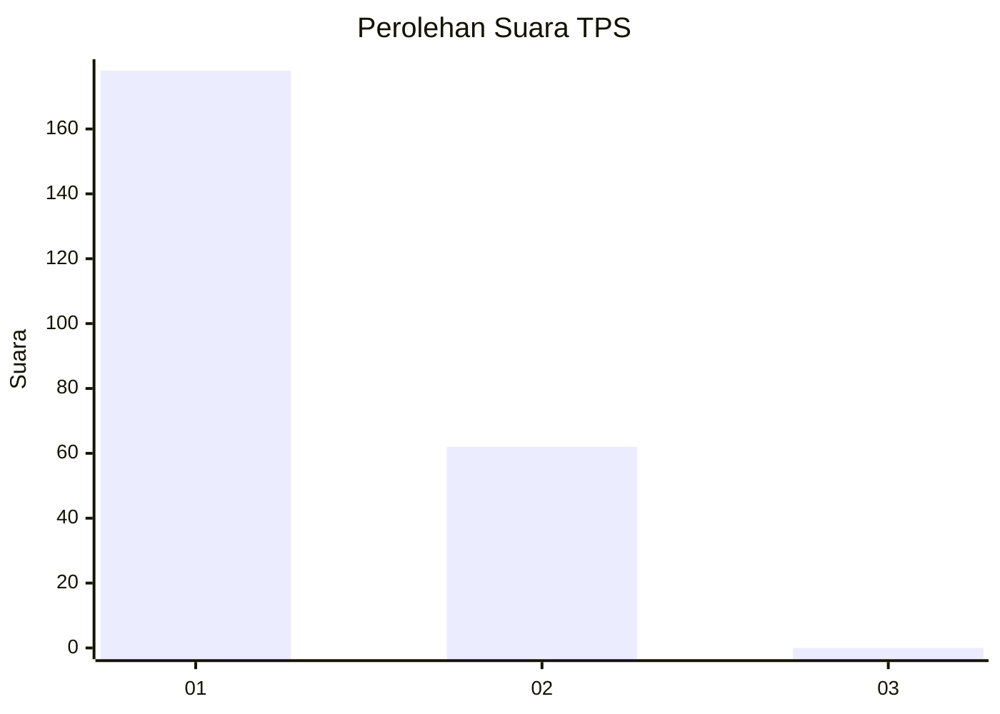
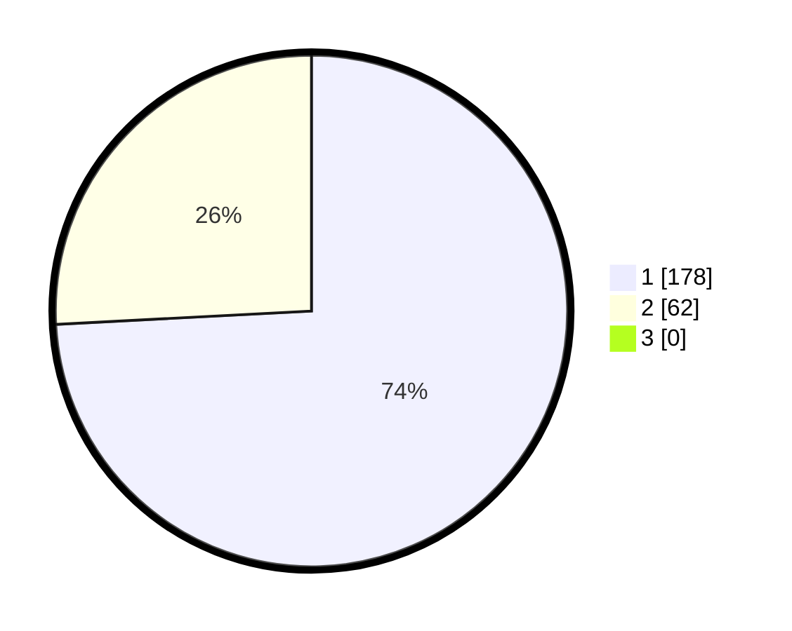

# Hasil

## Grafik

## Tabel

| No. | Nama Paslon    | Suara | Suara (raw) | Persentase |
|:--- |:-------------- | -----:| -----------:| ----------:|
| 1   | ANIES MUHAIMIN | 178   | [178][p-1]  | 74,17      |
| 2   | PRABOWO GIBRAN | 62    | [62][p-2]   | 25,83      |
| 3   | GANJAR MAHFUD  | 0     | [0][p-3]    | 0,00       |

[p-1]: https://github.com/gigit-pemilu/pemilu-2024/blob/main/pilpres/hitung-suara/sub/12-sumatera-utara/sub/13-mandailing-natal/sub/01-panyabungan/sub/1031-panyabungan-ii/sub/002-tps/sub/paslon-1.txt
[p-2]: https://github.com/gigit-pemilu/pemilu-2024/blob/main/pilpres/hitung-suara/sub/12-sumatera-utara/sub/13-mandailing-natal/sub/01-panyabungan/sub/1031-panyabungan-ii/sub/002-tps/sub/paslon-2.txt
[p-3]: https://github.com/gigit-pemilu/pemilu-2024/blob/main/pilpres/hitung-suara/sub/12-sumatera-utara/sub/13-mandailing-natal/sub/01-panyabungan/sub/1031-panyabungan-ii/sub/002-tps/sub/paslon-3.txt

## Foto C Plano

https://sirekap-obj-formc.kpu.go.id/6109/pemilu/ppwp/12/13/01/10/31/1213011031002-20240224-220117--d370bae3-3cd5-46de-89ab-3789e3e63850.jpg

https://sirekap-obj-formc.kpu.go.id/6109/pemilu/ppwp/12/13/01/10/31/1213011031002-20240224-215305--58af0a15-2066-46ad-9445-a997371c7d3e.jpg

https://sirekap-obj-formc.kpu.go.id/6109/pemilu/ppwp/12/13/01/10/31/1213011031002-20240224-215604--4948a7a0-6a54-4dde-a0c4-ce937bb66420.jpg

## Metadata

| Key        | Value               |
| ---------- | ------------------- |
| Time Stamp | 2024-02-28 19:00:00 |

