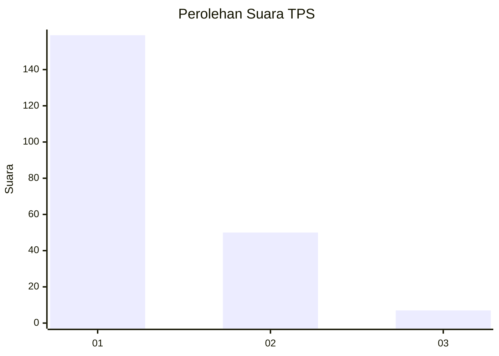
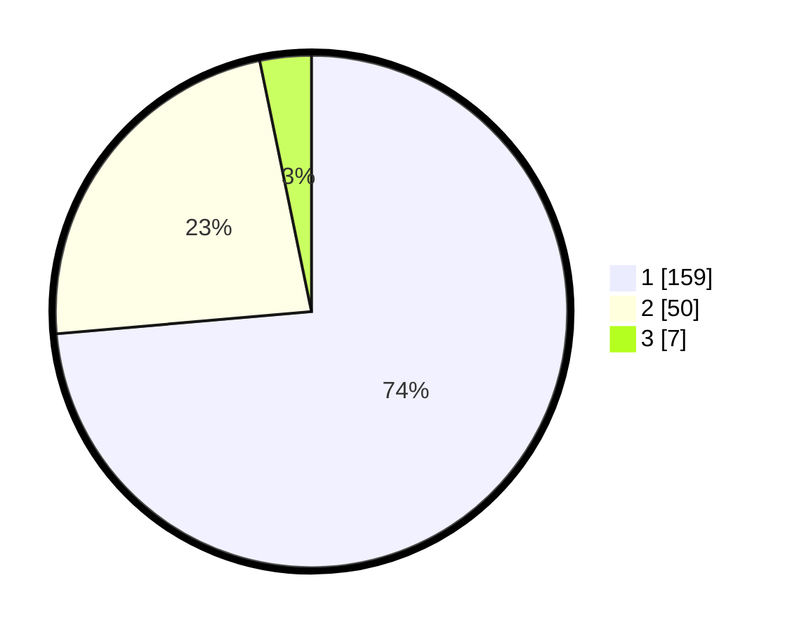

# Hasil

## Grafik

## Tabel

| No. | Nama Paslon    | Suara | Suara (raw) | Persentase |
|:--- |:-------------- | -----:| -----------:| ----------:|
| 1   | ANIES MUHAIMIN | 159   | [159][p-1]  | 73,61      |
| 2   | PRABOWO GIBRAN | 50    | [50][p-2]   | 23,15      |
| 3   | GANJAR MAHFUD  | 7     | [7][p-3]    | 3,24       |

[p-1]: https://github.com/gigit-pemilu/pemilu-2024-12-sumatera-utara/blob/main/pilpres/hitung-suara/sub/12-sumatera-utara/sub/13-mandailing-natal/sub/01-panyabungan/sub/1031-panyabungan-ii/sub/008-tps/sub/paslon-1.txt
[p-2]: https://github.com/gigit-pemilu/pemilu-2024-12-sumatera-utara/blob/main/pilpres/hitung-suara/sub/12-sumatera-utara/sub/13-mandailing-natal/sub/01-panyabungan/sub/1031-panyabungan-ii/sub/008-tps/sub/paslon-2.txt
[p-3]: https://github.com/gigit-pemilu/pemilu-2024-12-sumatera-utara/blob/main/pilpres/hitung-suara/sub/12-sumatera-utara/sub/13-mandailing-natal/sub/01-panyabungan/sub/1031-panyabungan-ii/sub/008-tps/sub/paslon-3.txt

## Foto C Plano

https://sirekap-obj-formc.kpu.go.id/7b09/pemilu/ppwp/12/13/01/10/31/1213011031008-20240215-105015--fd368a41-b5b4-4462-a0cc-1a338c45dcaa.jpg

https://sirekap-obj-formc.kpu.go.id/7b09/pemilu/ppwp/12/13/01/10/31/1213011031008-20240215-105113--3d8a4b95-c3c0-4f45-a8b0-07d47871b33b.jpg

https://sirekap-obj-formc.kpu.go.id/7b09/pemilu/ppwp/12/13/01/10/31/1213011031008-20240215-105211--8c19df73-aea5-4936-be03-dc69115f25fb.jpg

## Metadata

| Key        | Value               |
| ---------- | ------------------- |
| Time Stamp | 2024-02-16 00:30:27 |

