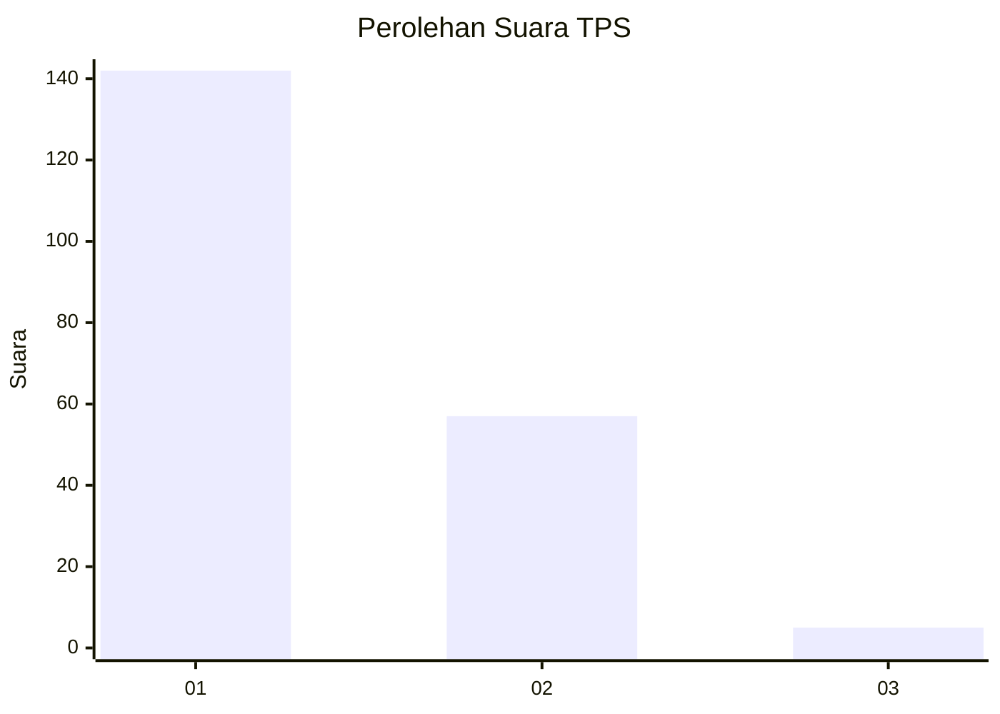
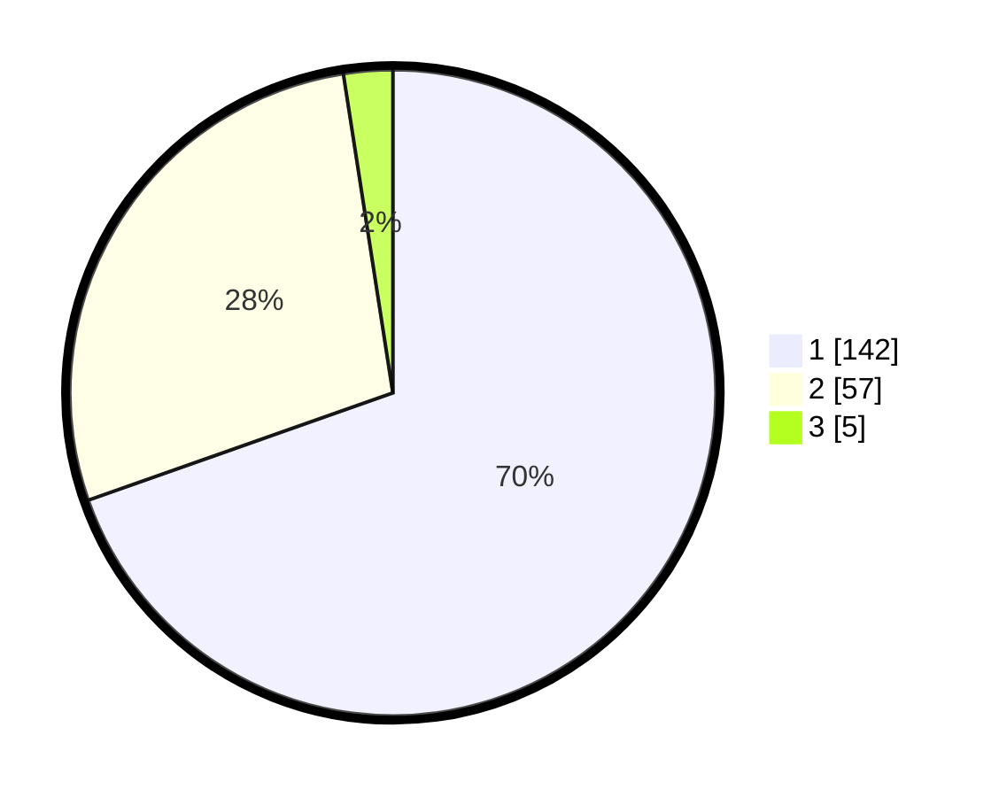

# Hasil

## Grafik

## Tabel

| No. | Nama Paslon    | Suara | Suara (raw) | Persentase |
|:--- |:-------------- | -----:| -----------:| ----------:|
| 1   | ANIES MUHAIMIN | 142   | [142][p-1]  | 69,61      |
| 2   | PRABOWO GIBRAN | 57    | [57][p-2]   | 27,94      |
| 3   | GANJAR MAHFUD  | 5     | [5][p-3]    | 2,45       |

[p-1]: https://github.com/gigit-pemilu/pemilu-2024/blob/main/pilpres/hitung-suara/sub/12-sumatera-utara/sub/13-mandailing-natal/sub/01-panyabungan/sub/1031-panyabungan-ii/sub/011-tps/sub/paslon-1.txt
[p-2]: https://github.com/gigit-pemilu/pemilu-2024/blob/main/pilpres/hitung-suara/sub/12-sumatera-utara/sub/13-mandailing-natal/sub/01-panyabungan/sub/1031-panyabungan-ii/sub/011-tps/sub/paslon-2.txt
[p-3]: https://github.com/gigit-pemilu/pemilu-2024/blob/main/pilpres/hitung-suara/sub/12-sumatera-utara/sub/13-mandailing-natal/sub/01-panyabungan/sub/1031-panyabungan-ii/sub/011-tps/sub/paslon-3.txt

## Foto C Plano

https://sirekap-obj-formc.kpu.go.id/41ff/pemilu/ppwp/12/13/01/10/31/1213011031011-20240215-070031--23e3af88-668b-4b5e-8d5f-30b945b659c0.jpg

https://sirekap-obj-formc.kpu.go.id/41ff/pemilu/ppwp/12/13/01/10/31/1213011031011-20240215-070149--4fabf7e4-1477-4075-b7d6-53cd7127148a.jpg

https://sirekap-obj-formc.kpu.go.id/41ff/pemilu/ppwp/12/13/01/10/31/1213011031011-20240215-070425--b6b9e32a-859e-4585-9492-d4afc629467b.jpg

## Metadata

| Key        | Value               |
| ---------- | ------------------- |
| Time Stamp | 2024-02-15 23:29:50 |

