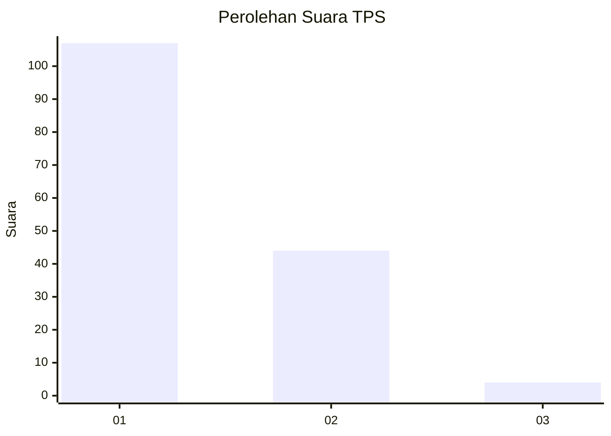
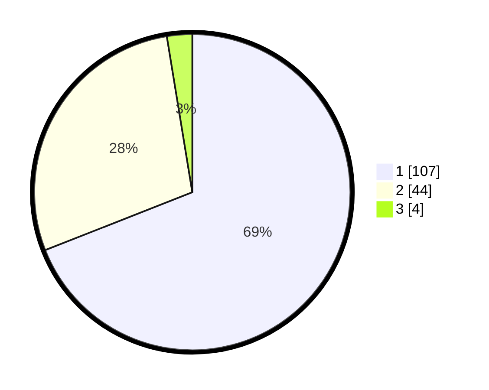

# Hasil

## Grafik

## Tabel

| No. | Nama Paslon    | Suara | Suara (raw) | Persentase |
|:--- |:-------------- | -----:| -----------:| ----------:|
| 1   | ANIES MUHAIMIN | 107   | [107][p-1]  | 69,03      |
| 2   | PRABOWO GIBRAN | 44    | [44][p-2]   | 28,39      |
| 3   | GANJAR MAHFUD  | 4     | [4][p-3]    | 2,58       |

[p-1]: https://github.com/gigit-pemilu/pemilu-2024/blob/main/pilpres/hitung-suara/sub/12-sumatera-utara/sub/13-mandailing-natal/sub/01-panyabungan/sub/1031-panyabungan-ii/sub/019-tps/sub/paslon-1.txt
[p-2]: https://github.com/gigit-pemilu/pemilu-2024/blob/main/pilpres/hitung-suara/sub/12-sumatera-utara/sub/13-mandailing-natal/sub/01-panyabungan/sub/1031-panyabungan-ii/sub/019-tps/sub/paslon-2.txt
[p-3]: https://github.com/gigit-pemilu/pemilu-2024/blob/main/pilpres/hitung-suara/sub/12-sumatera-utara/sub/13-mandailing-natal/sub/01-panyabungan/sub/1031-panyabungan-ii/sub/019-tps/sub/paslon-3.txt

## Foto C Plano

https://sirekap-obj-formc.kpu.go.id/7a62/pemilu/ppwp/12/13/01/10/31/1213011031019-20240224-224358--937fc2d8-d348-4315-a2d7-999cb32c0ca2.jpg

https://sirekap-obj-formc.kpu.go.id/7a62/pemilu/ppwp/12/13/01/10/31/1213011031019-20240224-225221--5d195d66-6ef3-4530-8da6-f24743a6f944.jpg

https://sirekap-obj-formc.kpu.go.id/7a62/pemilu/ppwp/12/13/01/10/31/1213011031019-20240224-230019--68e3ee12-bdc8-4a7a-be38-6e9b5342adff.jpg

## Metadata

| Key        | Value               |
| ---------- | ------------------- |
| Time Stamp | 2024-02-28 19:00:00 |

