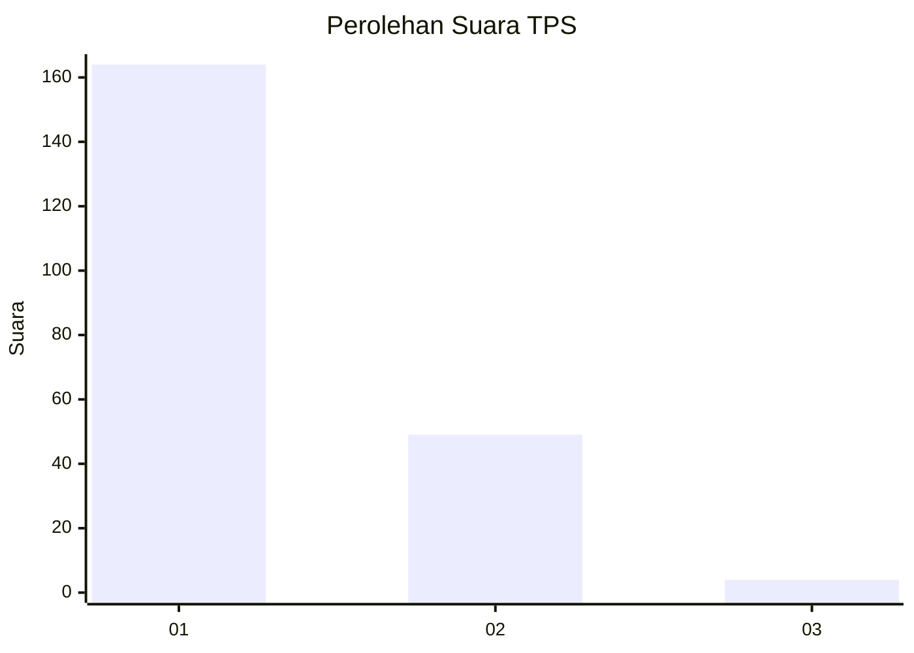
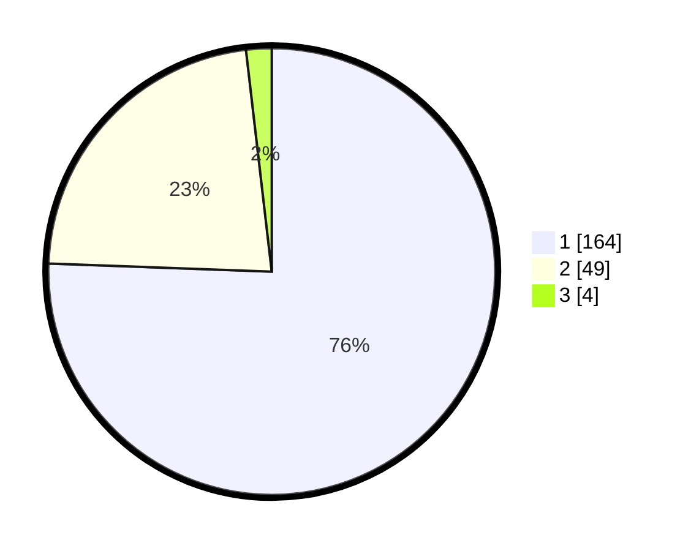

# Hasil

## Grafik

## Tabel

| No. | Nama Paslon    | Suara | Suara (raw) | Persentase |
|:--- |:-------------- | -----:| -----------:| ----------:|
| 1   | ANIES MUHAIMIN | 164   | [164][p-1]  | 75,58      |
| 2   | PRABOWO GIBRAN | 49    | [49][p-2]   | 22,58      |
| 3   | GANJAR MAHFUD  | 4     | [4][p-3]    | 1,84       |

[p-1]: https://github.com/gigit-pemilu/pemilu-2024-12-sumatera-utara/blob/main/pilpres/hitung-suara/sub/12-sumatera-utara/sub/13-mandailing-natal/sub/01-panyabungan/sub/1032-panyabungan-iii/sub/002-tps/sub/paslon-1.txt
[p-2]: https://github.com/gigit-pemilu/pemilu-2024-12-sumatera-utara/blob/main/pilpres/hitung-suara/sub/12-sumatera-utara/sub/13-mandailing-natal/sub/01-panyabungan/sub/1032-panyabungan-iii/sub/002-tps/sub/paslon-2.txt
[p-3]: https://github.com/gigit-pemilu/pemilu-2024-12-sumatera-utara/blob/main/pilpres/hitung-suara/sub/12-sumatera-utara/sub/13-mandailing-natal/sub/01-panyabungan/sub/1032-panyabungan-iii/sub/002-tps/sub/paslon-3.txt

## Foto C Plano

https://sirekap-obj-formc.kpu.go.id/9996/pemilu/ppwp/12/13/01/10/32/1213011032002-20240215-015516--35047d14-38e0-405b-8066-0f81127a9c87.jpg

https://sirekap-obj-formc.kpu.go.id/9996/pemilu/ppwp/12/13/01/10/32/1213011032002-20240215-015610--51c2f22a-8deb-4722-a051-adc7ad7de5c8.jpg

https://sirekap-obj-formc.kpu.go.id/9996/pemilu/ppwp/12/13/01/10/32/1213011032002-20240215-015744--a2a862bb-cdc8-4dc7-aa63-c373631e963c.jpg

## Metadata

| Key        | Value               |
| ---------- | ------------------- |
| Time Stamp | 2024-02-15 23:29:50 |

