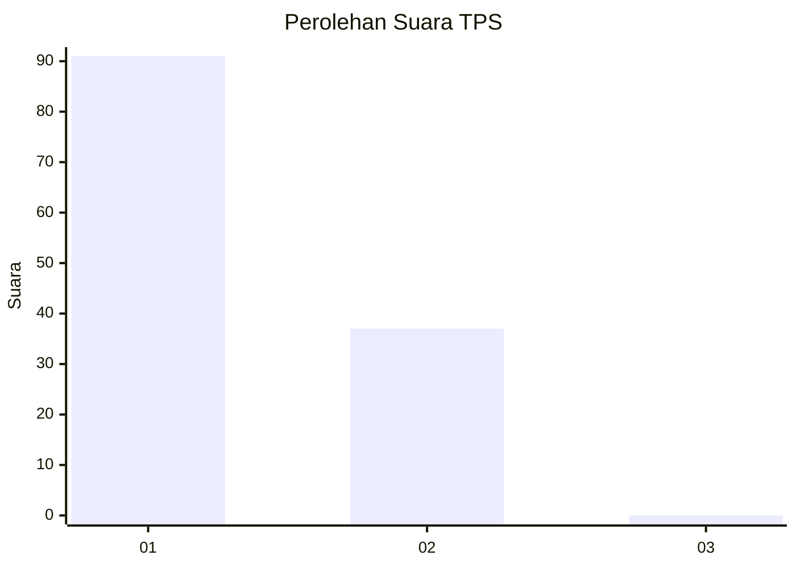
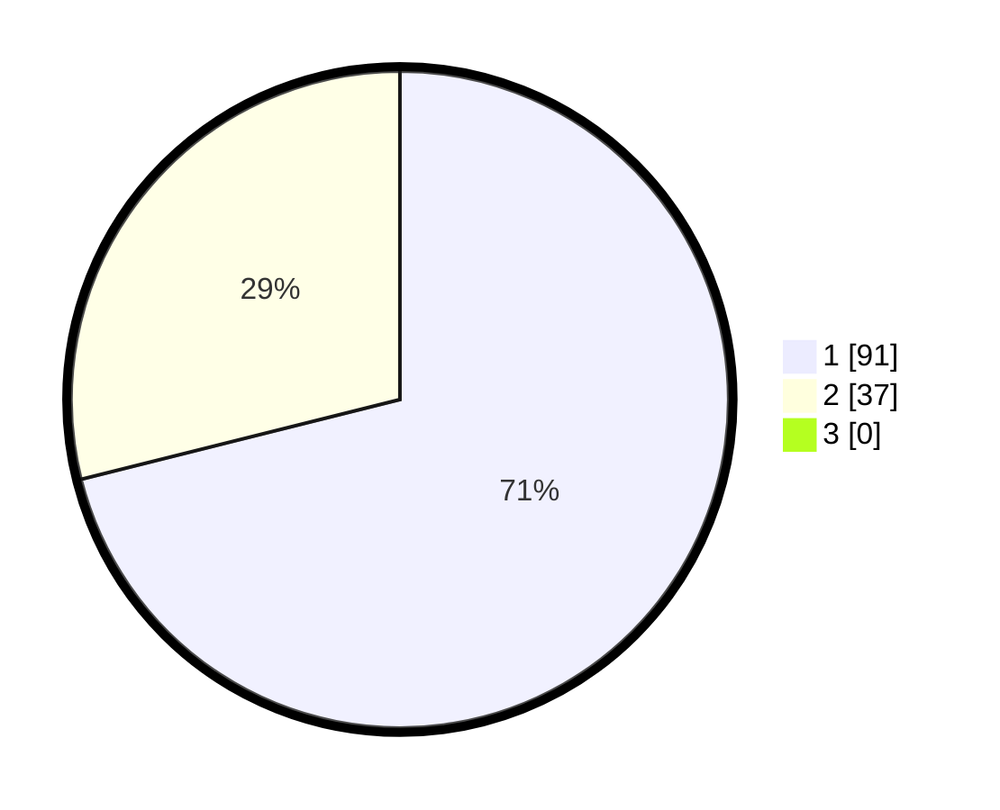

# Hasil

## Grafik

## Tabel

| No. | Nama Paslon    | Suara | Suara (raw) | Persentase |
|:--- |:-------------- | -----:| -----------:| ----------:|
| 1   | ANIES MUHAIMIN | 91    | [91][p-1]   | 71,09      |
| 2   | PRABOWO GIBRAN | 37    | [37][p-2]   | 28,91      |
| 3   | GANJAR MAHFUD  | 0     | [0][p-3]    | 0,00       |

[p-1]: https://github.com/gigit-pemilu/pemilu-2024/blob/main/pilpres/hitung-suara/sub/12-sumatera-utara/sub/13-mandailing-natal/sub/01-panyabungan/sub/1032-panyabungan-iii/sub/010-tps/sub/paslon-1.txt
[p-2]: https://github.com/gigit-pemilu/pemilu-2024/blob/main/pilpres/hitung-suara/sub/12-sumatera-utara/sub/13-mandailing-natal/sub/01-panyabungan/sub/1032-panyabungan-iii/sub/010-tps/sub/paslon-2.txt
[p-3]: https://github.com/gigit-pemilu/pemilu-2024/blob/main/pilpres/hitung-suara/sub/12-sumatera-utara/sub/13-mandailing-natal/sub/01-panyabungan/sub/1032-panyabungan-iii/sub/010-tps/sub/paslon-3.txt

## Foto C Plano

https://sirekap-obj-formc.kpu.go.id/a8ed/pemilu/ppwp/12/13/01/10/32/1213011032010-20240224-124348--b347dd1e-70fe-4459-acda-d3fd4c9d43b1.jpg

https://sirekap-obj-formc.kpu.go.id/a8ed/pemilu/ppwp/12/13/01/10/32/1213011032010-20240224-124551--4528d6ea-4958-4262-b269-66d1f6f16748.jpg

https://sirekap-obj-formc.kpu.go.id/a8ed/pemilu/ppwp/12/13/01/10/32/1213011032010-20240224-124728--861e7679-1dd8-42d3-b56b-9fade76b5fd0.jpg

## Metadata

| Key        | Value               |
| ---------- | ------------------- |
| Time Stamp | 2024-02-28 21:00:00 |

