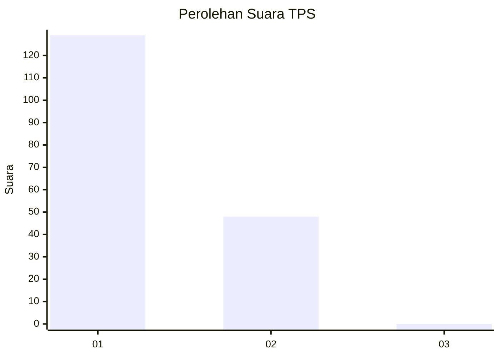
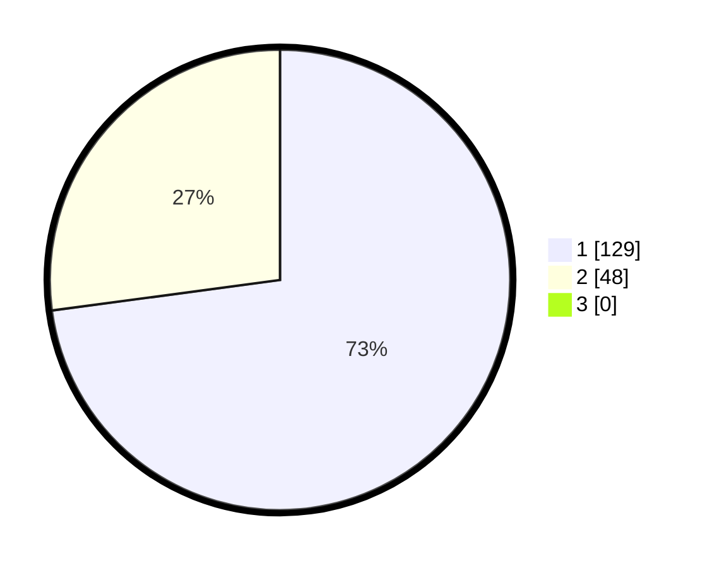

# Hasil

## Grafik

## Tabel

| No. | Nama Paslon    | Suara | Suara (raw) | Persentase |
|:--- |:-------------- | -----:| -----------:| ----------:|
| 1   | ANIES MUHAIMIN | 129   | [129][p-1]  | 72,88      |
| 2   | PRABOWO GIBRAN | 48    | [48][p-2]   | 27,12      |
| 3   | GANJAR MAHFUD  | 0     | [0][p-3]    | 0,00       |

[p-1]: https://github.com/gigit-pemilu/pemilu-2024-12-sumatera-utara/blob/main/pilpres/hitung-suara/sub/12-sumatera-utara/sub/13-mandailing-natal/sub/01-panyabungan/sub/1035-sipolu-polu/sub/002-tps/sub/paslon-1.txt
[p-2]: https://github.com/gigit-pemilu/pemilu-2024-12-sumatera-utara/blob/main/pilpres/hitung-suara/sub/12-sumatera-utara/sub/13-mandailing-natal/sub/01-panyabungan/sub/1035-sipolu-polu/sub/002-tps/sub/paslon-2.txt
[p-3]: https://github.com/gigit-pemilu/pemilu-2024-12-sumatera-utara/blob/main/pilpres/hitung-suara/sub/12-sumatera-utara/sub/13-mandailing-natal/sub/01-panyabungan/sub/1035-sipolu-polu/sub/002-tps/sub/paslon-3.txt

## Foto C Plano

https://sirekap-obj-formc.kpu.go.id/ea3b/pemilu/ppwp/12/13/01/10/35/1213011035002-20240214-203418--1758c76d-db68-475c-93b0-431688041e8d.jpg

https://sirekap-obj-formc.kpu.go.id/ea3b/pemilu/ppwp/12/13/01/10/35/1213011035002-20240214-203624--ad3ebf3e-4dd0-48d4-a973-881b6b1d6dc8.jpg

https://sirekap-obj-formc.kpu.go.id/ea3b/pemilu/ppwp/12/13/01/10/35/1213011035002-20240214-203706--cffc3719-72b9-4ae2-b7a6-f24c01049d02.jpg

## Metadata

| Key        | Value               |
| ---------- | ------------------- |
| Time Stamp | 2024-02-15 00:41:44 |

