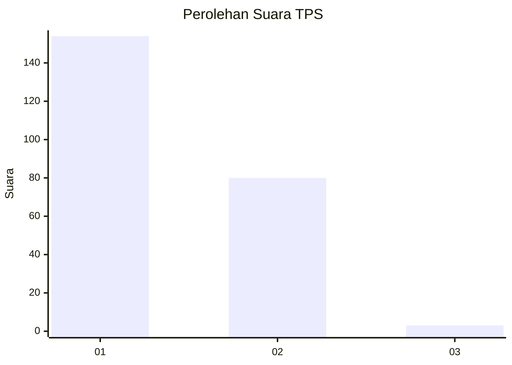
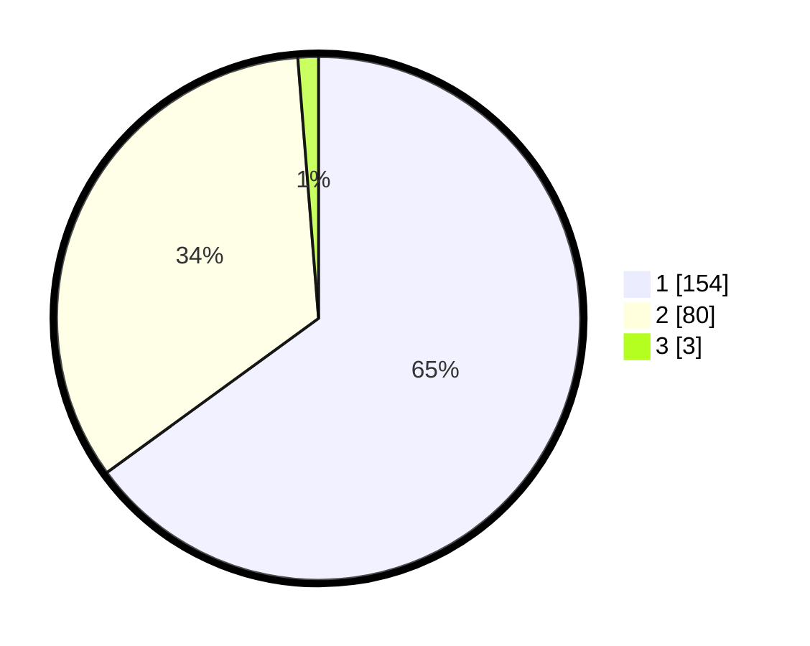

# Hasil

## Grafik

## Tabel

| No. | Nama Paslon    | Suara | Suara (raw) | Persentase |
|:--- |:-------------- | -----:| -----------:| ----------:|
| 1   | ANIES MUHAIMIN | 154   | [154][p-1]  | 64,98      |
| 2   | PRABOWO GIBRAN | 80    | [80][p-2]   | 33,76      |
| 3   | GANJAR MAHFUD  | 3     | [3][p-3]    | 1,27       |

[p-1]: https://github.com/gigit-pemilu/pemilu-2024/blob/main/pilpres/hitung-suara/sub/12-sumatera-utara/sub/13-mandailing-natal/sub/01-panyabungan/sub/1035-sipolu-polu/sub/007-tps/sub/paslon-1.txt
[p-2]: https://github.com/gigit-pemilu/pemilu-2024/blob/main/pilpres/hitung-suara/sub/12-sumatera-utara/sub/13-mandailing-natal/sub/01-panyabungan/sub/1035-sipolu-polu/sub/007-tps/sub/paslon-2.txt
[p-3]: https://github.com/gigit-pemilu/pemilu-2024/blob/main/pilpres/hitung-suara/sub/12-sumatera-utara/sub/13-mandailing-natal/sub/01-panyabungan/sub/1035-sipolu-polu/sub/007-tps/sub/paslon-3.txt

## Foto C Plano

https://sirekap-obj-formc.kpu.go.id/fb9c/pemilu/ppwp/12/13/01/10/35/1213011035007-20240225-111729--37dc60ad-d80b-4992-a9bc-dad7d833188d.jpg

https://sirekap-obj-formc.kpu.go.id/fb9c/pemilu/ppwp/12/13/01/10/35/1213011035007-20240225-111454--ef6cf1ad-7470-4a18-8be0-8144ef8fbb34.jpg

https://sirekap-obj-formc.kpu.go.id/fb9c/pemilu/ppwp/12/13/01/10/35/1213011035007-20240225-111638--7cde527b-d083-46f9-bb31-fd5e2718a5c7.jpg

## Metadata

| Key        | Value               |
| ---------- | ------------------- |
| Time Stamp | 2024-02-28 19:00:00 |

