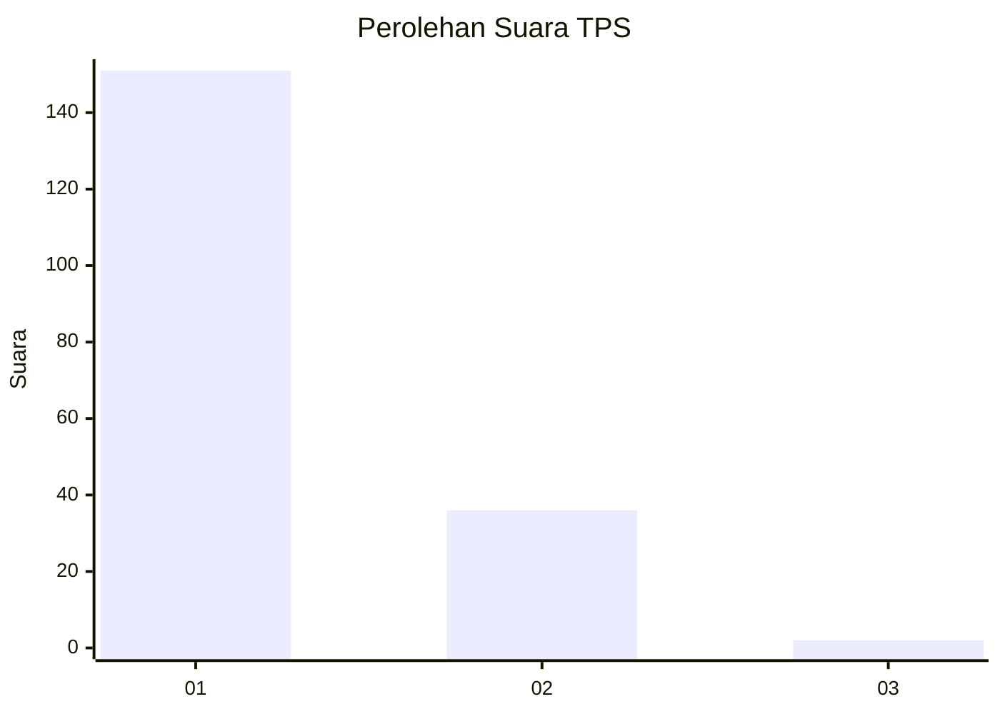
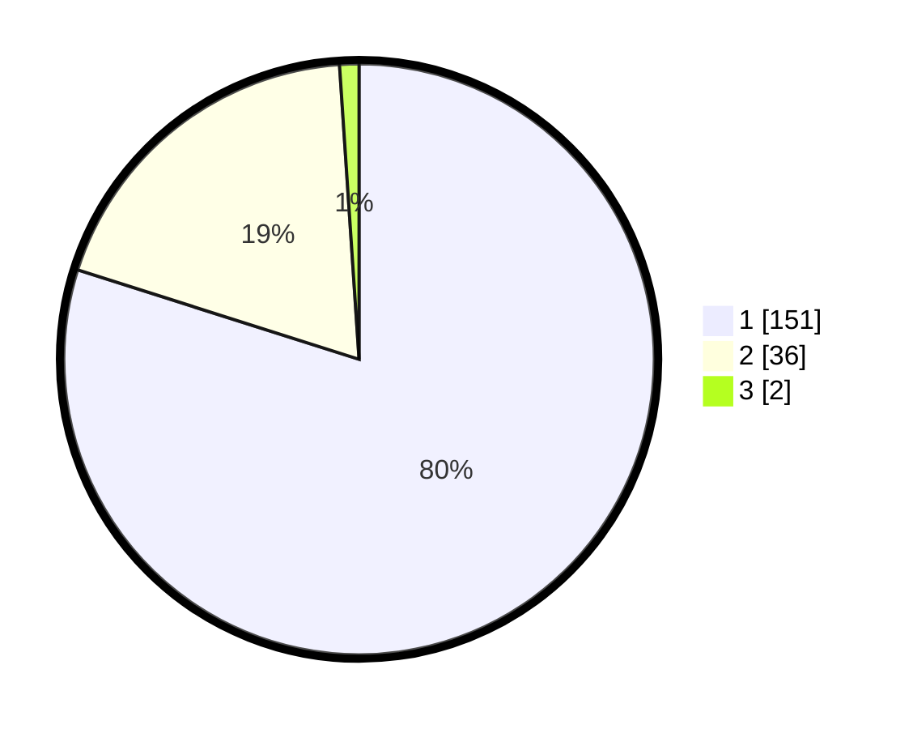

# Hasil

## Grafik

## Tabel

| No. | Nama Paslon    | Suara | Suara (raw) | Persentase |
|:--- |:-------------- | -----:| -----------:| ----------:|
| 1   | ANIES MUHAIMIN | 151   | [151][p-1]  | 79,89      |
| 2   | PRABOWO GIBRAN | 36    | [36][p-2]   | 19,05      |
| 3   | GANJAR MAHFUD  | 2     | [2][p-3]    | 1,06       |

[p-1]: https://github.com/gigit-pemilu/pemilu-2024/blob/main/pilpres/hitung-suara/sub/12-sumatera-utara/sub/13-mandailing-natal/sub/01-panyabungan/sub/1035-sipolu-polu/sub/009-tps/sub/paslon-1.txt
[p-2]: https://github.com/gigit-pemilu/pemilu-2024/blob/main/pilpres/hitung-suara/sub/12-sumatera-utara/sub/13-mandailing-natal/sub/01-panyabungan/sub/1035-sipolu-polu/sub/009-tps/sub/paslon-2.txt
[p-3]: https://github.com/gigit-pemilu/pemilu-2024/blob/main/pilpres/hitung-suara/sub/12-sumatera-utara/sub/13-mandailing-natal/sub/01-panyabungan/sub/1035-sipolu-polu/sub/009-tps/sub/paslon-3.txt

## Foto C Plano

https://sirekap-obj-formc.kpu.go.id/7d84/pemilu/ppwp/12/13/01/10/35/1213011035009-20240215-194443--8290f6ae-d749-4f22-9f04-6f13e17bf0e9.jpg

https://sirekap-obj-formc.kpu.go.id/7d84/pemilu/ppwp/12/13/01/10/35/1213011035009-20240215-224954--1b39558c-d8f1-4d60-b906-6105d9b1218f.jpg

https://sirekap-obj-formc.kpu.go.id/7d84/pemilu/ppwp/12/13/01/10/35/1213011035009-20240215-225140--789dcc03-389d-4d47-b98d-6b9ec555d35a.jpg

## Metadata

| Key        | Value               |
| ---------- | ------------------- |
| Time Stamp | 2024-02-17 16:00:02 |

