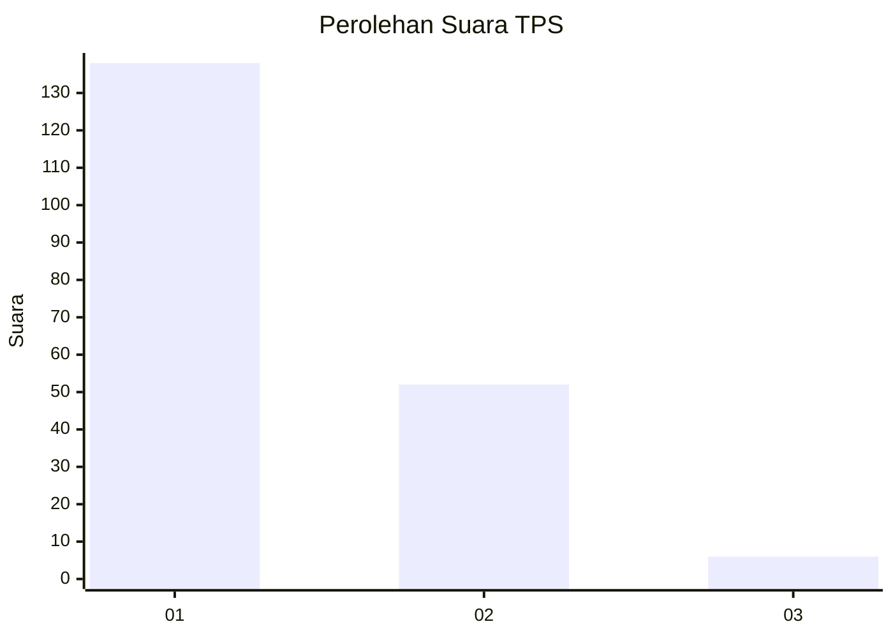
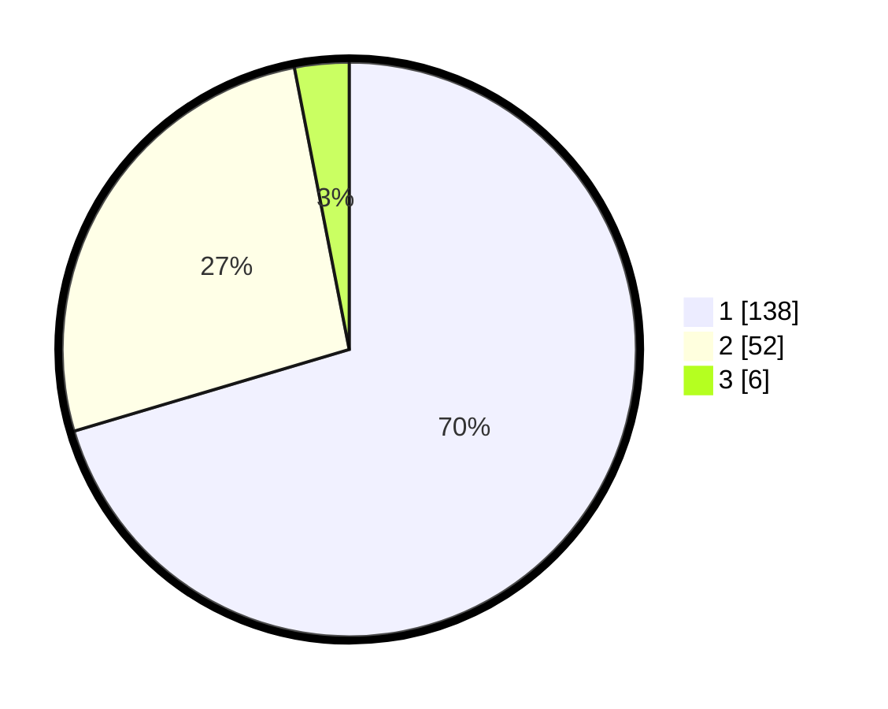

# Hasil

## Grafik

## Tabel

| No. | Nama Paslon    | Suara | Suara (raw) | Persentase |
|:--- |:-------------- | -----:| -----------:| ----------:|
| 1   | ANIES MUHAIMIN | 138   | [138][p-1]  | 70,41      |
| 2   | PRABOWO GIBRAN | 52    | [52][p-2]   | 26,53      |
| 3   | GANJAR MAHFUD  | 6     | [6][p-3]    | 3,06       |

[p-1]: https://github.com/gigit-pemilu/pemilu-2024-12-sumatera-utara/blob/main/pilpres/hitung-suara/sub/12-sumatera-utara/sub/13-mandailing-natal/sub/01-panyabungan/sub/1035-sipolu-polu/sub/014-tps/sub/paslon-1.txt
[p-2]: https://github.com/gigit-pemilu/pemilu-2024-12-sumatera-utara/blob/main/pilpres/hitung-suara/sub/12-sumatera-utara/sub/13-mandailing-natal/sub/01-panyabungan/sub/1035-sipolu-polu/sub/014-tps/sub/paslon-2.txt
[p-3]: https://github.com/gigit-pemilu/pemilu-2024-12-sumatera-utara/blob/main/pilpres/hitung-suara/sub/12-sumatera-utara/sub/13-mandailing-natal/sub/01-panyabungan/sub/1035-sipolu-polu/sub/014-tps/sub/paslon-3.txt

## Foto C Plano

https://sirekap-obj-formc.kpu.go.id/c4c6/pemilu/ppwp/12/13/01/10/35/1213011035014-20240215-165854--7d9d3eaa-809f-43bf-a9dc-e480e3b1f608.jpg

https://sirekap-obj-formc.kpu.go.id/c4c6/pemilu/ppwp/12/13/01/10/35/1213011035014-20240215-170114--f1fa581c-6d56-41b4-902c-d2aea0f494f8.jpg

https://sirekap-obj-formc.kpu.go.id/c4c6/pemilu/ppwp/12/13/01/10/35/1213011035014-20240215-170228--ecd89f2c-23e2-46e7-929c-3239bbab41bb.jpg

## Metadata

| Key        | Value               |
| ---------- | ------------------- |
| Time Stamp | 2024-02-16 00:30:27 |

