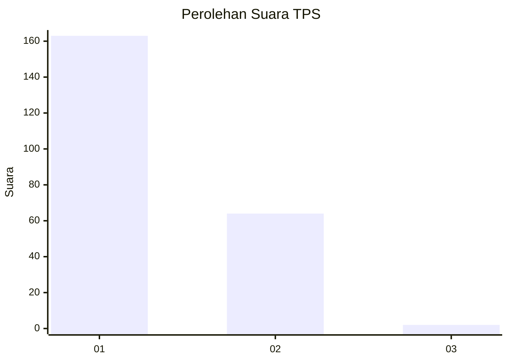
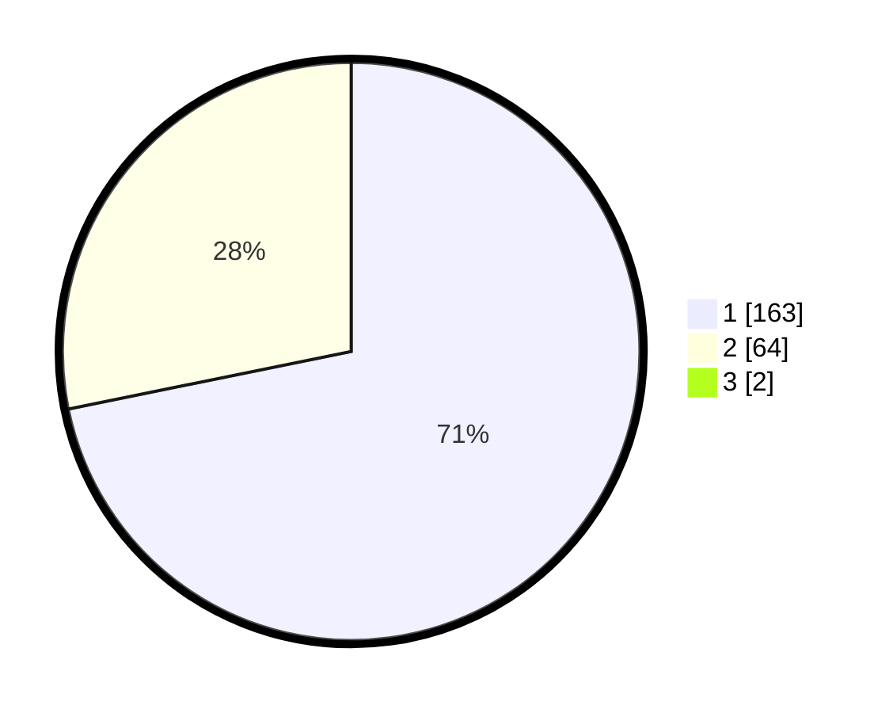

# Hasil

## Grafik

## Tabel

| No. | Nama Paslon    | Suara | Suara (raw) | Persentase |
|:--- |:-------------- | -----:| -----------:| ----------:|
| 1   | ANIES MUHAIMIN | 163   | [163][p-1]  | 71,18      |
| 2   | PRABOWO GIBRAN | 64    | [64][p-2]   | 27,95      |
| 3   | GANJAR MAHFUD  | 2     | [2][p-3]    | 0,87       |

[p-1]: https://github.com/gigit-pemilu/pemilu-2024/blob/main/pilpres/hitung-suara/sub/12-sumatera-utara/sub/13-mandailing-natal/sub/01-panyabungan/sub/1035-sipolu-polu/sub/017-tps/sub/paslon-1.txt
[p-2]: https://github.com/gigit-pemilu/pemilu-2024/blob/main/pilpres/hitung-suara/sub/12-sumatera-utara/sub/13-mandailing-natal/sub/01-panyabungan/sub/1035-sipolu-polu/sub/017-tps/sub/paslon-2.txt
[p-3]: https://github.com/gigit-pemilu/pemilu-2024/blob/main/pilpres/hitung-suara/sub/12-sumatera-utara/sub/13-mandailing-natal/sub/01-panyabungan/sub/1035-sipolu-polu/sub/017-tps/sub/paslon-3.txt

## Foto C Plano

https://sirekap-obj-formc.kpu.go.id/df5c/pemilu/ppwp/12/13/01/10/35/1213011035017-20240217-004712--ba376c98-ee47-4c75-9e33-e3eb383fd1bb.jpg

https://sirekap-obj-formc.kpu.go.id/df5c/pemilu/ppwp/12/13/01/10/35/1213011035017-20240215-231450--cef859e5-8e5a-457c-833c-b08111c3ccfb.jpg

https://sirekap-obj-formc.kpu.go.id/df5c/pemilu/ppwp/12/13/01/10/35/1213011035017-20240215-231550--66b33ee1-4b13-40ba-9bec-74866d86a4d0.jpg

## Metadata

| Key        | Value               |
| ---------- | ------------------- |
| Time Stamp | 2024-02-17 01:00:00 |

