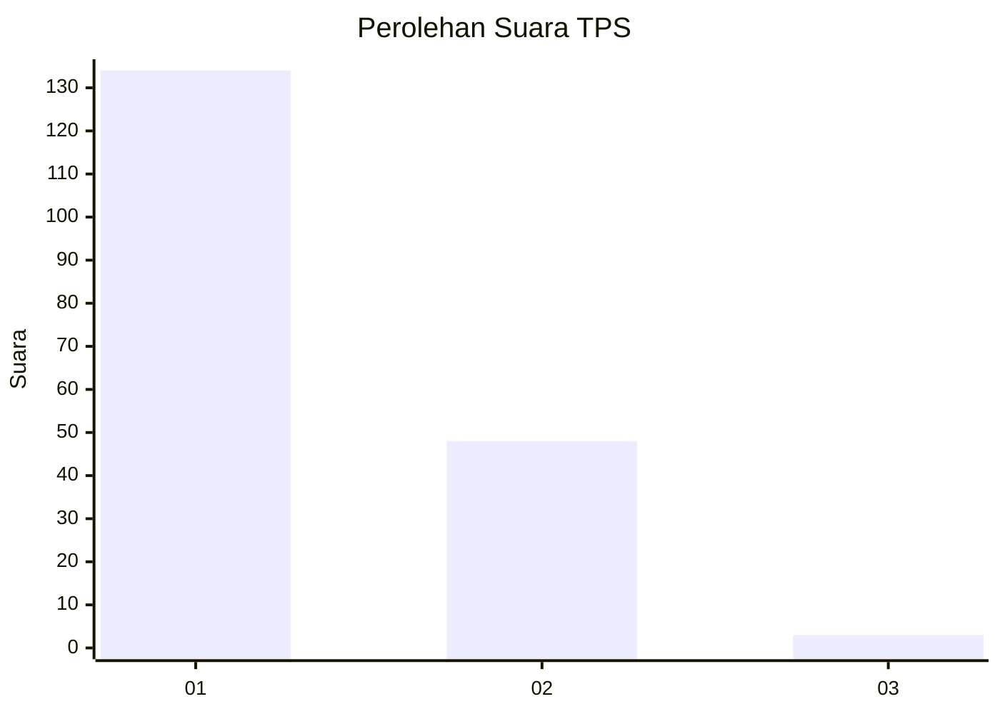
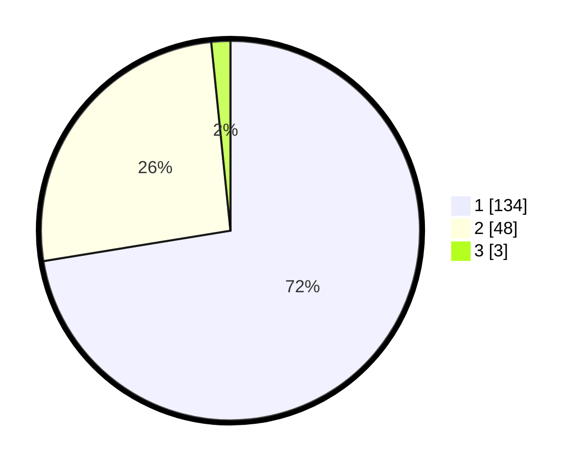

# Hasil

## Grafik

## Tabel

| No. | Nama Paslon    | Suara | Suara (raw) | Persentase |
|:--- |:-------------- | -----:| -----------:| ----------:|
| 1   | ANIES MUHAIMIN | 134   | [134][p-1]  | 72,43      |
| 2   | PRABOWO GIBRAN | 48    | [48][p-2]   | 25,95      |
| 3   | GANJAR MAHFUD  | 3     | [3][p-3]    | 1,62       |

[p-1]: https://github.com/gigit-pemilu/pemilu-2024/blob/main/pilpres/hitung-suara/sub/12-sumatera-utara/sub/13-mandailing-natal/sub/01-panyabungan/sub/1036-dalan-lidang/sub/007-tps/sub/paslon-1.txt
[p-2]: https://github.com/gigit-pemilu/pemilu-2024/blob/main/pilpres/hitung-suara/sub/12-sumatera-utara/sub/13-mandailing-natal/sub/01-panyabungan/sub/1036-dalan-lidang/sub/007-tps/sub/paslon-2.txt
[p-3]: https://github.com/gigit-pemilu/pemilu-2024/blob/main/pilpres/hitung-suara/sub/12-sumatera-utara/sub/13-mandailing-natal/sub/01-panyabungan/sub/1036-dalan-lidang/sub/007-tps/sub/paslon-3.txt

## Foto C Plano

https://sirekap-obj-formc.kpu.go.id/361d/pemilu/ppwp/12/13/01/10/36/1213011036007-20240214-155208--8391375e-49f0-4ae6-a97f-66e21b5eecda.jpg

https://sirekap-obj-formc.kpu.go.id/361d/pemilu/ppwp/12/13/01/10/36/1213011036007-20240214-155609--3a6ca120-a7b4-4d74-9047-48f22d153195.jpg

https://sirekap-obj-formc.kpu.go.id/361d/pemilu/ppwp/12/13/01/10/36/1213011036007-20240214-155722--1e83b69c-f238-4337-bdf7-7cfe0e4ebd15.jpg

## Metadata

| Key        | Value               |
| ---------- | ------------------- |
| Time Stamp | 2024-02-24 22:31:28 |

