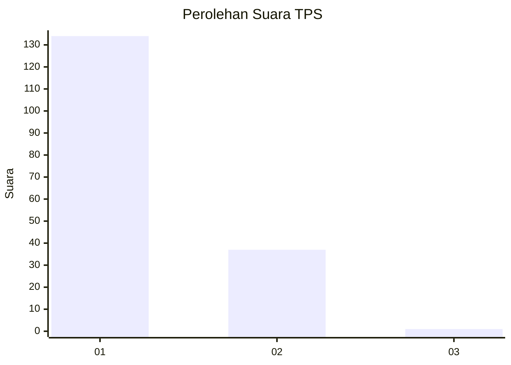
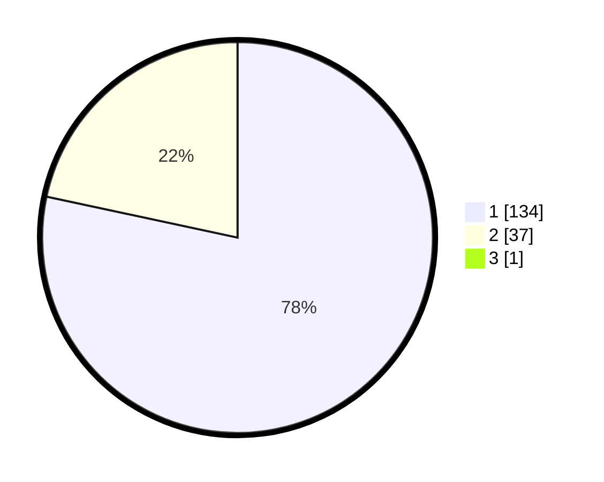

# Hasil

## Grafik

## Tabel

| No. | Nama Paslon    | Suara | Suara (raw) | Persentase |
|:--- |:-------------- | -----:| -----------:| ----------:|
| 1   | ANIES MUHAIMIN | 134   | [134][p-1]  | 77,91      |
| 2   | PRABOWO GIBRAN | 37    | [37][p-2]   | 21,51      |
| 3   | GANJAR MAHFUD  | 1     | [1][p-3]    | 0,58       |

[p-1]: https://github.com/gigit-pemilu/pemilu-2024/blob/main/pilpres/hitung-suara/sub/12-sumatera-utara/sub/13-mandailing-natal/sub/01-panyabungan/sub/2001-adian-jior/sub/002-tps/sub/paslon-1.txt
[p-2]: https://github.com/gigit-pemilu/pemilu-2024/blob/main/pilpres/hitung-suara/sub/12-sumatera-utara/sub/13-mandailing-natal/sub/01-panyabungan/sub/2001-adian-jior/sub/002-tps/sub/paslon-2.txt
[p-3]: https://github.com/gigit-pemilu/pemilu-2024/blob/main/pilpres/hitung-suara/sub/12-sumatera-utara/sub/13-mandailing-natal/sub/01-panyabungan/sub/2001-adian-jior/sub/002-tps/sub/paslon-3.txt

## Foto C Plano

https://sirekap-obj-formc.kpu.go.id/b239/pemilu/ppwp/12/13/01/20/01/1213012001002-20240215-125442--4d227261-6539-48d7-b266-721dccd6e8bc.jpg

https://sirekap-obj-formc.kpu.go.id/b239/pemilu/ppwp/12/13/01/20/01/1213012001002-20240215-125606--f5b8c825-9e16-4223-880b-adab0db41b95.jpg

https://sirekap-obj-formc.kpu.go.id/b239/pemilu/ppwp/12/13/01/20/01/1213012001002-20240215-125728--07017140-ba76-4123-81b4-6263085d8a70.jpg

## Metadata

| Key        | Value               |
| ---------- | ------------------- |
| Time Stamp | 2024-02-17 01:00:00 |

