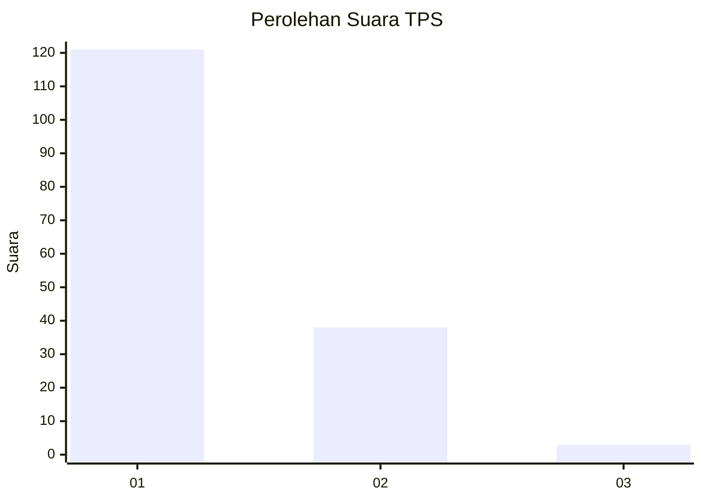
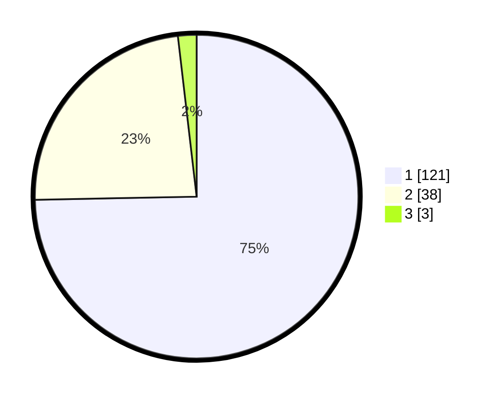

# Hasil

## Grafik

## Tabel

| No. | Nama Paslon    | Suara | Suara (raw) | Persentase |
|:--- |:-------------- | -----:| -----------:| ----------:|
| 1   | ANIES MUHAIMIN | 121   | [121][p-1]  | 74,69      |
| 2   | PRABOWO GIBRAN | 38    | [38][p-2]   | 23,46      |
| 3   | GANJAR MAHFUD  | 3     | [3][p-3]    | 1,85       |

[p-1]: https://github.com/gigit-pemilu/pemilu-2024/blob/main/pilpres/hitung-suara/sub/12-sumatera-utara/sub/13-mandailing-natal/sub/01-panyabungan/sub/2002-aek-banir/sub/004-tps/sub/paslon-1.txt
[p-2]: https://github.com/gigit-pemilu/pemilu-2024/blob/main/pilpres/hitung-suara/sub/12-sumatera-utara/sub/13-mandailing-natal/sub/01-panyabungan/sub/2002-aek-banir/sub/004-tps/sub/paslon-2.txt
[p-3]: https://github.com/gigit-pemilu/pemilu-2024/blob/main/pilpres/hitung-suara/sub/12-sumatera-utara/sub/13-mandailing-natal/sub/01-panyabungan/sub/2002-aek-banir/sub/004-tps/sub/paslon-3.txt

## Foto C Plano

https://sirekap-obj-formc.kpu.go.id/5ca0/pemilu/ppwp/12/13/01/20/02/1213012002004-20240223-234222--051eecf7-dd87-4b77-ac94-0110dc2b8922.jpg

https://sirekap-obj-formc.kpu.go.id/5ca0/pemilu/ppwp/12/13/01/20/02/1213012002004-20240223-234315--6f131e1c-d6e8-4318-a6f0-64734bda6cb4.jpg

https://sirekap-obj-formc.kpu.go.id/5ca0/pemilu/ppwp/12/13/01/20/02/1213012002004-20240223-234355--576e311b-c20e-474c-ae7d-320b49b7321e.jpg

## Metadata

| Key        | Value               |
| ---------- | ------------------- |
| Time Stamp | 2024-02-25 02:00:00 |

