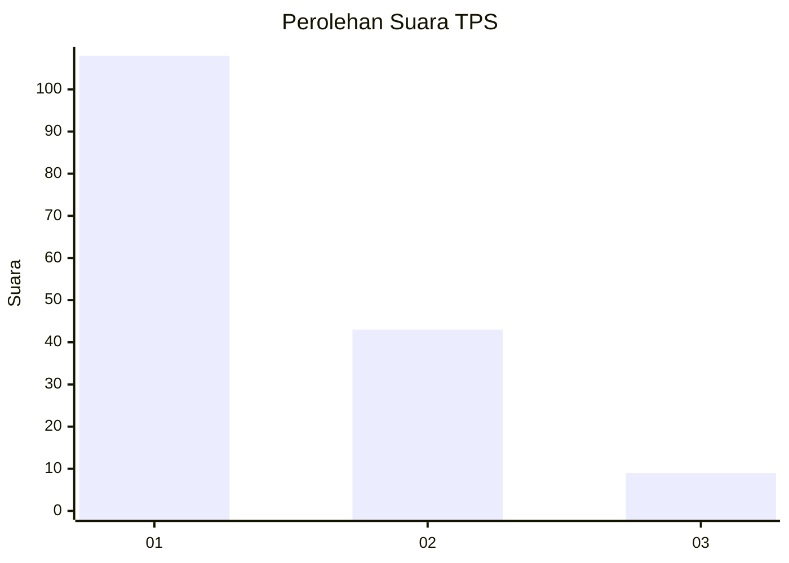
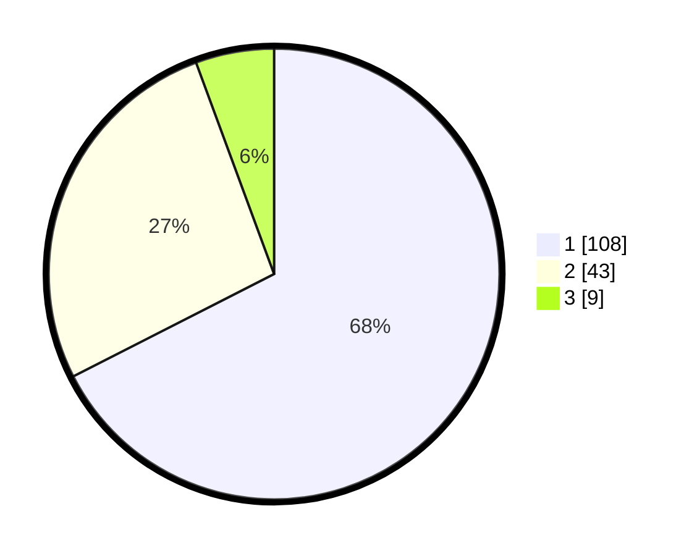

# Hasil

## Grafik

## Tabel

| No. | Nama Paslon    | Suara | Suara (raw) | Persentase |
|:--- |:-------------- | -----:| -----------:| ----------:|
| 1   | ANIES MUHAIMIN | 108   | [108][p-1]  | 67,50      |
| 2   | PRABOWO GIBRAN | 43    | [43][p-2]   | 26,88      |
| 3   | GANJAR MAHFUD  | 9     | [9][p-3]    | 5,63       |

[p-1]: https://github.com/gigit-pemilu/pemilu-2024-12-sumatera-utara/blob/main/pilpres/hitung-suara/sub/12-sumatera-utara/sub/13-mandailing-natal/sub/01-panyabungan/sub/2002-aek-banir/sub/006-tps/sub/paslon-1.txt
[p-2]: https://github.com/gigit-pemilu/pemilu-2024-12-sumatera-utara/blob/main/pilpres/hitung-suara/sub/12-sumatera-utara/sub/13-mandailing-natal/sub/01-panyabungan/sub/2002-aek-banir/sub/006-tps/sub/paslon-2.txt
[p-3]: https://github.com/gigit-pemilu/pemilu-2024-12-sumatera-utara/blob/main/pilpres/hitung-suara/sub/12-sumatera-utara/sub/13-mandailing-natal/sub/01-panyabungan/sub/2002-aek-banir/sub/006-tps/sub/paslon-3.txt

## Foto C Plano

https://sirekap-obj-formc.kpu.go.id/979f/pemilu/ppwp/12/13/01/20/02/1213012002006-20240215-180716--e45e8595-bfb0-474d-913a-cc977f93b86a.jpg

https://sirekap-obj-formc.kpu.go.id/979f/pemilu/ppwp/12/13/01/20/02/1213012002006-20240215-181342--06c8d5d6-2a1f-48d7-be11-42617544b41d.jpg

https://sirekap-obj-formc.kpu.go.id/979f/pemilu/ppwp/12/13/01/20/02/1213012002006-20240215-182153--796cd3a8-d69b-46c3-9755-bc9c02ec869a.jpg

## Metadata

| Key        | Value               |
| ---------- | ------------------- |
| Time Stamp | 2024-02-17 19:30:00 |

