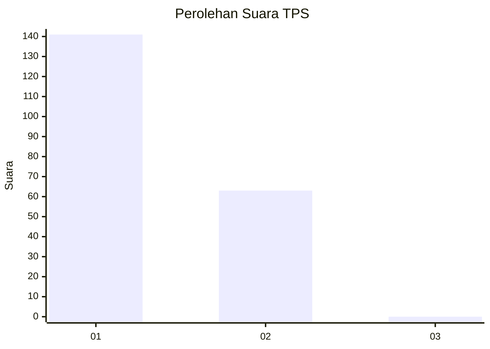
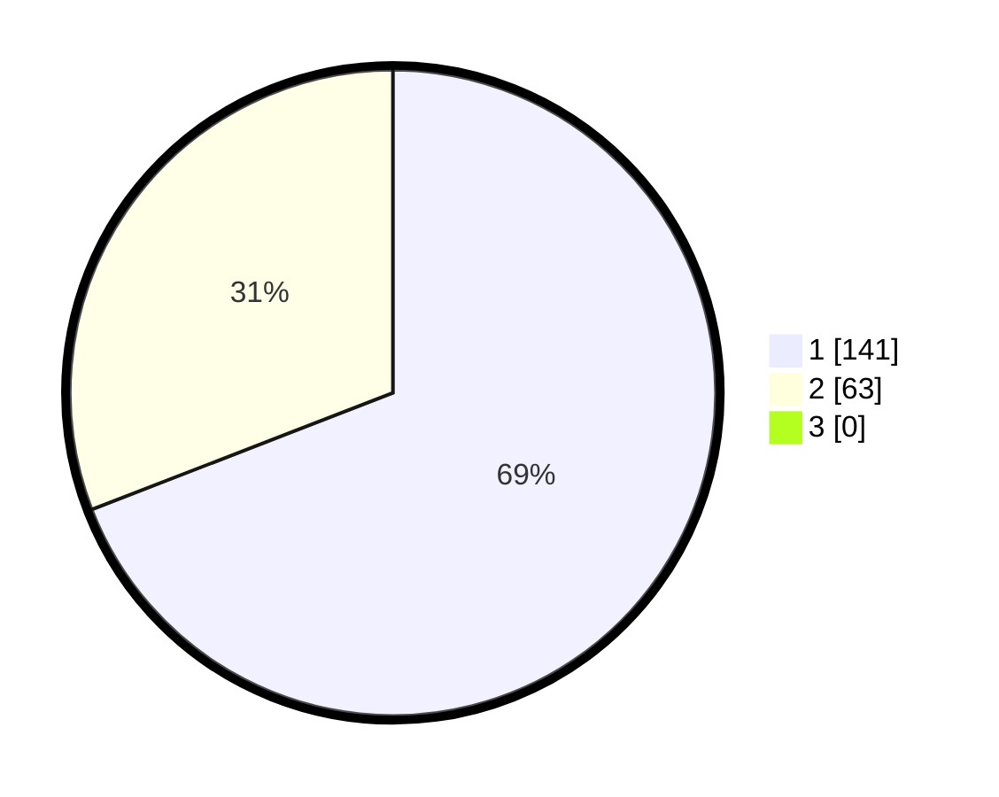

# Hasil

## Grafik

## Tabel

| No. | Nama Paslon    | Suara | Suara (raw) | Persentase |
|:--- |:-------------- | -----:| -----------:| ----------:|
| 1   | ANIES MUHAIMIN | 141   | [141][p-1]  | 69,12      |
| 2   | PRABOWO GIBRAN | 63    | [63][p-2]   | 30,88      |
| 3   | GANJAR MAHFUD  | 0     | [0][p-3]    | 0,00       |

[p-1]: https://github.com/gigit-pemilu/pemilu-2024/blob/main/pilpres/hitung-suara/sub/12-sumatera-utara/sub/13-mandailing-natal/sub/01-panyabungan/sub/2004-darussalam/sub/002-tps/sub/paslon-1.txt
[p-2]: https://github.com/gigit-pemilu/pemilu-2024/blob/main/pilpres/hitung-suara/sub/12-sumatera-utara/sub/13-mandailing-natal/sub/01-panyabungan/sub/2004-darussalam/sub/002-tps/sub/paslon-2.txt
[p-3]: https://github.com/gigit-pemilu/pemilu-2024/blob/main/pilpres/hitung-suara/sub/12-sumatera-utara/sub/13-mandailing-natal/sub/01-panyabungan/sub/2004-darussalam/sub/002-tps/sub/paslon-3.txt

## Foto C Plano

https://sirekap-obj-formc.kpu.go.id/ad4c/pemilu/ppwp/12/13/01/20/04/1213012004002-20240214-234519--4e7c6972-807c-4974-8f67-d1430cfa0752.jpg

https://sirekap-obj-formc.kpu.go.id/ad4c/pemilu/ppwp/12/13/01/20/04/1213012004002-20240214-234614--a96f5b07-e1bf-4f0d-9a7b-e28d7b716fa6.jpg

https://sirekap-obj-formc.kpu.go.id/ad4c/pemilu/ppwp/12/13/01/20/04/1213012004002-20240214-234700--e75e89dc-2163-43b5-983f-9c9b00128a75.jpg

## Metadata

| Key        | Value               |
| ---------- | ------------------- |
| Time Stamp | 2024-02-17 01:00:00 |

