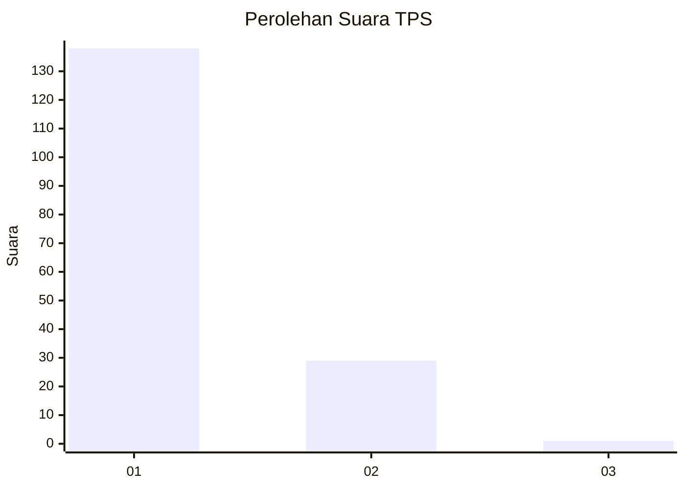
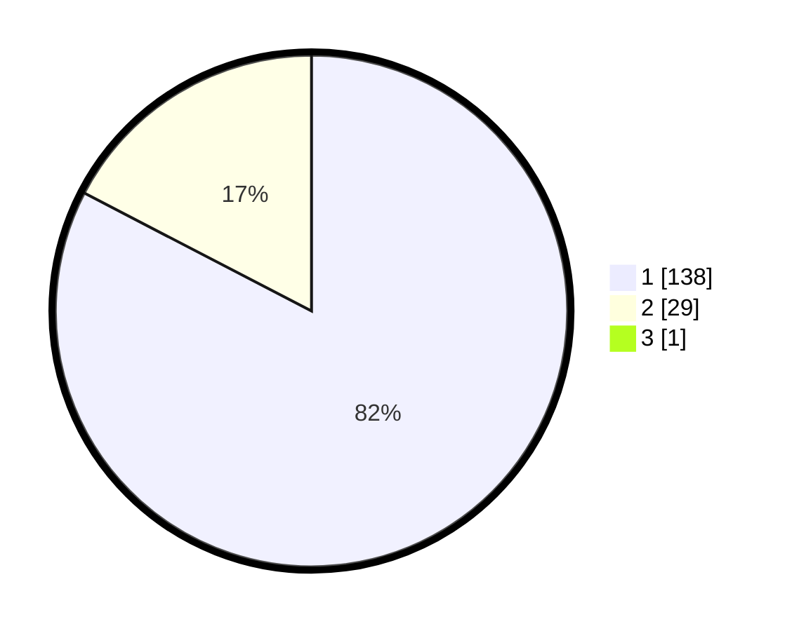

# Hasil

## Grafik

## Tabel

| No. | Nama Paslon    | Suara | Suara (raw) | Persentase |
|:--- |:-------------- | -----:| -----------:| ----------:|
| 1   | ANIES MUHAIMIN | 138   | [138][p-1]  | 82,14      |
| 2   | PRABOWO GIBRAN | 29    | [29][p-2]   | 17,26      |
| 3   | GANJAR MAHFUD  | 1     | [1][p-3]    | 0,60       |

[p-1]: https://github.com/gigit-pemilu/pemilu-2024-12-sumatera-utara/blob/main/pilpres/hitung-suara/sub/12-sumatera-utara/sub/13-mandailing-natal/sub/01-panyabungan/sub/2005-gunung-barani/sub/004-tps/sub/paslon-1.txt
[p-2]: https://github.com/gigit-pemilu/pemilu-2024-12-sumatera-utara/blob/main/pilpres/hitung-suara/sub/12-sumatera-utara/sub/13-mandailing-natal/sub/01-panyabungan/sub/2005-gunung-barani/sub/004-tps/sub/paslon-2.txt
[p-3]: https://github.com/gigit-pemilu/pemilu-2024-12-sumatera-utara/blob/main/pilpres/hitung-suara/sub/12-sumatera-utara/sub/13-mandailing-natal/sub/01-panyabungan/sub/2005-gunung-barani/sub/004-tps/sub/paslon-3.txt

## Foto C Plano

https://sirekap-obj-formc.kpu.go.id/4427/pemilu/ppwp/12/13/01/20/05/1213012005004-20240214-155351--0cebc307-0eee-42b6-b89a-7ccf2c827a46.jpg

https://sirekap-obj-formc.kpu.go.id/4427/pemilu/ppwp/12/13/01/20/05/1213012005004-20240214-155511--c346431f-8856-48dd-b506-5c4e9c1facab.jpg

https://sirekap-obj-formc.kpu.go.id/4427/pemilu/ppwp/12/13/01/20/05/1213012005004-20240214-155839--32fc2d23-6408-4e29-8d98-d4bf50bf10bc.jpg

## Metadata

| Key        | Value               |
| ---------- | ------------------- |
| Time Stamp | 2024-02-17 19:30:00 |

