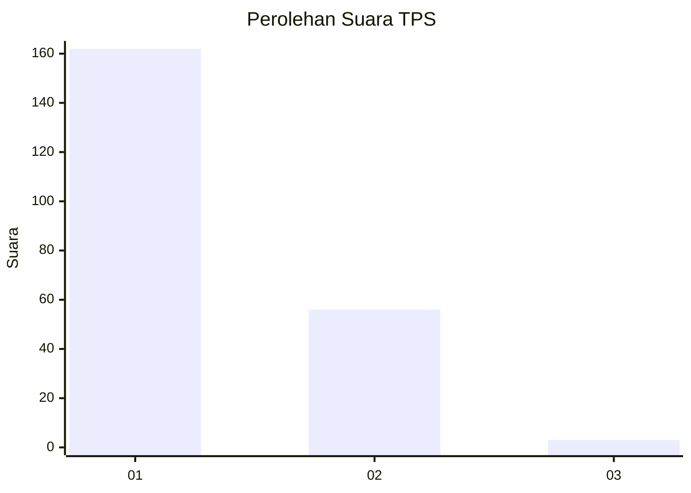
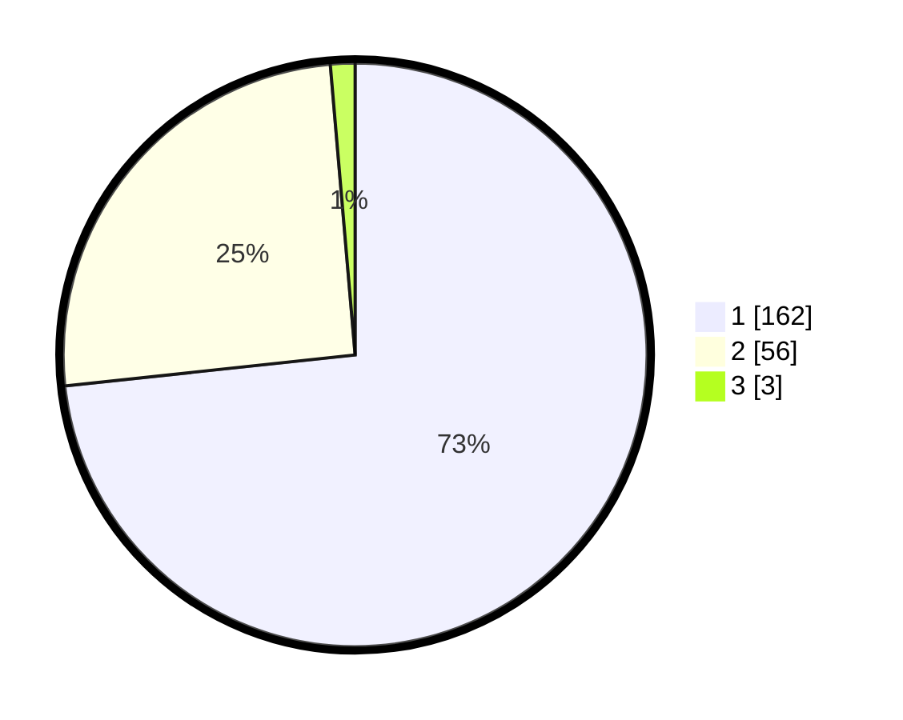

# Hasil

## Grafik

## Tabel

| No. | Nama Paslon    | Suara | Suara (raw) | Persentase |
|:--- |:-------------- | -----:| -----------:| ----------:|
| 1   | ANIES MUHAIMIN | 162   | [162][p-1]  | 73,30      |
| 2   | PRABOWO GIBRAN | 56    | [56][p-2]   | 25,34      |
| 3   | GANJAR MAHFUD  | 3     | [3][p-3]    | 1,36       |

[p-1]: https://github.com/gigit-pemilu/pemilu-2024-12-sumatera-utara/blob/main/pilpres/hitung-suara/sub/12-sumatera-utara/sub/13-mandailing-natal/sub/01-panyabungan/sub/2013-kampung-padang/sub/001-tps/sub/paslon-1.txt
[p-2]: https://github.com/gigit-pemilu/pemilu-2024-12-sumatera-utara/blob/main/pilpres/hitung-suara/sub/12-sumatera-utara/sub/13-mandailing-natal/sub/01-panyabungan/sub/2013-kampung-padang/sub/001-tps/sub/paslon-2.txt
[p-3]: https://github.com/gigit-pemilu/pemilu-2024-12-sumatera-utara/blob/main/pilpres/hitung-suara/sub/12-sumatera-utara/sub/13-mandailing-natal/sub/01-panyabungan/sub/2013-kampung-padang/sub/001-tps/sub/paslon-3.txt

## Foto C Plano

https://sirekap-obj-formc.kpu.go.id/61ae/pemilu/ppwp/12/13/01/20/13/1213012013001-20240215-022335--e02c6038-4b1e-41e2-98a6-007d77594c37.jpg

https://sirekap-obj-formc.kpu.go.id/61ae/pemilu/ppwp/12/13/01/20/13/1213012013001-20240215-005231--dea853d1-1bb1-471e-bbb4-2e45777632a0.jpg

https://sirekap-obj-formc.kpu.go.id/61ae/pemilu/ppwp/12/13/01/20/13/1213012013001-20240215-022139--8a5b3a10-74f1-4e69-a150-6ecb29104ed1.jpg

## Metadata

| Key        | Value               |
| ---------- | ------------------- |
| Time Stamp | 2024-02-16 16:25:10 |

