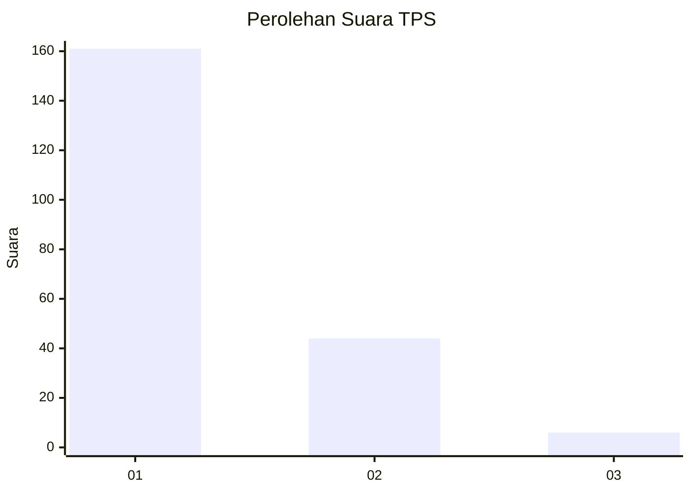
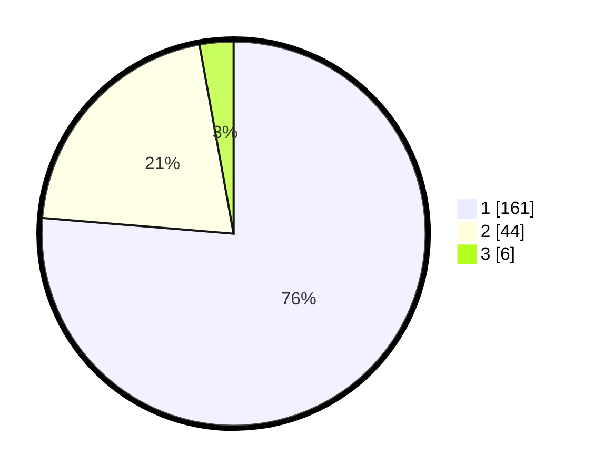

# Hasil

## Grafik

## Tabel

| No. | Nama Paslon    | Suara | Suara (raw) | Persentase |
|:--- |:-------------- | -----:| -----------:| ----------:|
| 1   | ANIES MUHAIMIN | 161   | [161][p-1]  | 76,30      |
| 2   | PRABOWO GIBRAN | 44    | [44][p-2]   | 20,85      |
| 3   | GANJAR MAHFUD  | 6     | [6][p-3]    | 2,84       |

[p-1]: https://github.com/gigit-pemilu/pemilu-2024/blob/main/pilpres/hitung-suara/sub/12-sumatera-utara/sub/13-mandailing-natal/sub/01-panyabungan/sub/2013-kampung-padang/sub/004-tps/sub/paslon-1.txt
[p-2]: https://github.com/gigit-pemilu/pemilu-2024/blob/main/pilpres/hitung-suara/sub/12-sumatera-utara/sub/13-mandailing-natal/sub/01-panyabungan/sub/2013-kampung-padang/sub/004-tps/sub/paslon-2.txt
[p-3]: https://github.com/gigit-pemilu/pemilu-2024/blob/main/pilpres/hitung-suara/sub/12-sumatera-utara/sub/13-mandailing-natal/sub/01-panyabungan/sub/2013-kampung-padang/sub/004-tps/sub/paslon-3.txt

## Foto C Plano

https://sirekap-obj-formc.kpu.go.id/783e/pemilu/ppwp/12/13/01/20/13/1213012013004-20240215-010314--c7c9fd3b-3067-4695-a681-057471c85cc4.jpg

https://sirekap-obj-formc.kpu.go.id/783e/pemilu/ppwp/12/13/01/20/13/1213012013004-20240215-010325--3b6cd06a-4890-4734-9ab2-2f7706884a02.jpg

https://sirekap-obj-formc.kpu.go.id/783e/pemilu/ppwp/12/13/01/20/13/1213012013004-20240215-010341--ca30577c-5b6c-4db5-a898-89b5f4cce881.jpg

## Metadata

| Key        | Value               |
| ---------- | ------------------- |
| Time Stamp | 2024-02-17 01:07:28 |

