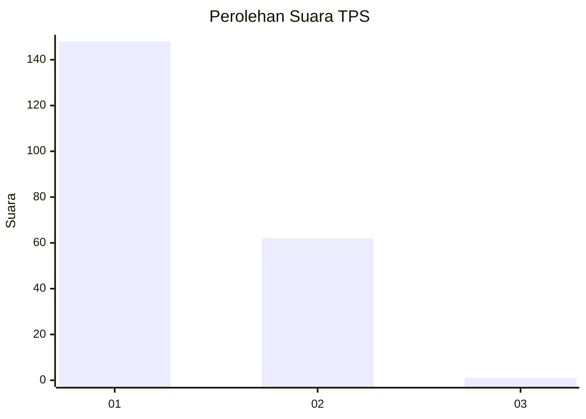
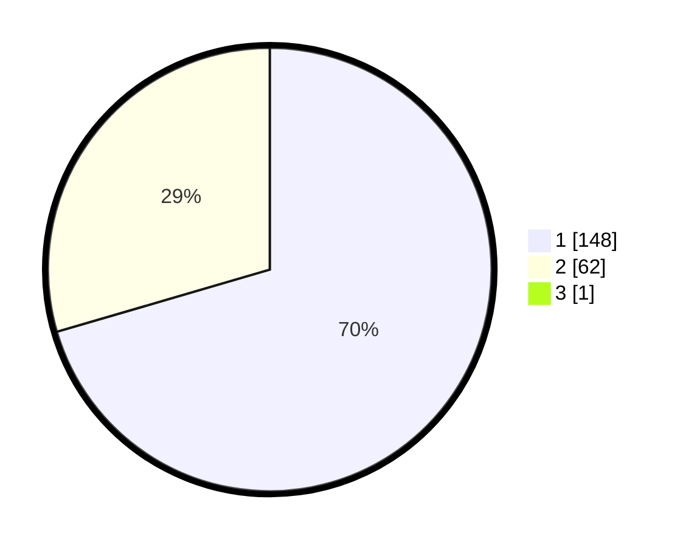

# Hasil

## Grafik

## Tabel

| No. | Nama Paslon    | Suara | Suara (raw) | Persentase |
|:--- |:-------------- | -----:| -----------:| ----------:|
| 1   | ANIES MUHAIMIN | 148   | [148][p-1]  | 70,14      |
| 2   | PRABOWO GIBRAN | 62    | [62][p-2]   | 29,38      |
| 3   | GANJAR MAHFUD  | 1     | [1][p-3]    | 0,47       |

[p-1]: https://github.com/gigit-pemilu/pemilu-2024-12-sumatera-utara/blob/main/pilpres/hitung-suara/sub/12-sumatera-utara/sub/13-mandailing-natal/sub/01-panyabungan/sub/2017-pagaran-tonga/sub/002-tps/sub/paslon-1.txt
[p-2]: https://github.com/gigit-pemilu/pemilu-2024-12-sumatera-utara/blob/main/pilpres/hitung-suara/sub/12-sumatera-utara/sub/13-mandailing-natal/sub/01-panyabungan/sub/2017-pagaran-tonga/sub/002-tps/sub/paslon-2.txt
[p-3]: https://github.com/gigit-pemilu/pemilu-2024-12-sumatera-utara/blob/main/pilpres/hitung-suara/sub/12-sumatera-utara/sub/13-mandailing-natal/sub/01-panyabungan/sub/2017-pagaran-tonga/sub/002-tps/sub/paslon-3.txt

## Foto C Plano

https://sirekap-obj-formc.kpu.go.id/ef5b/pemilu/ppwp/12/13/01/20/17/1213012017002-20240215-074149--2cd58ea5-a681-4153-9425-5105e1cdfcec.jpg

https://sirekap-obj-formc.kpu.go.id/ef5b/pemilu/ppwp/12/13/01/20/17/1213012017002-20240215-074349--1dbd0ac6-16b3-4ac2-97a1-d928dd3a14f0.jpg

https://sirekap-obj-formc.kpu.go.id/ef5b/pemilu/ppwp/12/13/01/20/17/1213012017002-20240215-074512--3c2bf472-09de-45c9-a9e8-9fcd7457b8c1.jpg

## Metadata

| Key        | Value               |
| ---------- | ------------------- |
| Time Stamp | 2024-02-17 01:22:58 |

