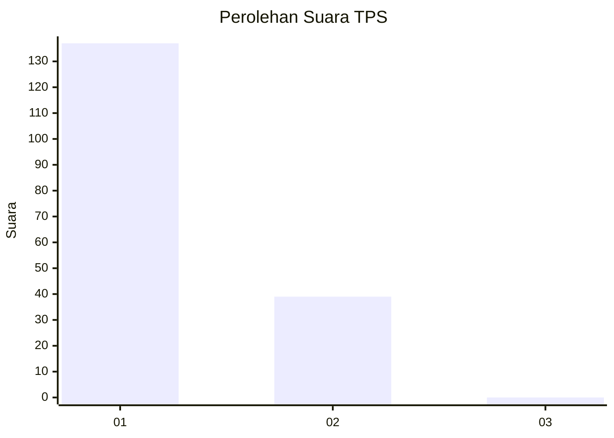
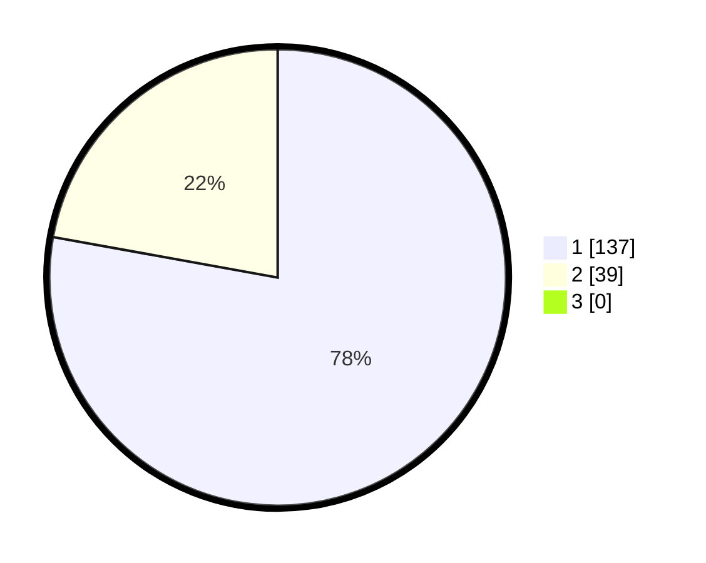

# Hasil

## Grafik

## Tabel

| No. | Nama Paslon    | Suara | Suara (raw) | Persentase |
|:--- |:-------------- | -----:| -----------:| ----------:|
| 1   | ANIES MUHAIMIN | 137   | [137][p-1]  | 77,84      |
| 2   | PRABOWO GIBRAN | 39    | [39][p-2]   | 22,16      |
| 3   | GANJAR MAHFUD  | 0     | [0][p-3]    | 0,00       |

[p-1]: https://github.com/gigit-pemilu/pemilu-2024/blob/main/pilpres/hitung-suara/sub/12-sumatera-utara/sub/13-mandailing-natal/sub/01-panyabungan/sub/2018-panyabungan-jae/sub/005-tps/sub/paslon-1.txt
[p-2]: https://github.com/gigit-pemilu/pemilu-2024/blob/main/pilpres/hitung-suara/sub/12-sumatera-utara/sub/13-mandailing-natal/sub/01-panyabungan/sub/2018-panyabungan-jae/sub/005-tps/sub/paslon-2.txt
[p-3]: https://github.com/gigit-pemilu/pemilu-2024/blob/main/pilpres/hitung-suara/sub/12-sumatera-utara/sub/13-mandailing-natal/sub/01-panyabungan/sub/2018-panyabungan-jae/sub/005-tps/sub/paslon-3.txt

## Foto C Plano

https://sirekap-obj-formc.kpu.go.id/d257/pemilu/ppwp/12/13/01/20/18/1213012018005-20240215-055205--f259446a-160c-4c80-8b25-1d061f8f096e.jpg

https://sirekap-obj-formc.kpu.go.id/d257/pemilu/ppwp/12/13/01/20/18/1213012018005-20240215-055421--0b7fa54b-7a1c-4557-97f7-8b2d54a69784.jpg

https://sirekap-obj-formc.kpu.go.id/d257/pemilu/ppwp/12/13/01/20/18/1213012018005-20240215-055605--57bf14b8-d9f8-4a78-8124-f2671b0fc3f2.jpg

## Metadata

| Key        | Value               |
| ---------- | ------------------- |
| Time Stamp | 2024-02-16 00:00:26 |

