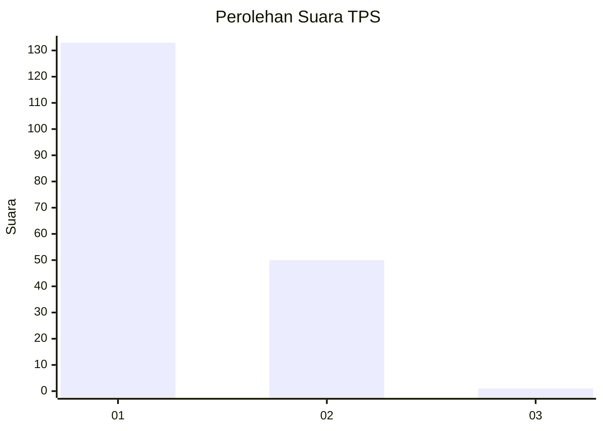
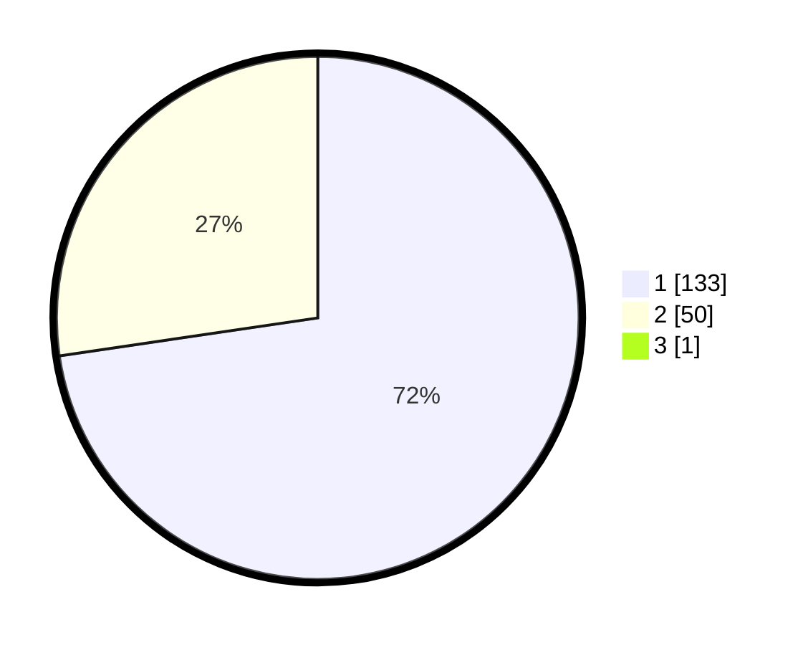

# Hasil

## Grafik

## Tabel

| No. | Nama Paslon    | Suara | Suara (raw) | Persentase |
|:--- |:-------------- | -----:| -----------:| ----------:|
| 1   | ANIES MUHAIMIN | 133   | [133][p-1]  | 72,28      |
| 2   | PRABOWO GIBRAN | 50    | [50][p-2]   | 27,17      |
| 3   | GANJAR MAHFUD  | 1     | [1][p-3]    | 0,54       |

[p-1]: https://github.com/gigit-pemilu/pemilu-2024/blob/main/pilpres/hitung-suara/sub/12-sumatera-utara/sub/13-mandailing-natal/sub/01-panyabungan/sub/2018-panyabungan-jae/sub/006-tps/sub/paslon-1.txt
[p-2]: https://github.com/gigit-pemilu/pemilu-2024/blob/main/pilpres/hitung-suara/sub/12-sumatera-utara/sub/13-mandailing-natal/sub/01-panyabungan/sub/2018-panyabungan-jae/sub/006-tps/sub/paslon-2.txt
[p-3]: https://github.com/gigit-pemilu/pemilu-2024/blob/main/pilpres/hitung-suara/sub/12-sumatera-utara/sub/13-mandailing-natal/sub/01-panyabungan/sub/2018-panyabungan-jae/sub/006-tps/sub/paslon-3.txt

## Foto C Plano

https://sirekap-obj-formc.kpu.go.id/6d9f/pemilu/ppwp/12/13/01/20/18/1213012018006-20240215-083957--43d3a115-0e3e-4dec-879c-dde5c7ca5e31.jpg

https://sirekap-obj-formc.kpu.go.id/6d9f/pemilu/ppwp/12/13/01/20/18/1213012018006-20240215-084138--f5de1d72-b270-43f8-b4e9-d03c60ae4ee9.jpg

https://sirekap-obj-formc.kpu.go.id/6d9f/pemilu/ppwp/12/13/01/20/18/1213012018006-20240215-084320--a9355804-c86c-436e-a6a6-fa8671ddd1c1.jpg

## Metadata

| Key        | Value               |
| ---------- | ------------------- |
| Time Stamp | 2024-02-17 01:22:58 |

