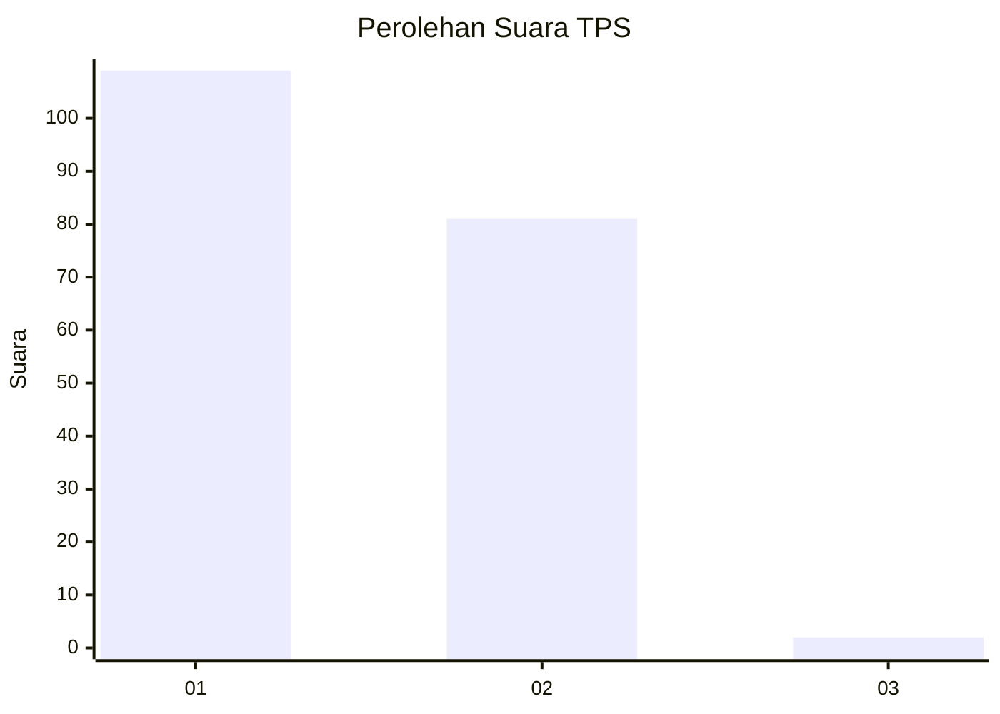
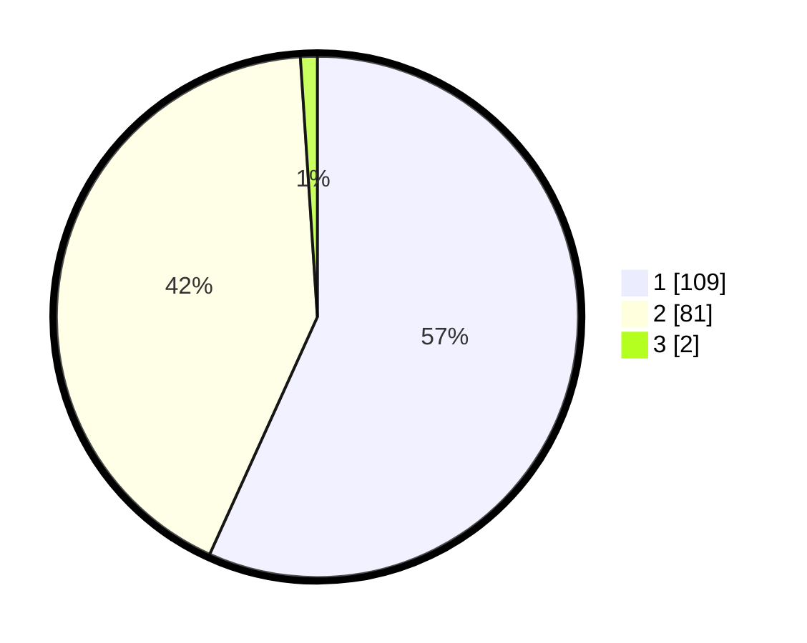

# Hasil

## Grafik

## Tabel

| No. | Nama Paslon    | Suara | Suara (raw) | Persentase |
|:--- |:-------------- | -----:| -----------:| ----------:|
| 1   | ANIES MUHAIMIN | 109   | [109][p-1]  | 56,77      |
| 2   | PRABOWO GIBRAN | 81    | [81][p-2]   | 42,19      |
| 3   | GANJAR MAHFUD  | 2     | [2][p-3]    | 1,04       |

[p-1]: https://github.com/gigit-pemilu/pemilu-2024/blob/main/pilpres/hitung-suara/sub/12-sumatera-utara/sub/13-mandailing-natal/sub/01-panyabungan/sub/2019-panyabungan-julu/sub/004-tps/sub/paslon-1.txt
[p-2]: https://github.com/gigit-pemilu/pemilu-2024/blob/main/pilpres/hitung-suara/sub/12-sumatera-utara/sub/13-mandailing-natal/sub/01-panyabungan/sub/2019-panyabungan-julu/sub/004-tps/sub/paslon-2.txt
[p-3]: https://github.com/gigit-pemilu/pemilu-2024/blob/main/pilpres/hitung-suara/sub/12-sumatera-utara/sub/13-mandailing-natal/sub/01-panyabungan/sub/2019-panyabungan-julu/sub/004-tps/sub/paslon-3.txt

## Foto C Plano

https://sirekap-obj-formc.kpu.go.id/3c4b/pemilu/ppwp/12/13/01/20/19/1213012019004-20240215-035617--489c71ce-d44d-4eec-a7cf-bbd96a936e1c.jpg

https://sirekap-obj-formc.kpu.go.id/3c4b/pemilu/ppwp/12/13/01/20/19/1213012019004-20240215-035917--caa565ed-3e64-4c47-b81b-c5e13795e9d3.jpg

https://sirekap-obj-formc.kpu.go.id/3c4b/pemilu/ppwp/12/13/01/20/19/1213012019004-20240215-040729--3d33d437-6ae5-470c-ad23-2ca46b2eea81.jpg

## Metadata

| Key        | Value               |
| ---------- | ------------------- |
| Time Stamp | 2024-02-17 01:22:58 |

