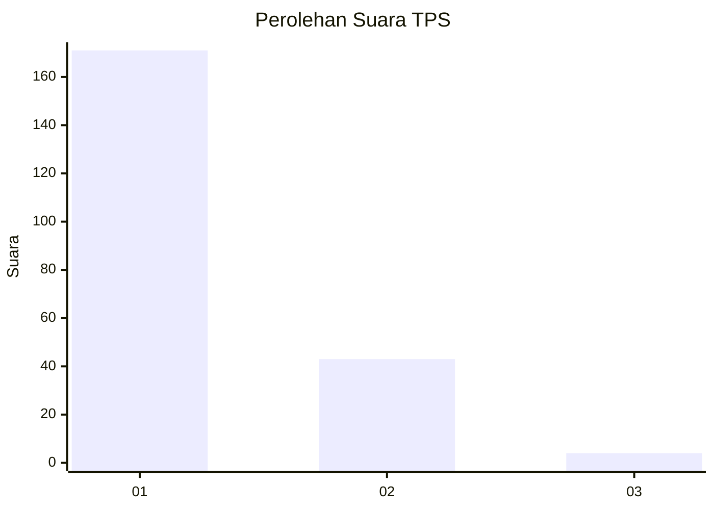
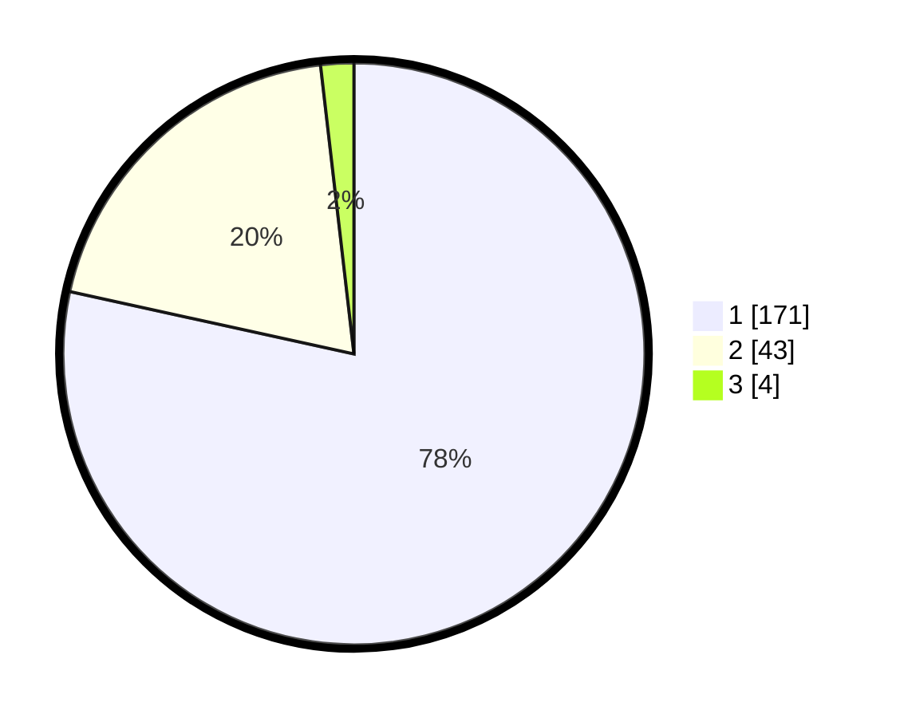

# Hasil

## Grafik

## Tabel

| No. | Nama Paslon    | Suara | Suara (raw) | Persentase |
|:--- |:-------------- | -----:| -----------:| ----------:|
| 1   | ANIES MUHAIMIN | 171   | [171][p-1]  | 78,44      |
| 2   | PRABOWO GIBRAN | 43    | [43][p-2]   | 19,72      |
| 3   | GANJAR MAHFUD  | 4     | [4][p-3]    | 1,83       |

[p-1]: https://github.com/gigit-pemilu/pemilu-2024/blob/main/pilpres/hitung-suara/sub/12-sumatera-utara/sub/13-mandailing-natal/sub/01-panyabungan/sub/2020-panyabungan-tonga/sub/003-tps/sub/paslon-1.txt
[p-2]: https://github.com/gigit-pemilu/pemilu-2024/blob/main/pilpres/hitung-suara/sub/12-sumatera-utara/sub/13-mandailing-natal/sub/01-panyabungan/sub/2020-panyabungan-tonga/sub/003-tps/sub/paslon-2.txt
[p-3]: https://github.com/gigit-pemilu/pemilu-2024/blob/main/pilpres/hitung-suara/sub/12-sumatera-utara/sub/13-mandailing-natal/sub/01-panyabungan/sub/2020-panyabungan-tonga/sub/003-tps/sub/paslon-3.txt

## Foto C Plano

https://sirekap-obj-formc.kpu.go.id/9ebd/pemilu/ppwp/12/13/01/20/20/1213012020003-20240217-202427--86443346-1975-470d-9829-3f375f9ed042.jpg

https://sirekap-obj-formc.kpu.go.id/9ebd/pemilu/ppwp/12/13/01/20/20/1213012020003-20240217-202451--2bf90d1b-7b97-4cc7-b531-e6fba76b7e2c.jpg

https://sirekap-obj-formc.kpu.go.id/9ebd/pemilu/ppwp/12/13/01/20/20/1213012020003-20240218-125346--ae913d2f-e98d-407b-8dde-98b54495f8d6.jpg

## Metadata

| Key        | Value               |
| ---------- | ------------------- |
| Time Stamp | 2024-02-19 06:16:00 |

