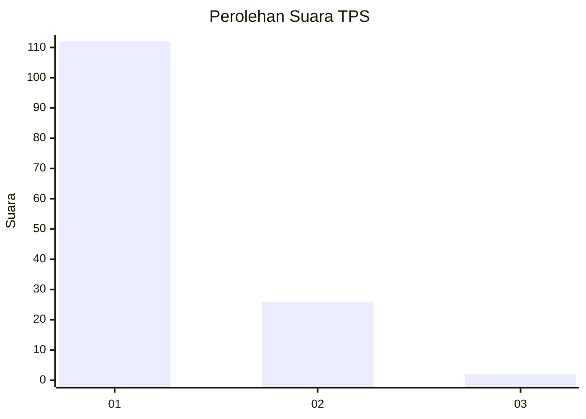
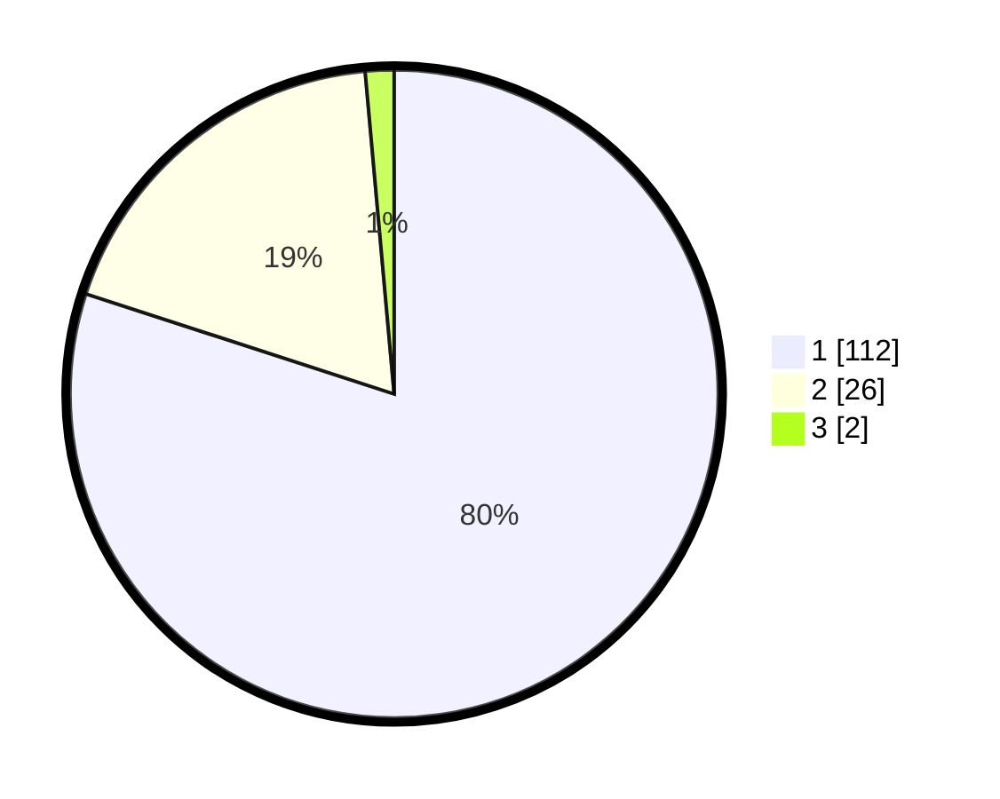

# Hasil

## Grafik

## Tabel

| No. | Nama Paslon    | Suara | Suara (raw) | Persentase |
|:--- |:-------------- | -----:| -----------:| ----------:|
| 1   | ANIES MUHAIMIN | 112   | [112][p-1]  | 80,00      |
| 2   | PRABOWO GIBRAN | 26    | [26][p-2]   | 18,57      |
| 3   | GANJAR MAHFUD  | 2     | [2][p-3]    | 1,43       |

[p-1]: https://github.com/gigit-pemilu/pemilu-2024-12-sumatera-utara/blob/main/pilpres/hitung-suara/sub/12-sumatera-utara/sub/13-mandailing-natal/sub/01-panyabungan/sub/2020-panyabungan-tonga/sub/006-tps/sub/paslon-1.txt
[p-2]: https://github.com/gigit-pemilu/pemilu-2024-12-sumatera-utara/blob/main/pilpres/hitung-suara/sub/12-sumatera-utara/sub/13-mandailing-natal/sub/01-panyabungan/sub/2020-panyabungan-tonga/sub/006-tps/sub/paslon-2.txt
[p-3]: https://github.com/gigit-pemilu/pemilu-2024-12-sumatera-utara/blob/main/pilpres/hitung-suara/sub/12-sumatera-utara/sub/13-mandailing-natal/sub/01-panyabungan/sub/2020-panyabungan-tonga/sub/006-tps/sub/paslon-3.txt

## Foto C Plano

https://sirekap-obj-formc.kpu.go.id/d473/pemilu/ppwp/12/13/01/20/20/1213012020006-20240215-003557--b4d5eae4-924f-4141-9700-7480f9ad05be.jpg

https://sirekap-obj-formc.kpu.go.id/d473/pemilu/ppwp/12/13/01/20/20/1213012020006-20240215-003956--b4ca4ffa-4f02-4c96-bb6b-febe9250eb8f.jpg

https://sirekap-obj-formc.kpu.go.id/d473/pemilu/ppwp/12/13/01/20/20/1213012020006-20240215-004243--e94fdbc6-da90-42d4-ad4a-d00c2b15cf04.jpg

## Metadata

| Key        | Value               |
| ---------- | ------------------- |
| Time Stamp | 2024-02-17 01:22:58 |

