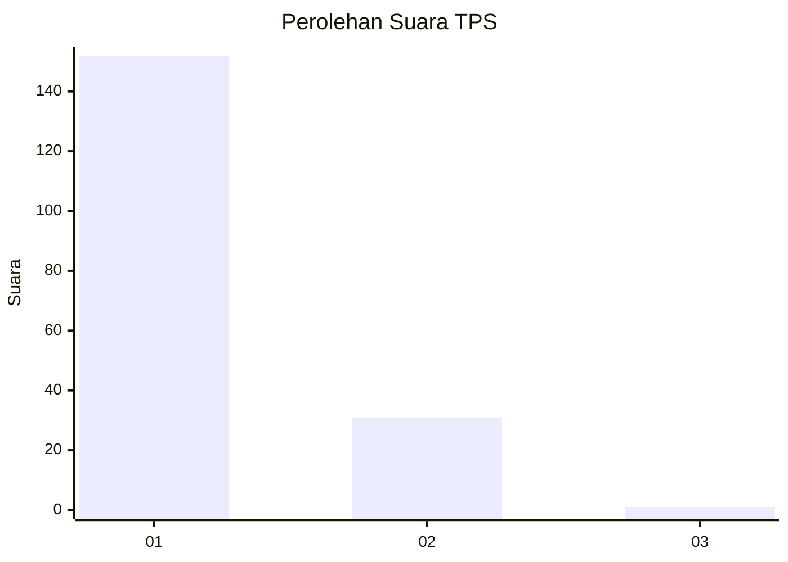
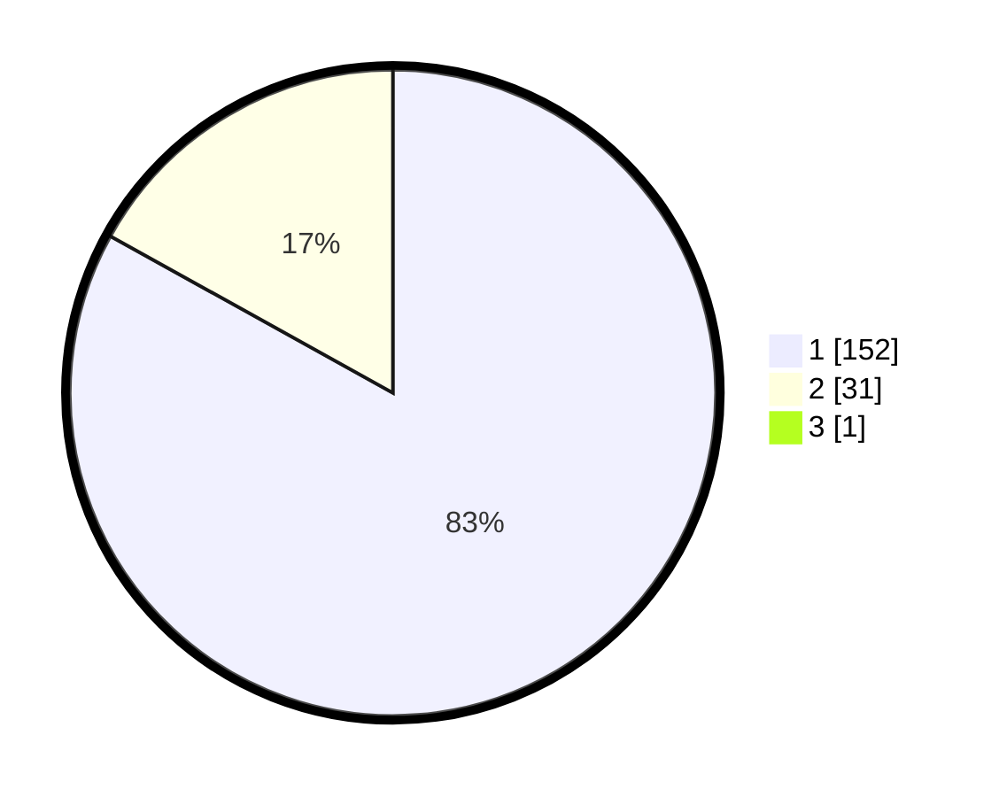

# Hasil

## Grafik

## Tabel

| No. | Nama Paslon    | Suara | Suara (raw) | Persentase |
|:--- |:-------------- | -----:| -----------:| ----------:|
| 1   | ANIES MUHAIMIN | 152   | [152][p-1]  | 82,61      |
| 2   | PRABOWO GIBRAN | 31    | [31][p-2]   | 16,85      |
| 3   | GANJAR MAHFUD  | 1     | [1][p-3]    | 0,54       |

[p-1]: https://github.com/gigit-pemilu/pemilu-2024/blob/main/pilpres/hitung-suara/sub/12-sumatera-utara/sub/13-mandailing-natal/sub/01-panyabungan/sub/2024-pidoli-lombang/sub/008-tps/sub/paslon-1.txt
[p-2]: https://github.com/gigit-pemilu/pemilu-2024/blob/main/pilpres/hitung-suara/sub/12-sumatera-utara/sub/13-mandailing-natal/sub/01-panyabungan/sub/2024-pidoli-lombang/sub/008-tps/sub/paslon-2.txt
[p-3]: https://github.com/gigit-pemilu/pemilu-2024/blob/main/pilpres/hitung-suara/sub/12-sumatera-utara/sub/13-mandailing-natal/sub/01-panyabungan/sub/2024-pidoli-lombang/sub/008-tps/sub/paslon-3.txt

## Foto C Plano

https://sirekap-obj-formc.kpu.go.id/1dbc/pemilu/ppwp/12/13/01/20/24/1213012024008-20240215-110634--f3b5e0a0-c2e7-43ab-954e-f91a3a1874f7.jpg

https://sirekap-obj-formc.kpu.go.id/1dbc/pemilu/ppwp/12/13/01/20/24/1213012024008-20240215-110757--779c3e58-25df-47e5-b80e-652ceac4ee47.jpg

https://sirekap-obj-formc.kpu.go.id/1dbc/pemilu/ppwp/12/13/01/20/24/1213012024008-20240215-110928--bc01163d-a469-4c84-84d8-8bcaae4561b4.jpg

## Metadata

| Key        | Value               |
| ---------- | ------------------- |
| Time Stamp | 2024-02-17 01:22:58 |

