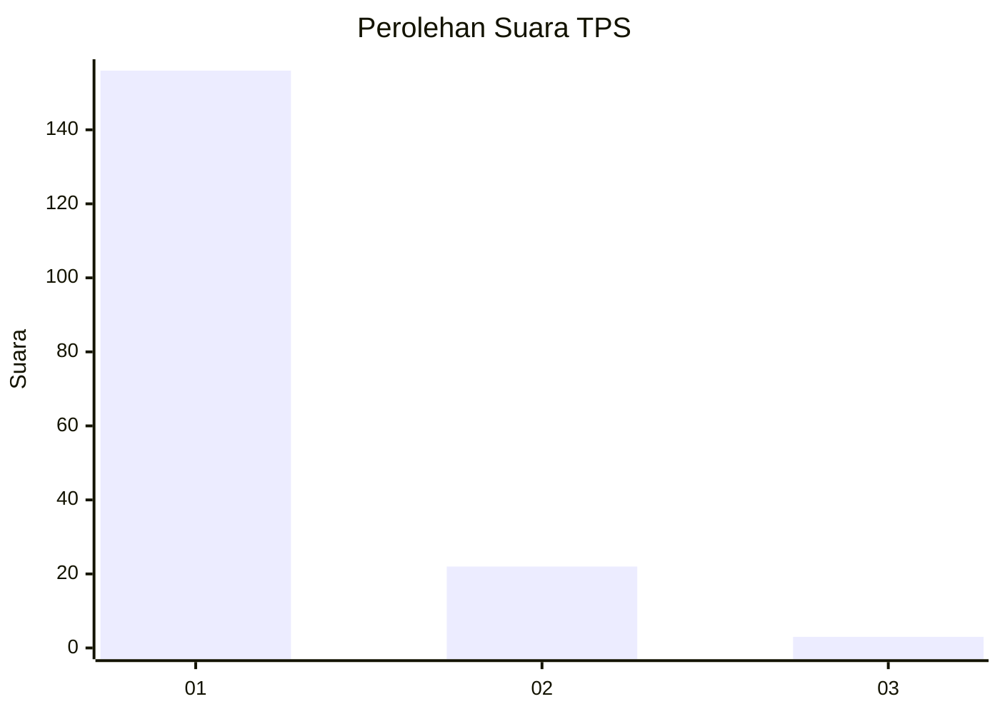
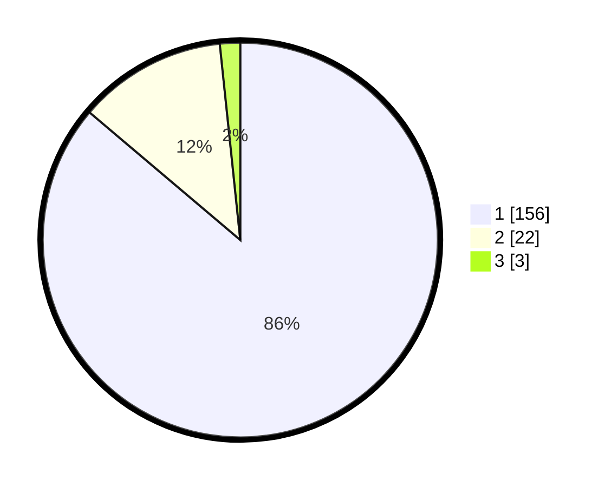

# Hasil

## Grafik

## Tabel

| No. | Nama Paslon    | Suara | Suara (raw) | Persentase |
|:--- |:-------------- | -----:| -----------:| ----------:|
| 1   | ANIES MUHAIMIN | 156   | [156][p-1]  | 86,19      |
| 2   | PRABOWO GIBRAN | 22    | [22][p-2]   | 12,15      |
| 3   | GANJAR MAHFUD  | 3     | [3][p-3]    | 1,66       |

[p-1]: https://github.com/gigit-pemilu/pemilu-2024-12-sumatera-utara/blob/main/pilpres/hitung-suara/sub/12-sumatera-utara/sub/13-mandailing-natal/sub/01-panyabungan/sub/2025-salam-bue/sub/001-tps/sub/paslon-1.txt
[p-2]: https://github.com/gigit-pemilu/pemilu-2024-12-sumatera-utara/blob/main/pilpres/hitung-suara/sub/12-sumatera-utara/sub/13-mandailing-natal/sub/01-panyabungan/sub/2025-salam-bue/sub/001-tps/sub/paslon-2.txt
[p-3]: https://github.com/gigit-pemilu/pemilu-2024-12-sumatera-utara/blob/main/pilpres/hitung-suara/sub/12-sumatera-utara/sub/13-mandailing-natal/sub/01-panyabungan/sub/2025-salam-bue/sub/001-tps/sub/paslon-3.txt

## Foto C Plano

https://sirekap-obj-formc.kpu.go.id/5b9b/pemilu/ppwp/12/13/01/20/25/1213012025001-20240215-002749--12e257b7-a9eb-4ea8-8643-ef61cbe6e758.jpg

https://sirekap-obj-formc.kpu.go.id/5b9b/pemilu/ppwp/12/13/01/20/25/1213012025001-20240215-002740--84f33b15-4ad0-457d-8793-51c6b0bda8ed.jpg

https://sirekap-obj-formc.kpu.go.id/5b9b/pemilu/ppwp/12/13/01/20/25/1213012025001-20240215-002719--25554d99-cf7f-458c-85db-47446751311d.jpg

## Metadata

| Key        | Value               |
| ---------- | ------------------- |
| Time Stamp | 2024-02-17 01:22:58 |

