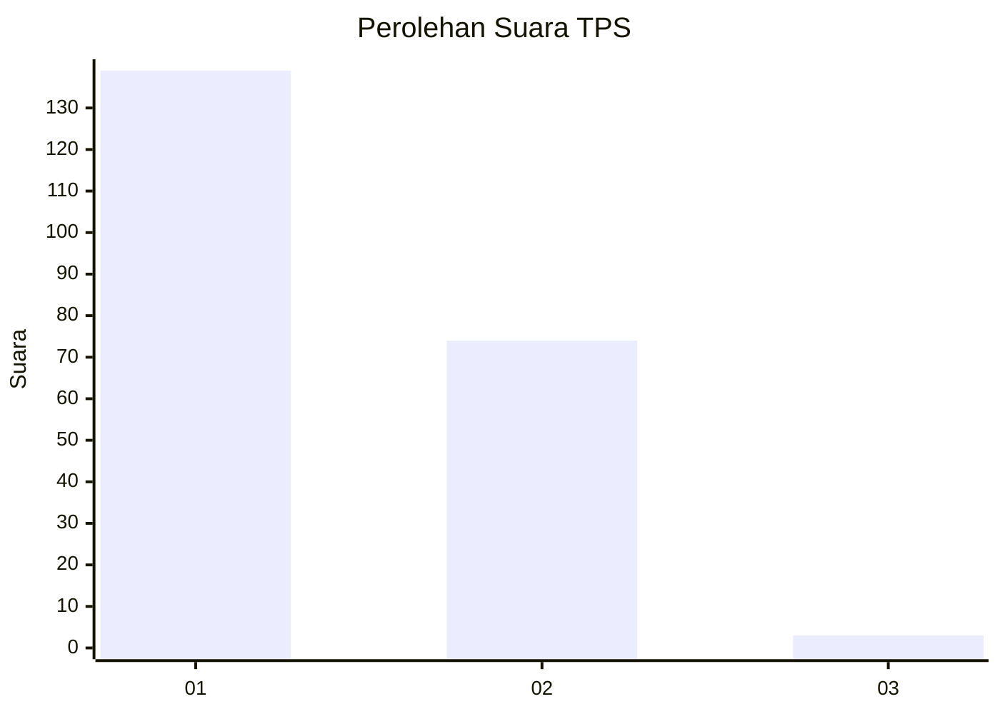
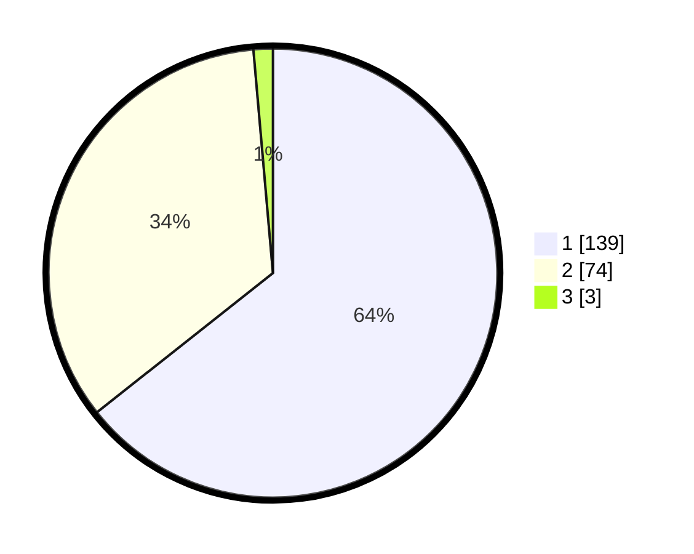

# Hasil

## Grafik

## Tabel

| No. | Nama Paslon    | Suara | Suara (raw) | Persentase |
|:--- |:-------------- | -----:| -----------:| ----------:|
| 1   | ANIES MUHAIMIN | 139   | [139][p-1]  | 64,35      |
| 2   | PRABOWO GIBRAN | 74    | [74][p-2]   | 34,26      |
| 3   | GANJAR MAHFUD  | 3     | [3][p-3]    | 1,39       |

[p-1]: https://github.com/gigit-pemilu/pemilu-2024/blob/main/pilpres/hitung-suara/sub/12-sumatera-utara/sub/13-mandailing-natal/sub/01-panyabungan/sub/2027-sigalapang-julu/sub/003-tps/sub/paslon-1.txt
[p-2]: https://github.com/gigit-pemilu/pemilu-2024/blob/main/pilpres/hitung-suara/sub/12-sumatera-utara/sub/13-mandailing-natal/sub/01-panyabungan/sub/2027-sigalapang-julu/sub/003-tps/sub/paslon-2.txt
[p-3]: https://github.com/gigit-pemilu/pemilu-2024/blob/main/pilpres/hitung-suara/sub/12-sumatera-utara/sub/13-mandailing-natal/sub/01-panyabungan/sub/2027-sigalapang-julu/sub/003-tps/sub/paslon-3.txt

## Foto C Plano

https://sirekap-obj-formc.kpu.go.id/249b/pemilu/ppwp/12/13/01/20/27/1213012027003-20240214-235940--d65d8ac3-9a71-4109-aa5b-20a11be0ee0a.jpg

https://sirekap-obj-formc.kpu.go.id/249b/pemilu/ppwp/12/13/01/20/27/1213012027003-20240215-000128--666a482b-f0bf-4714-bef9-163262d4be3c.jpg

https://sirekap-obj-formc.kpu.go.id/249b/pemilu/ppwp/12/13/01/20/27/1213012027003-20240215-000202--8ce0529c-335f-491e-9b41-1a26a81228d7.jpg

## Metadata

| Key        | Value               |
| ---------- | ------------------- |
| Time Stamp | 2024-02-17 01:22:58 |

