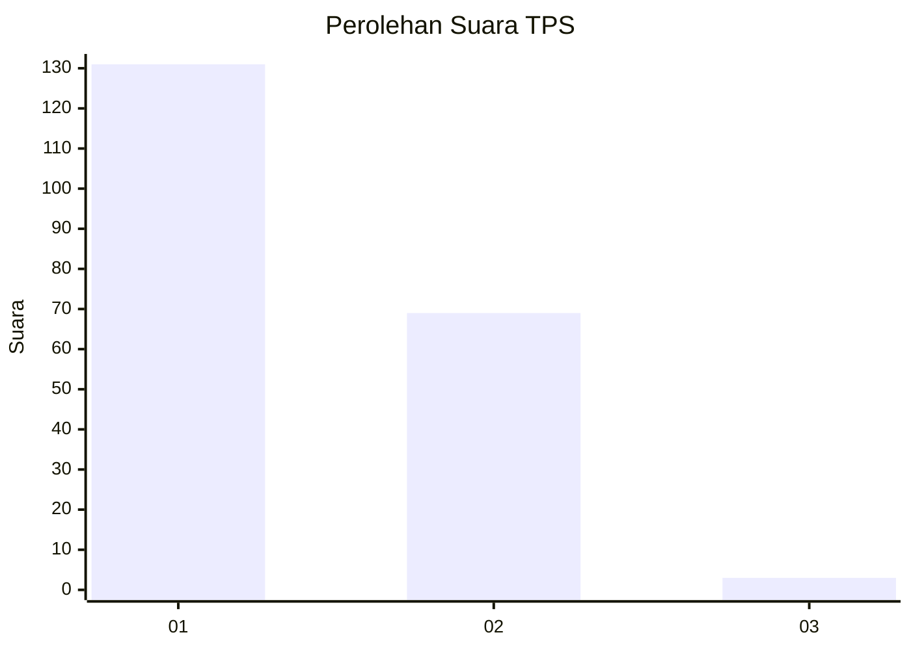
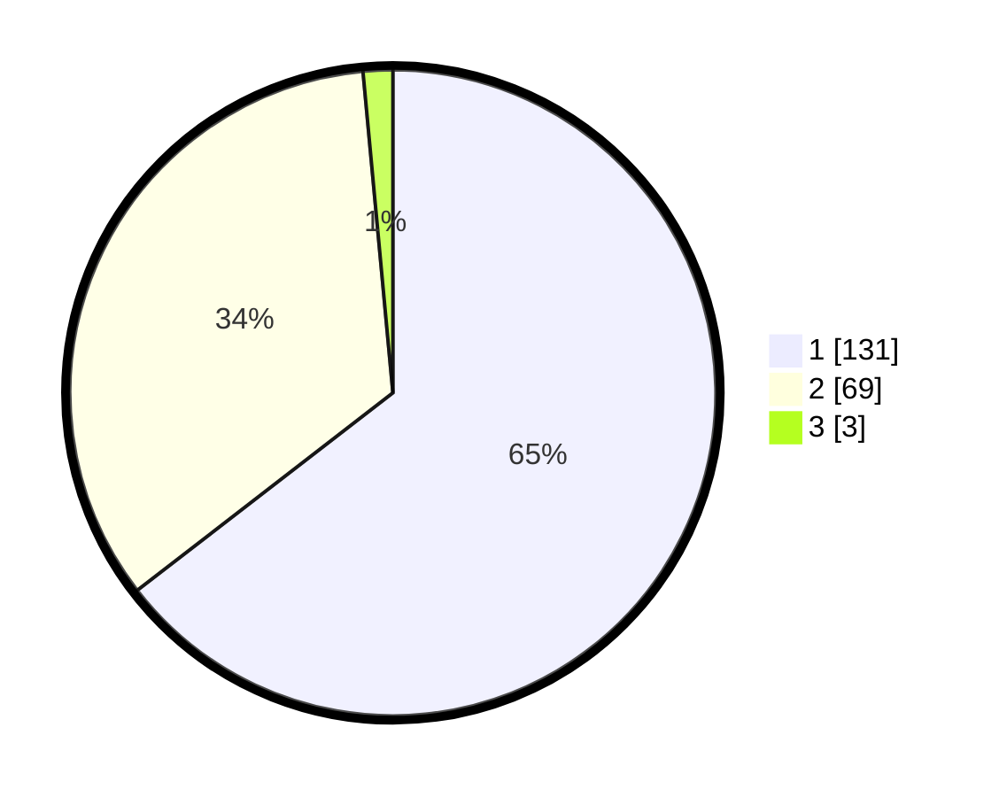

# Hasil

## Grafik

## Tabel

| No. | Nama Paslon    | Suara | Suara (raw) | Persentase |
|:--- |:-------------- | -----:| -----------:| ----------:|
| 1   | ANIES MUHAIMIN | 131   | [131][p-1]  | 64,53      |
| 2   | PRABOWO GIBRAN | 69    | [69][p-2]   | 33,99      |
| 3   | GANJAR MAHFUD  | 3     | [3][p-3]    | 1,48       |

[p-1]: https://github.com/gigit-pemilu/pemilu-2024/blob/main/pilpres/hitung-suara/sub/12-sumatera-utara/sub/13-mandailing-natal/sub/01-panyabungan/sub/2030-sopobatu/sub/001-tps/sub/paslon-1.txt
[p-2]: https://github.com/gigit-pemilu/pemilu-2024/blob/main/pilpres/hitung-suara/sub/12-sumatera-utara/sub/13-mandailing-natal/sub/01-panyabungan/sub/2030-sopobatu/sub/001-tps/sub/paslon-2.txt
[p-3]: https://github.com/gigit-pemilu/pemilu-2024/blob/main/pilpres/hitung-suara/sub/12-sumatera-utara/sub/13-mandailing-natal/sub/01-panyabungan/sub/2030-sopobatu/sub/001-tps/sub/paslon-3.txt

## Foto C Plano

https://sirekap-obj-formc.kpu.go.id/0580/pemilu/ppwp/12/13/01/20/30/1213012030001-20240217-150516--8e6f20bf-71ee-40cd-b486-3a740562a2b8.jpg

https://sirekap-obj-formc.kpu.go.id/0580/pemilu/ppwp/12/13/01/20/30/1213012030001-20240217-150615--db08654e-5c9f-4b9c-b2d0-6f1ead5fad5d.jpg

https://sirekap-obj-formc.kpu.go.id/0580/pemilu/ppwp/12/13/01/20/30/1213012030001-20240217-150711--e52aea6c-b93e-4c11-ae40-94af5efaf5c0.jpg

## Metadata

| Key        | Value               |
| ---------- | ------------------- |
| Time Stamp | 2024-02-25 12:00:00 |

