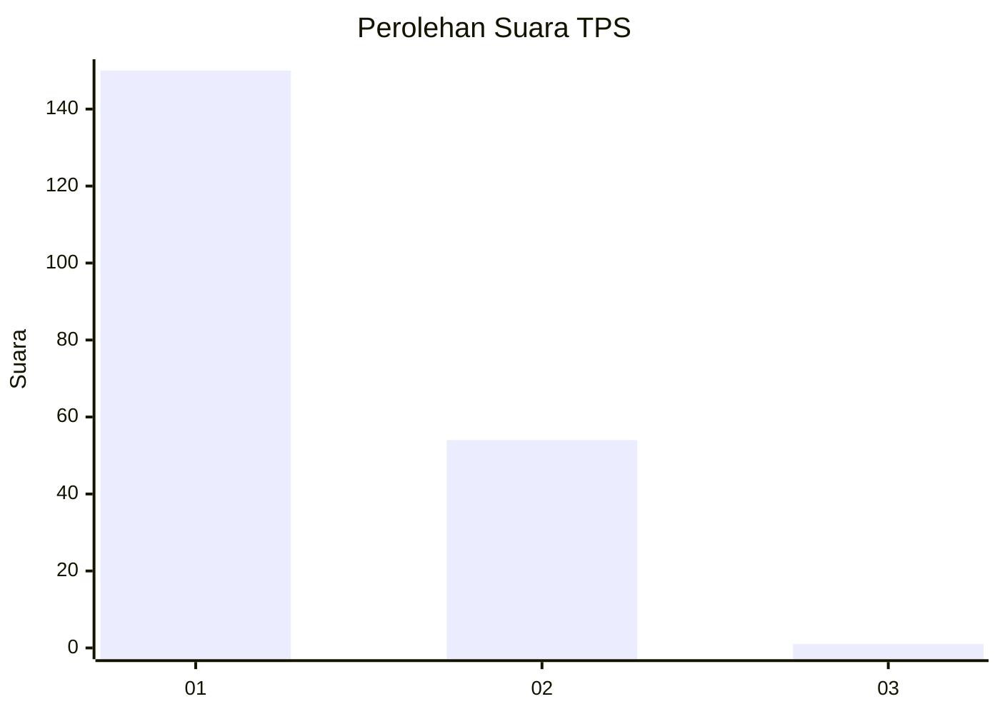
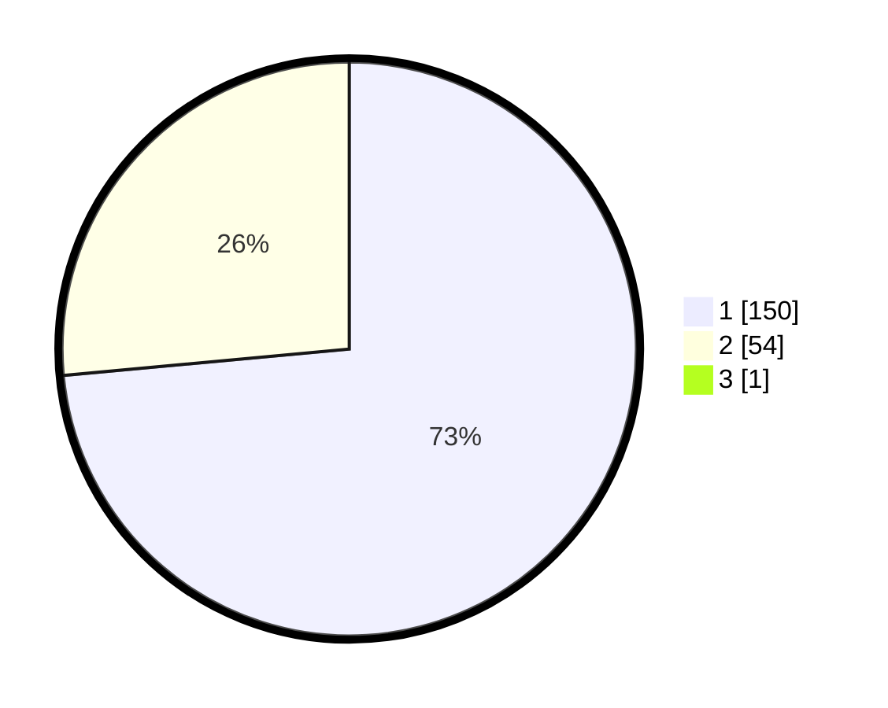

# Hasil

## Grafik

## Tabel

| No. | Nama Paslon    | Suara | Suara (raw) | Persentase |
|:--- |:-------------- | -----:| -----------:| ----------:|
| 1   | ANIES MUHAIMIN | 150   | [150][p-1]  | 73,17      |
| 2   | PRABOWO GIBRAN | 54    | [54][p-2]   | 26,34      |
| 3   | GANJAR MAHFUD  | 1     | [1][p-3]    | 0,49       |

[p-1]: https://github.com/gigit-pemilu/pemilu-2024/blob/main/pilpres/hitung-suara/sub/12-sumatera-utara/sub/13-mandailing-natal/sub/02-panyabungan-utara/sub/1012-mompang-jae/sub/001-tps/sub/paslon-1.txt
[p-2]: https://github.com/gigit-pemilu/pemilu-2024/blob/main/pilpres/hitung-suara/sub/12-sumatera-utara/sub/13-mandailing-natal/sub/02-panyabungan-utara/sub/1012-mompang-jae/sub/001-tps/sub/paslon-2.txt
[p-3]: https://github.com/gigit-pemilu/pemilu-2024/blob/main/pilpres/hitung-suara/sub/12-sumatera-utara/sub/13-mandailing-natal/sub/02-panyabungan-utara/sub/1012-mompang-jae/sub/001-tps/sub/paslon-3.txt

## Foto C Plano

https://sirekap-obj-formc.kpu.go.id/6a03/pemilu/ppwp/12/13/02/10/12/1213021012001-20240217-004744--1adad0e6-2301-4d03-ae86-333d4329bf29.jpg

https://sirekap-obj-formc.kpu.go.id/6a03/pemilu/ppwp/12/13/02/10/12/1213021012001-20240217-005949--7a02ebfb-d665-4f6d-93d0-4849ebc5cf82.jpg

## Metadata

| Key        | Value               |
| ---------- | ------------------- |
| Time Stamp | 2024-02-21 18:00:00 |

