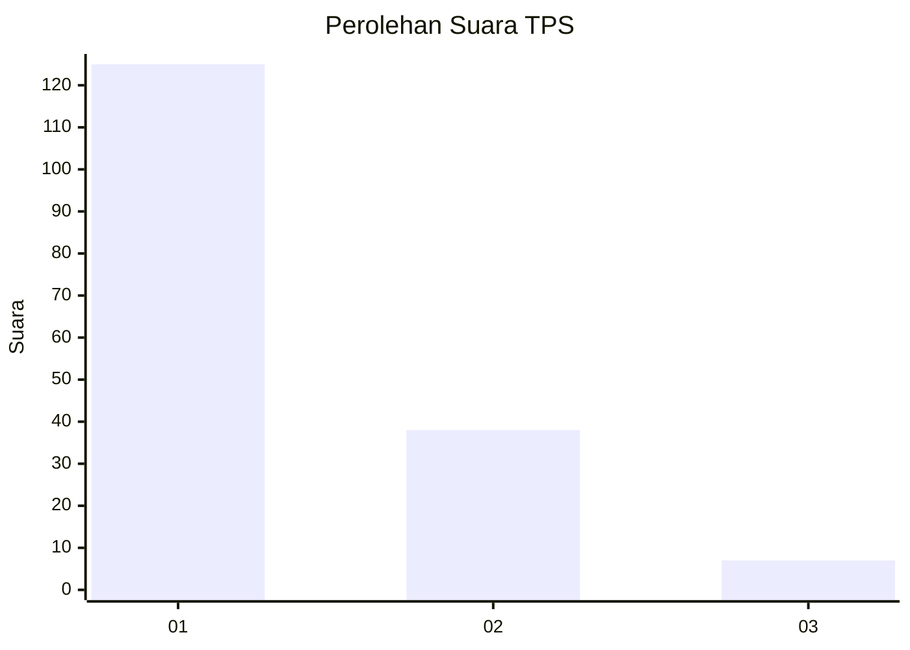
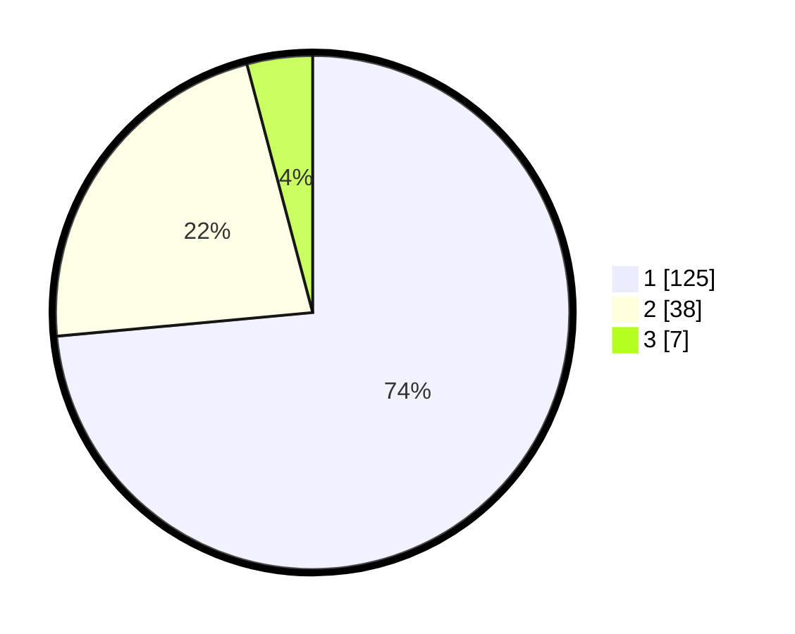

# Hasil

## Grafik

## Tabel

| No. | Nama Paslon    | Suara | Suara (raw) | Persentase |
|:--- |:-------------- | -----:| -----------:| ----------:|
| 1   | ANIES MUHAIMIN | 125   | [125][p-1]  | 73,53      |
| 2   | PRABOWO GIBRAN | 38    | [38][p-2]   | 22,35      |
| 3   | GANJAR MAHFUD  | 7     | [7][p-3]    | 4,12       |

[p-1]: https://github.com/gigit-pemilu/pemilu-2024-12-sumatera-utara/blob/main/pilpres/hitung-suara/sub/12-sumatera-utara/sub/13-mandailing-natal/sub/02-panyabungan-utara/sub/1012-mompang-jae/sub/009-tps/sub/paslon-1.txt
[p-2]: https://github.com/gigit-pemilu/pemilu-2024-12-sumatera-utara/blob/main/pilpres/hitung-suara/sub/12-sumatera-utara/sub/13-mandailing-natal/sub/02-panyabungan-utara/sub/1012-mompang-jae/sub/009-tps/sub/paslon-2.txt
[p-3]: https://github.com/gigit-pemilu/pemilu-2024-12-sumatera-utara/blob/main/pilpres/hitung-suara/sub/12-sumatera-utara/sub/13-mandailing-natal/sub/02-panyabungan-utara/sub/1012-mompang-jae/sub/009-tps/sub/paslon-3.txt

## Foto C Plano

https://sirekap-obj-formc.kpu.go.id/d96b/pemilu/ppwp/12/13/02/10/12/1213021012009-20240217-003759--9cd8d5e7-a1dc-4b49-840c-4c8100e585f1.jpg

https://sirekap-obj-formc.kpu.go.id/d96b/pemilu/ppwp/12/13/02/10/12/1213021012009-20240217-003525--9fb434be-3408-4b40-9221-14bc6cd4c72a.jpg

## Metadata

| Key        | Value               |
| ---------- | ------------------- |
| Time Stamp | 2024-02-25 22:00:00 |

