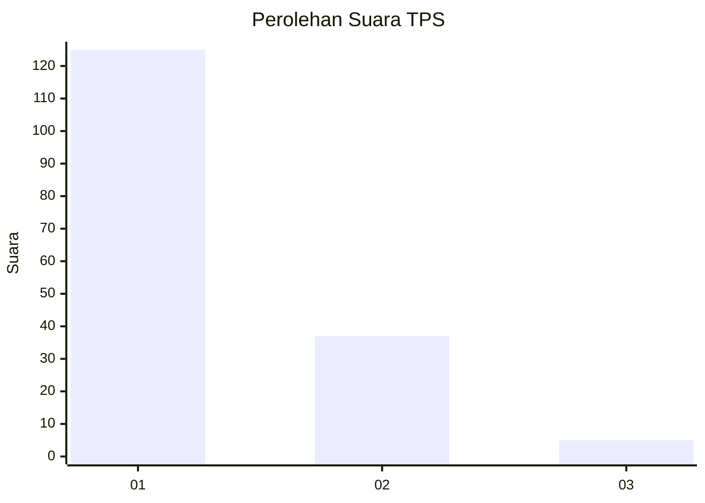
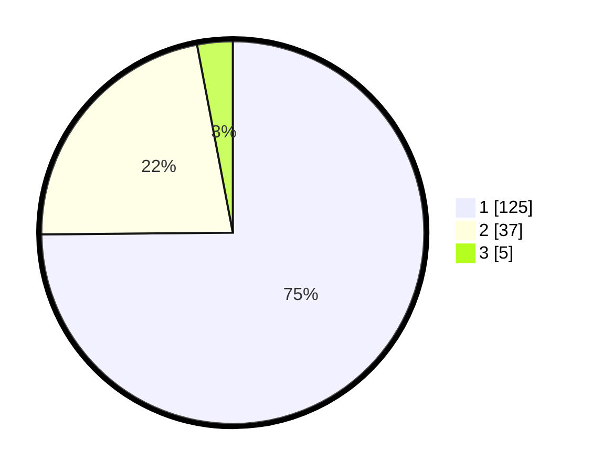

# Hasil

## Grafik

## Tabel

| No. | Nama Paslon    | Suara | Suara (raw) | Persentase |
|:--- |:-------------- | -----:| -----------:| ----------:|
| 1   | ANIES MUHAIMIN | 125   | [125][p-1]  | 74,85      |
| 2   | PRABOWO GIBRAN | 37    | [37][p-2]   | 22,16      |
| 3   | GANJAR MAHFUD  | 5     | [5][p-3]    | 2,99       |

[p-1]: https://github.com/gigit-pemilu/pemilu-2024/blob/main/pilpres/hitung-suara/sub/12-sumatera-utara/sub/13-mandailing-natal/sub/02-panyabungan-utara/sub/1012-mompang-jae/sub/012-tps/sub/paslon-1.txt
[p-2]: https://github.com/gigit-pemilu/pemilu-2024/blob/main/pilpres/hitung-suara/sub/12-sumatera-utara/sub/13-mandailing-natal/sub/02-panyabungan-utara/sub/1012-mompang-jae/sub/012-tps/sub/paslon-2.txt
[p-3]: https://github.com/gigit-pemilu/pemilu-2024/blob/main/pilpres/hitung-suara/sub/12-sumatera-utara/sub/13-mandailing-natal/sub/02-panyabungan-utara/sub/1012-mompang-jae/sub/012-tps/sub/paslon-3.txt

## Foto C Plano

https://sirekap-obj-formc.kpu.go.id/308e/pemilu/ppwp/12/13/02/10/12/1213021012012-20240216-201457--eeb98d95-cabe-44d8-be50-3169f7312f25.jpg

https://sirekap-obj-formc.kpu.go.id/308e/pemilu/ppwp/12/13/02/10/12/1213021012012-20240216-201557--c8240272-4e25-49bf-9916-ba0e41e47d34.jpg

## Metadata

| Key        | Value               |
| ---------- | ------------------- |
| Time Stamp | 2024-02-17 01:00:00 |

