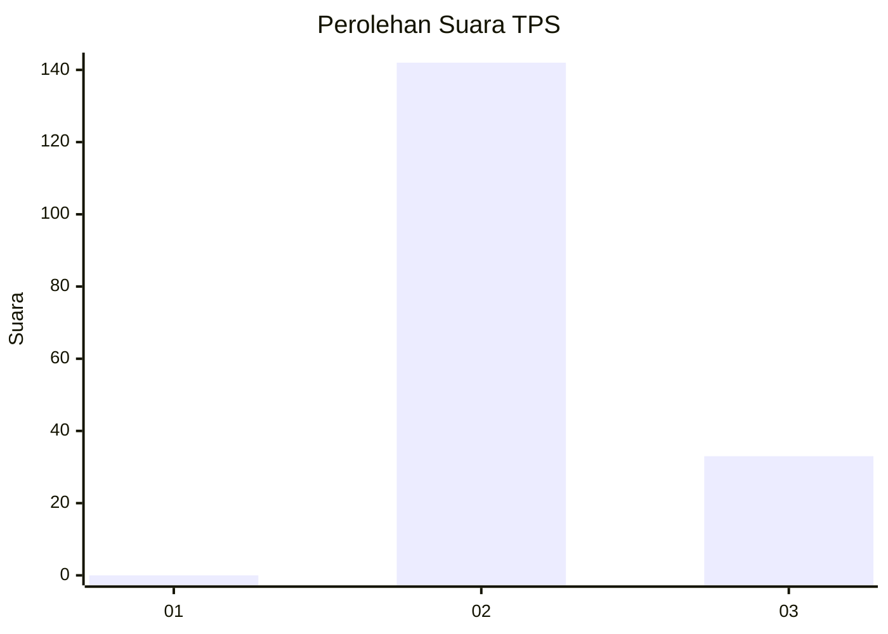
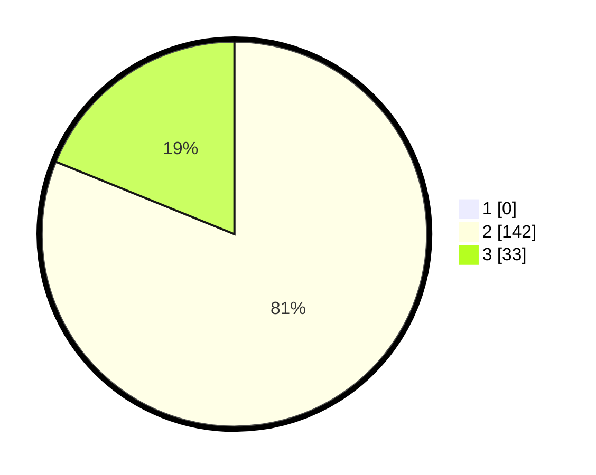

# Hasil

## Grafik

## Tabel

| No. | Nama Paslon    | Suara | Suara (raw) | Persentase |
|:--- |:-------------- | -----:| -----------:| ----------:|
| 1   | ANIES MUHAIMIN | 0     | [0][p-1]    | 0,00       |
| 2   | PRABOWO GIBRAN | 142   | [142][p-2]  | 81,14      |
| 3   | GANJAR MAHFUD  | 33    | [33][p-3]   | 18,86      |

[p-1]: https://github.com/gigit-pemilu/pemilu-2024/blob/main/pilpres/hitung-suara/sub/12-sumatera-utara/sub/13-mandailing-natal/sub/02-panyabungan-utara/sub/2007-huta-damai/sub/001-tps/sub/paslon-1.txt
[p-2]: https://github.com/gigit-pemilu/pemilu-2024/blob/main/pilpres/hitung-suara/sub/12-sumatera-utara/sub/13-mandailing-natal/sub/02-panyabungan-utara/sub/2007-huta-damai/sub/001-tps/sub/paslon-2.txt
[p-3]: https://github.com/gigit-pemilu/pemilu-2024/blob/main/pilpres/hitung-suara/sub/12-sumatera-utara/sub/13-mandailing-natal/sub/02-panyabungan-utara/sub/2007-huta-damai/sub/001-tps/sub/paslon-3.txt

## Foto C Plano

https://sirekap-obj-formc.kpu.go.id/a0d1/pemilu/ppwp/12/13/02/20/07/1213022007001-20240215-064522--2822f7bb-9a42-4b34-a307-dc1de8ff2e8a.jpg

https://sirekap-obj-formc.kpu.go.id/a0d1/pemilu/ppwp/12/13/02/20/07/1213022007001-20240215-064923--93f89039-47fe-49bf-bfe4-010b36fb683f.jpg

https://sirekap-obj-formc.kpu.go.id/a0d1/pemilu/ppwp/12/13/02/20/07/1213022007001-20240215-034048--facbb0f6-b811-4080-94ff-ec7cc50f04da.jpg

## Metadata

| Key        | Value               |
| ---------- | ------------------- |
| Time Stamp | 2024-02-15 22:40:13 |

