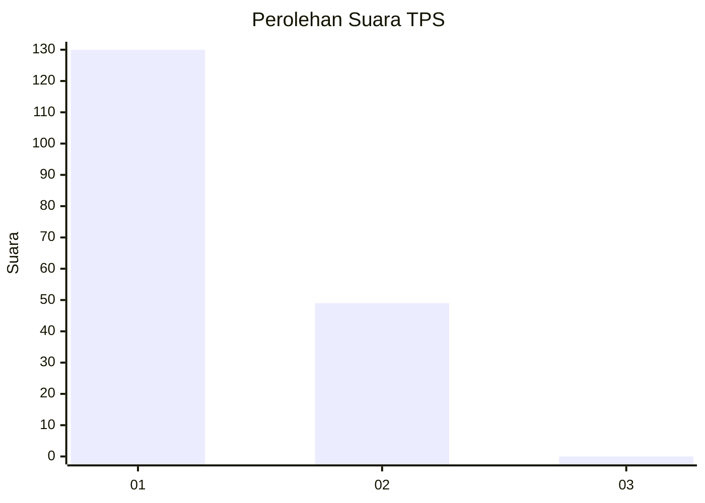
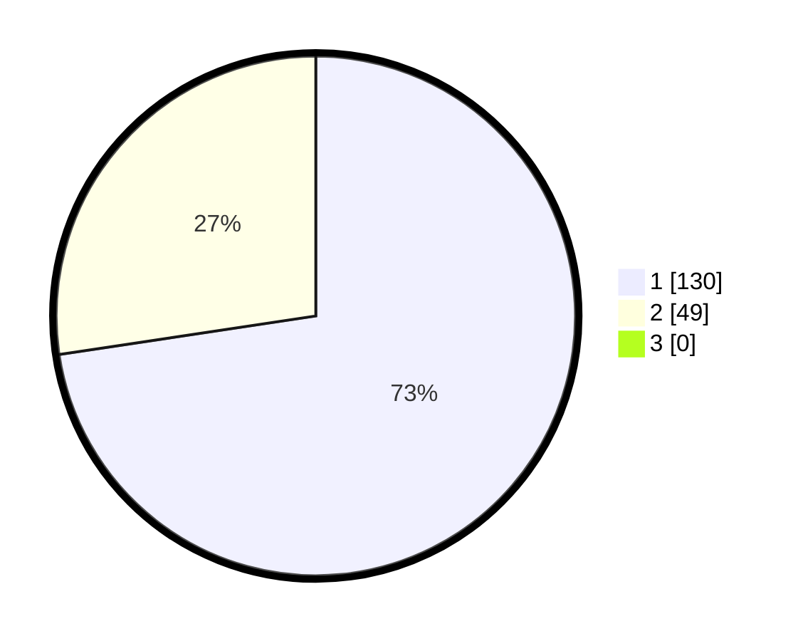

# Hasil

## Grafik

## Tabel

| No. | Nama Paslon    | Suara | Suara (raw) | Persentase |
|:--- |:-------------- | -----:| -----------:| ----------:|
| 1   | ANIES MUHAIMIN | 130   | [130][p-1]  | 72,63      |
| 2   | PRABOWO GIBRAN | 49    | [49][p-2]   | 27,37      |
| 3   | GANJAR MAHFUD  | 0     | [0][p-3]    | 0,00       |

[p-1]: https://github.com/gigit-pemilu/pemilu-2024/blob/main/pilpres/hitung-suara/sub/12-sumatera-utara/sub/13-mandailing-natal/sub/02-panyabungan-utara/sub/2008-jambur-padang-matinggi/sub/003-tps/sub/paslon-1.txt
[p-2]: https://github.com/gigit-pemilu/pemilu-2024/blob/main/pilpres/hitung-suara/sub/12-sumatera-utara/sub/13-mandailing-natal/sub/02-panyabungan-utara/sub/2008-jambur-padang-matinggi/sub/003-tps/sub/paslon-2.txt
[p-3]: https://github.com/gigit-pemilu/pemilu-2024/blob/main/pilpres/hitung-suara/sub/12-sumatera-utara/sub/13-mandailing-natal/sub/02-panyabungan-utara/sub/2008-jambur-padang-matinggi/sub/003-tps/sub/paslon-3.txt

## Foto C Plano

https://sirekap-obj-formc.kpu.go.id/b8eb/pemilu/ppwp/12/13/02/20/08/1213022008003-20240215-080311--67504f7d-80fc-45b3-aa29-47e2232af7aa.jpg

https://sirekap-obj-formc.kpu.go.id/b8eb/pemilu/ppwp/12/13/02/20/08/1213022008003-20240215-080408--dea815a6-f5e6-4d65-9ca5-076008c8de39.jpg

https://sirekap-obj-formc.kpu.go.id/b8eb/pemilu/ppwp/12/13/02/20/08/1213022008003-20240215-080502--55ecb498-20c1-494a-808b-2bda667296e1.jpg

## Metadata

| Key        | Value               |
| ---------- | ------------------- |
| Time Stamp | 2024-02-15 23:29:50 |

