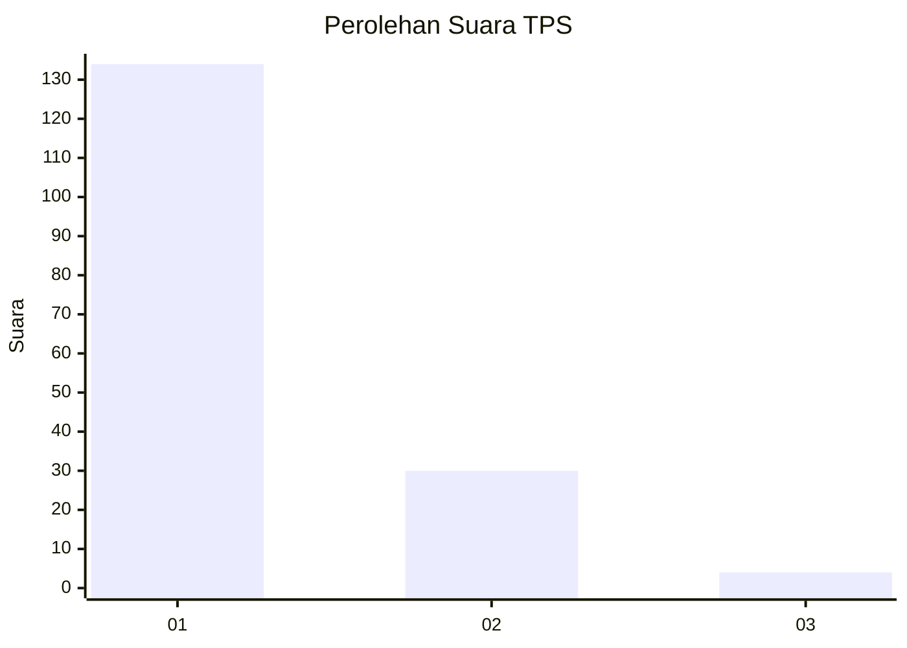
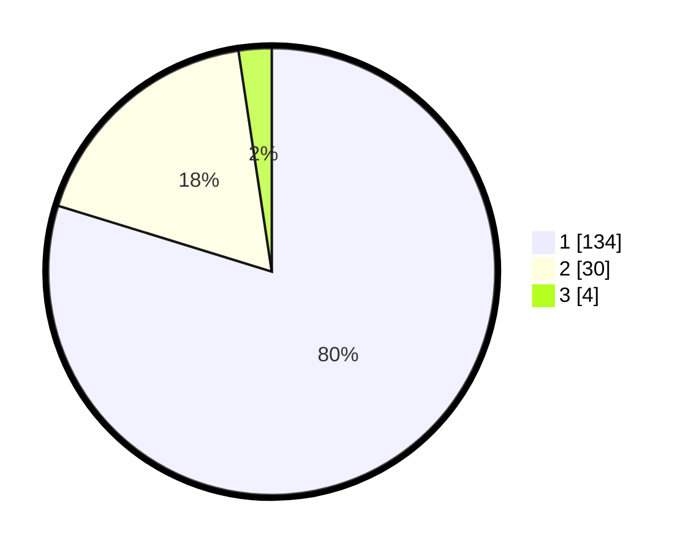

# Hasil

## Grafik

## Tabel

| No. | Nama Paslon    | Suara | Suara (raw) | Persentase |
|:--- |:-------------- | -----:| -----------:| ----------:|
| 1   | ANIES MUHAIMIN | 134   | [134][p-1]  | 79,76      |
| 2   | PRABOWO GIBRAN | 30    | [30][p-2]   | 17,86      |
| 3   | GANJAR MAHFUD  | 4     | [4][p-3]    | 2,38       |

[p-1]: https://github.com/gigit-pemilu/pemilu-2024/blob/main/pilpres/hitung-suara/sub/12-sumatera-utara/sub/13-mandailing-natal/sub/02-panyabungan-utara/sub/2008-jambur-padang-matinggi/sub/007-tps/sub/paslon-1.txt
[p-2]: https://github.com/gigit-pemilu/pemilu-2024/blob/main/pilpres/hitung-suara/sub/12-sumatera-utara/sub/13-mandailing-natal/sub/02-panyabungan-utara/sub/2008-jambur-padang-matinggi/sub/007-tps/sub/paslon-2.txt
[p-3]: https://github.com/gigit-pemilu/pemilu-2024/blob/main/pilpres/hitung-suara/sub/12-sumatera-utara/sub/13-mandailing-natal/sub/02-panyabungan-utara/sub/2008-jambur-padang-matinggi/sub/007-tps/sub/paslon-3.txt

## Foto C Plano

https://sirekap-obj-formc.kpu.go.id/24c7/pemilu/ppwp/12/13/02/20/08/1213022008007-20240215-051711--eb9a5fcf-66dd-4396-b68e-77d74002006c.jpg

https://sirekap-obj-formc.kpu.go.id/24c7/pemilu/ppwp/12/13/02/20/08/1213022008007-20240215-051919--0cc7e8c5-7935-420e-a622-84cebbedf32c.jpg

https://sirekap-obj-formc.kpu.go.id/24c7/pemilu/ppwp/12/13/02/20/08/1213022008007-20240215-052029--7162bba8-bf32-44d3-ad1e-b6b493627385.jpg

## Metadata

| Key        | Value               |
| ---------- | ------------------- |
| Time Stamp | 2024-02-15 23:29:50 |

