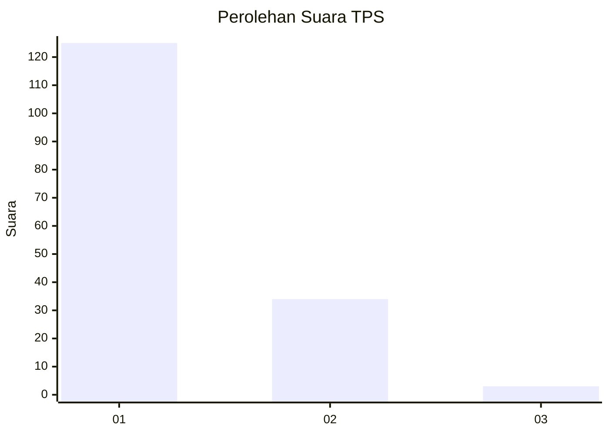
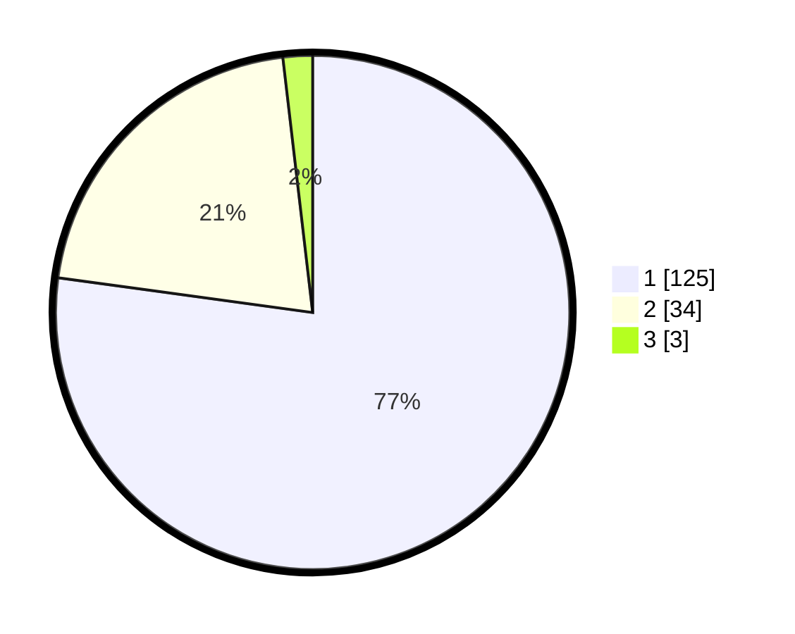

# Hasil

## Grafik

## Tabel

| No. | Nama Paslon    | Suara | Suara (raw) | Persentase |
|:--- |:-------------- | -----:| -----------:| ----------:|
| 1   | ANIES MUHAIMIN | 125   | [125][p-1]  | 77,16      |
| 2   | PRABOWO GIBRAN | 34    | [34][p-2]   | 20,99      |
| 3   | GANJAR MAHFUD  | 3     | [3][p-3]    | 1,85       |

[p-1]: https://github.com/gigit-pemilu/pemilu-2024-12-sumatera-utara/blob/main/pilpres/hitung-suara/sub/12-sumatera-utara/sub/13-mandailing-natal/sub/02-panyabungan-utara/sub/2008-jambur-padang-matinggi/sub/011-tps/sub/paslon-1.txt
[p-2]: https://github.com/gigit-pemilu/pemilu-2024-12-sumatera-utara/blob/main/pilpres/hitung-suara/sub/12-sumatera-utara/sub/13-mandailing-natal/sub/02-panyabungan-utara/sub/2008-jambur-padang-matinggi/sub/011-tps/sub/paslon-2.txt
[p-3]: https://github.com/gigit-pemilu/pemilu-2024-12-sumatera-utara/blob/main/pilpres/hitung-suara/sub/12-sumatera-utara/sub/13-mandailing-natal/sub/02-panyabungan-utara/sub/2008-jambur-padang-matinggi/sub/011-tps/sub/paslon-3.txt

## Foto C Plano

https://sirekap-obj-formc.kpu.go.id/7676/pemilu/ppwp/12/13/02/20/08/1213022008011-20240215-112546--46e26a0d-53e0-4e3b-b937-5bca80a68c82.jpg

https://sirekap-obj-formc.kpu.go.id/7676/pemilu/ppwp/12/13/02/20/08/1213022008011-20240215-112555--258a697c-58cd-45ca-81d5-8a714c7508ea.jpg

https://sirekap-obj-formc.kpu.go.id/7676/pemilu/ppwp/12/13/02/20/08/1213022008011-20240215-112602--fcc386c6-a28b-41cc-a214-2bbd4d4f90e7.jpg

## Metadata

| Key        | Value               |
| ---------- | ------------------- |
| Time Stamp | 2024-02-15 23:29:50 |

