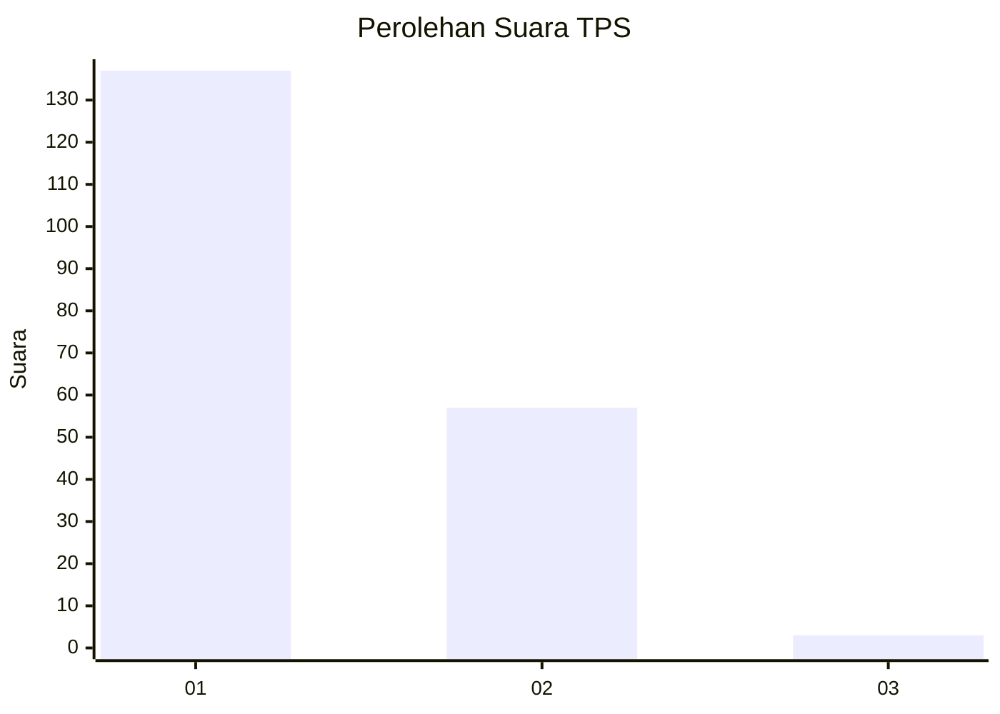
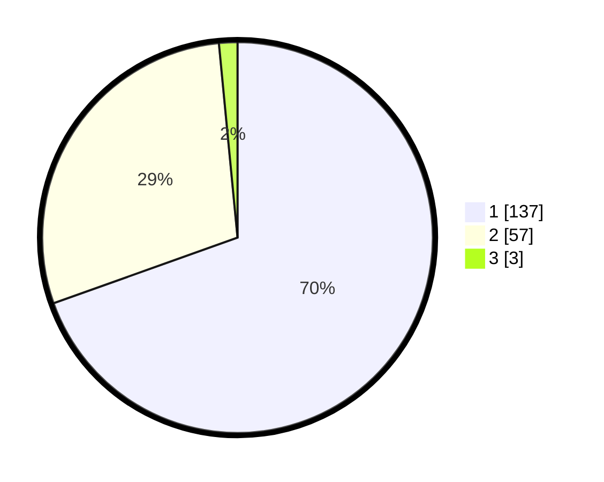

# Hasil

## Grafik

## Tabel

| No. | Nama Paslon    | Suara | Suara (raw) | Persentase |
|:--- |:-------------- | -----:| -----------:| ----------:|
| 1   | ANIES MUHAIMIN | 137   | [137][p-1]  | 69,54      |
| 2   | PRABOWO GIBRAN | 57    | [57][p-2]   | 28,93      |
| 3   | GANJAR MAHFUD  | 3     | [3][p-3]    | 1,52       |

[p-1]: https://github.com/gigit-pemilu/pemilu-2024-12-sumatera-utara/blob/main/pilpres/hitung-suara/sub/12-sumatera-utara/sub/13-mandailing-natal/sub/02-panyabungan-utara/sub/2010-mompang-julu/sub/010-tps/sub/paslon-1.txt
[p-2]: https://github.com/gigit-pemilu/pemilu-2024-12-sumatera-utara/blob/main/pilpres/hitung-suara/sub/12-sumatera-utara/sub/13-mandailing-natal/sub/02-panyabungan-utara/sub/2010-mompang-julu/sub/010-tps/sub/paslon-2.txt
[p-3]: https://github.com/gigit-pemilu/pemilu-2024-12-sumatera-utara/blob/main/pilpres/hitung-suara/sub/12-sumatera-utara/sub/13-mandailing-natal/sub/02-panyabungan-utara/sub/2010-mompang-julu/sub/010-tps/sub/paslon-3.txt

## Foto C Plano

https://sirekap-obj-formc.kpu.go.id/75b5/pemilu/ppwp/12/13/02/20/10/1213022010010-20240214-214944--55087138-0f45-4ad2-8466-f71d1d51e20f.jpg

https://sirekap-obj-formc.kpu.go.id/75b5/pemilu/ppwp/12/13/02/20/10/1213022010010-20240214-215141--7b4b8aaf-2e24-489f-9949-aedf39948548.jpg

https://sirekap-obj-formc.kpu.go.id/75b5/pemilu/ppwp/12/13/02/20/10/1213022010010-20240214-215241--bc63b766-6e9f-4864-88e4-5806f1ba1ef8.jpg

## Metadata

| Key        | Value               |
| ---------- | ------------------- |
| Time Stamp | 2024-02-16 00:00:26 |

