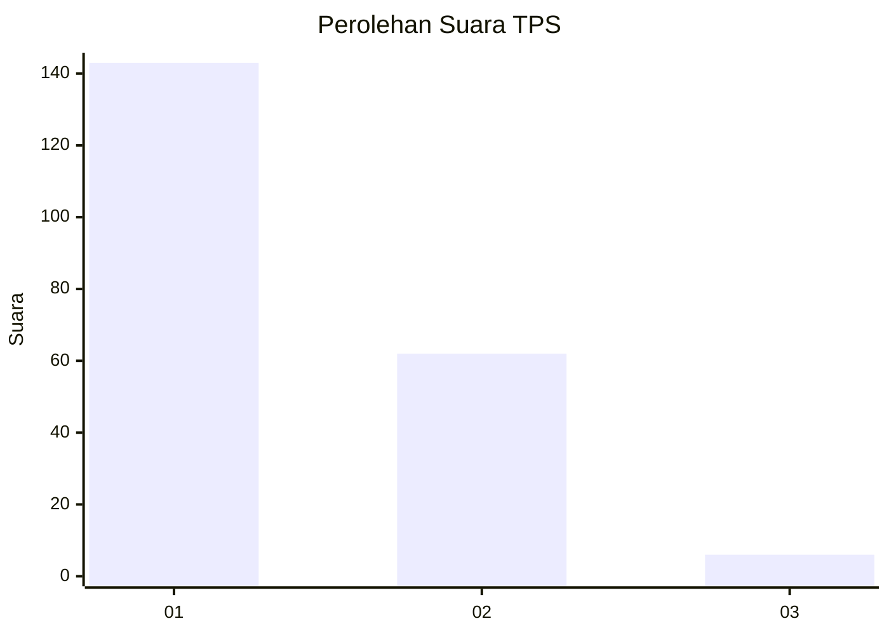
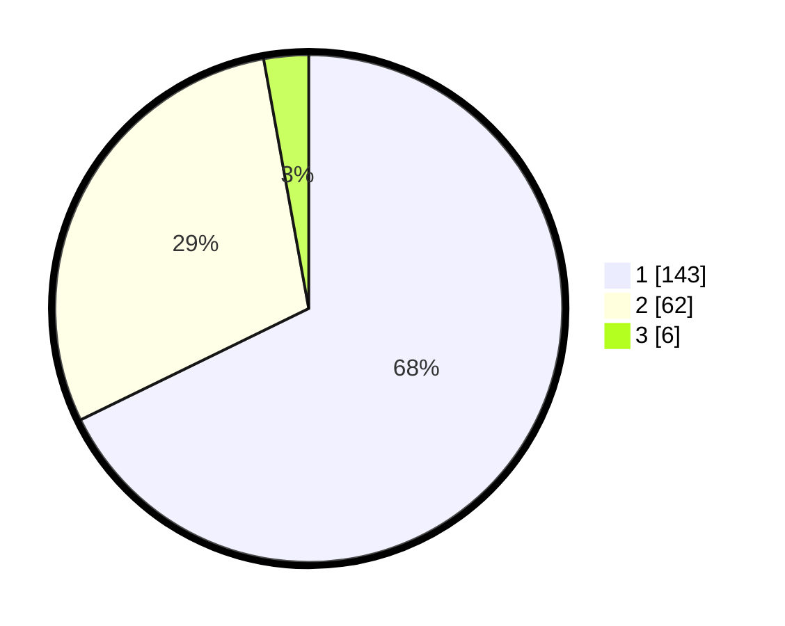

# Hasil

## Grafik

## Tabel

| No. | Nama Paslon    | Suara | Suara (raw) | Persentase |
|:--- |:-------------- | -----:| -----------:| ----------:|
| 1   | ANIES MUHAIMIN | 143   | [143][p-1]  | 67,77      |
| 2   | PRABOWO GIBRAN | 62    | [62][p-2]   | 29,38      |
| 3   | GANJAR MAHFUD  | 6     | [6][p-3]    | 2,84       |

[p-1]: https://github.com/gigit-pemilu/pemilu-2024/blob/main/pilpres/hitung-suara/sub/12-sumatera-utara/sub/13-mandailing-natal/sub/02-panyabungan-utara/sub/2010-mompang-julu/sub/011-tps/sub/paslon-1.txt
[p-2]: https://github.com/gigit-pemilu/pemilu-2024/blob/main/pilpres/hitung-suara/sub/12-sumatera-utara/sub/13-mandailing-natal/sub/02-panyabungan-utara/sub/2010-mompang-julu/sub/011-tps/sub/paslon-2.txt
[p-3]: https://github.com/gigit-pemilu/pemilu-2024/blob/main/pilpres/hitung-suara/sub/12-sumatera-utara/sub/13-mandailing-natal/sub/02-panyabungan-utara/sub/2010-mompang-julu/sub/011-tps/sub/paslon-3.txt

## Foto C Plano

https://sirekap-obj-formc.kpu.go.id/5d0e/pemilu/ppwp/12/13/02/20/10/1213022010011-20240215-011827--9ebe395a-a751-4c9f-a02b-9da6fbf1b82b.jpg

https://sirekap-obj-formc.kpu.go.id/5d0e/pemilu/ppwp/12/13/02/20/10/1213022010011-20240215-011909--0c49bd55-f2e4-4889-9689-7572ef986045.jpg

https://sirekap-obj-formc.kpu.go.id/5d0e/pemilu/ppwp/12/13/02/20/10/1213022010011-20240215-011952--95e4268a-24cd-45f7-8f90-420b6d1ec14f.jpg

## Metadata

| Key        | Value               |
| ---------- | ------------------- |
| Time Stamp | 2024-02-15 23:29:50 |

