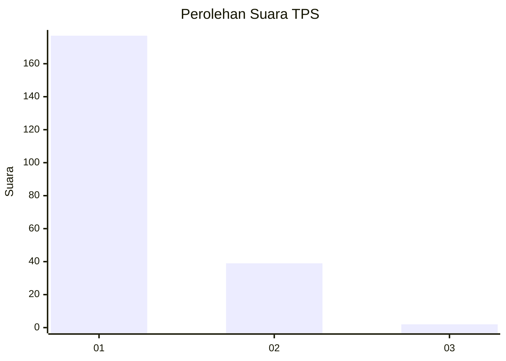
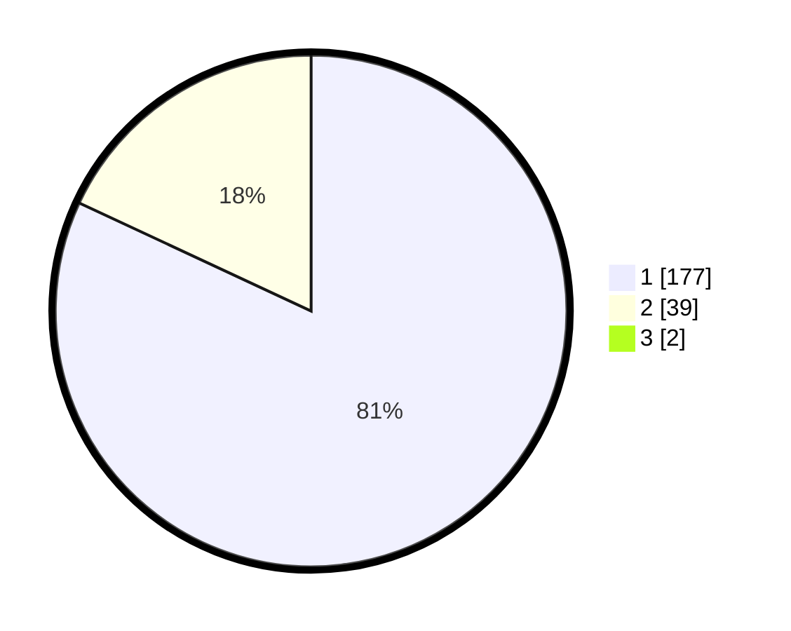

# Hasil

## Grafik

## Tabel

| No. | Nama Paslon    | Suara | Suara (raw) | Persentase |
|:--- |:-------------- | -----:| -----------:| ----------:|
| 1   | ANIES MUHAIMIN | 177   | [177][p-1]  | 81,19      |
| 2   | PRABOWO GIBRAN | 39    | [39][p-2]   | 17,89      |
| 3   | GANJAR MAHFUD  | 2     | [2][p-3]    | 0,92       |

[p-1]: https://github.com/gigit-pemilu/pemilu-2024-12-sumatera-utara/blob/main/pilpres/hitung-suara/sub/12-sumatera-utara/sub/13-mandailing-natal/sub/02-panyabungan-utara/sub/2014-rumbio/sub/001-tps/sub/paslon-1.txt
[p-2]: https://github.com/gigit-pemilu/pemilu-2024-12-sumatera-utara/blob/main/pilpres/hitung-suara/sub/12-sumatera-utara/sub/13-mandailing-natal/sub/02-panyabungan-utara/sub/2014-rumbio/sub/001-tps/sub/paslon-2.txt
[p-3]: https://github.com/gigit-pemilu/pemilu-2024-12-sumatera-utara/blob/main/pilpres/hitung-suara/sub/12-sumatera-utara/sub/13-mandailing-natal/sub/02-panyabungan-utara/sub/2014-rumbio/sub/001-tps/sub/paslon-3.txt

## Foto C Plano

https://sirekap-obj-formc.kpu.go.id/75c4/pemilu/ppwp/12/13/02/20/14/1213022014001-20240215-052004--1b15417b-9c5e-4257-87b6-7a3403b94089.jpg

https://sirekap-obj-formc.kpu.go.id/75c4/pemilu/ppwp/12/13/02/20/14/1213022014001-20240215-052228--c3272cdc-1972-43e3-8ad5-78250921c657.jpg

https://sirekap-obj-formc.kpu.go.id/75c4/pemilu/ppwp/12/13/02/20/14/1213022014001-20240215-052508--74730e51-4ae3-4e33-9011-97d41d1d70f2.jpg

## Metadata

| Key        | Value               |
| ---------- | ------------------- |
| Time Stamp | 2024-02-16 00:00:26 |

