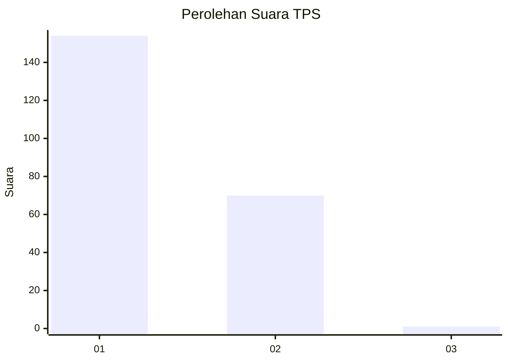
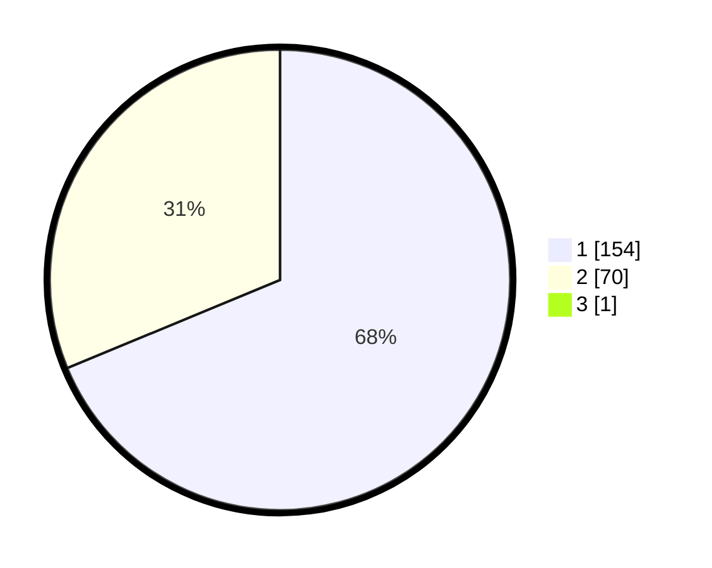

# Hasil

## Grafik

## Tabel

| No. | Nama Paslon    | Suara | Suara (raw) | Persentase |
|:--- |:-------------- | -----:| -----------:| ----------:|
| 1   | ANIES MUHAIMIN | 154   | [154][p-1]  | 68,44      |
| 2   | PRABOWO GIBRAN | 70    | [70][p-2]   | 31,11      |
| 3   | GANJAR MAHFUD  | 1     | [1][p-3]    | 0,44       |

[p-1]: https://github.com/gigit-pemilu/pemilu-2024/blob/main/pilpres/hitung-suara/sub/12-sumatera-utara/sub/13-mandailing-natal/sub/02-panyabungan-utara/sub/2014-rumbio/sub/004-tps/sub/paslon-1.txt
[p-2]: https://github.com/gigit-pemilu/pemilu-2024/blob/main/pilpres/hitung-suara/sub/12-sumatera-utara/sub/13-mandailing-natal/sub/02-panyabungan-utara/sub/2014-rumbio/sub/004-tps/sub/paslon-2.txt
[p-3]: https://github.com/gigit-pemilu/pemilu-2024/blob/main/pilpres/hitung-suara/sub/12-sumatera-utara/sub/13-mandailing-natal/sub/02-panyabungan-utara/sub/2014-rumbio/sub/004-tps/sub/paslon-3.txt

## Foto C Plano

https://sirekap-obj-formc.kpu.go.id/c555/pemilu/ppwp/12/13/02/20/14/1213022014004-20240215-084039--3f3f4a58-9e71-4790-a0f8-4921a8bce8c6.jpg

https://sirekap-obj-formc.kpu.go.id/c555/pemilu/ppwp/12/13/02/20/14/1213022014004-20240215-084155--bde3585d-43b4-4aa8-be2d-311d276f3edf.jpg

https://sirekap-obj-formc.kpu.go.id/c555/pemilu/ppwp/12/13/02/20/14/1213022014004-20240215-084310--7c4a1d2f-0661-453a-8bc6-9cf2c55f5b3e.jpg

## Metadata

| Key        | Value               |
| ---------- | ------------------- |
| Time Stamp | 2024-02-16 00:00:26 |

