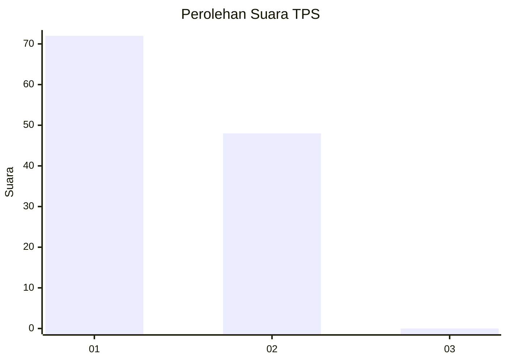
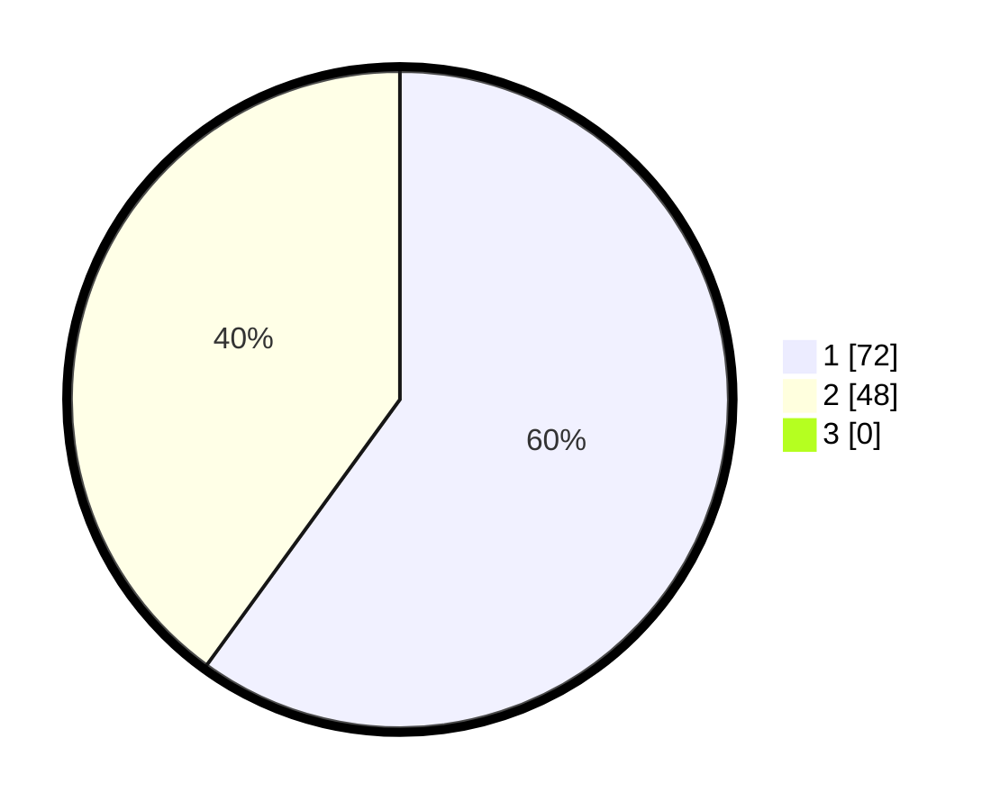

# Hasil

## Grafik

## Tabel

| No. | Nama Paslon    | Suara | Suara (raw) | Persentase |
|:--- |:-------------- | -----:| -----------:| ----------:|
| 1   | ANIES MUHAIMIN | 72    | [72][p-1]   | 60,00      |
| 2   | PRABOWO GIBRAN | 48    | [48][p-2]   | 40,00      |
| 3   | GANJAR MAHFUD  | 0     | [0][p-3]    | 0,00       |

[p-1]: https://github.com/gigit-pemilu/pemilu-2024-12-sumatera-utara/blob/main/pilpres/hitung-suara/sub/12-sumatera-utara/sub/13-mandailing-natal/sub/02-panyabungan-utara/sub/2017-sopo-sorik/sub/001-tps/sub/paslon-1.txt
[p-2]: https://github.com/gigit-pemilu/pemilu-2024-12-sumatera-utara/blob/main/pilpres/hitung-suara/sub/12-sumatera-utara/sub/13-mandailing-natal/sub/02-panyabungan-utara/sub/2017-sopo-sorik/sub/001-tps/sub/paslon-2.txt
[p-3]: https://github.com/gigit-pemilu/pemilu-2024-12-sumatera-utara/blob/main/pilpres/hitung-suara/sub/12-sumatera-utara/sub/13-mandailing-natal/sub/02-panyabungan-utara/sub/2017-sopo-sorik/sub/001-tps/sub/paslon-3.txt

## Foto C Plano

https://sirekap-obj-formc.kpu.go.id/f942/pemilu/ppwp/12/13/02/20/17/1213022017001-20240217-223111--a2a787c8-8ba8-4830-bcde-263dcfedf28f.jpg

https://sirekap-obj-formc.kpu.go.id/f942/pemilu/ppwp/12/13/02/20/17/1213022017001-20240215-020031--5190b2fa-5545-4414-8bd3-4f2adfe0486c.jpg

https://sirekap-obj-formc.kpu.go.id/f942/pemilu/ppwp/12/13/02/20/17/1213022017001-20240215-015703--27096b26-176c-44fd-99f2-6b5ae5dc7952.jpg

## Metadata

| Key        | Value               |
| ---------- | ------------------- |
| Time Stamp | 2024-02-19 06:16:00 |

