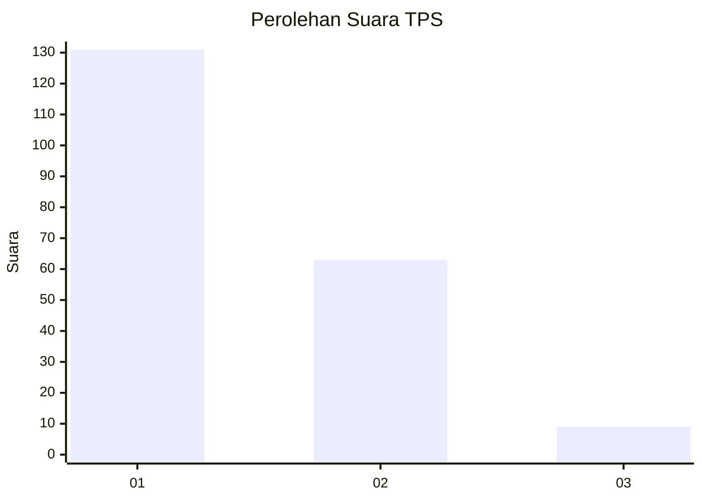
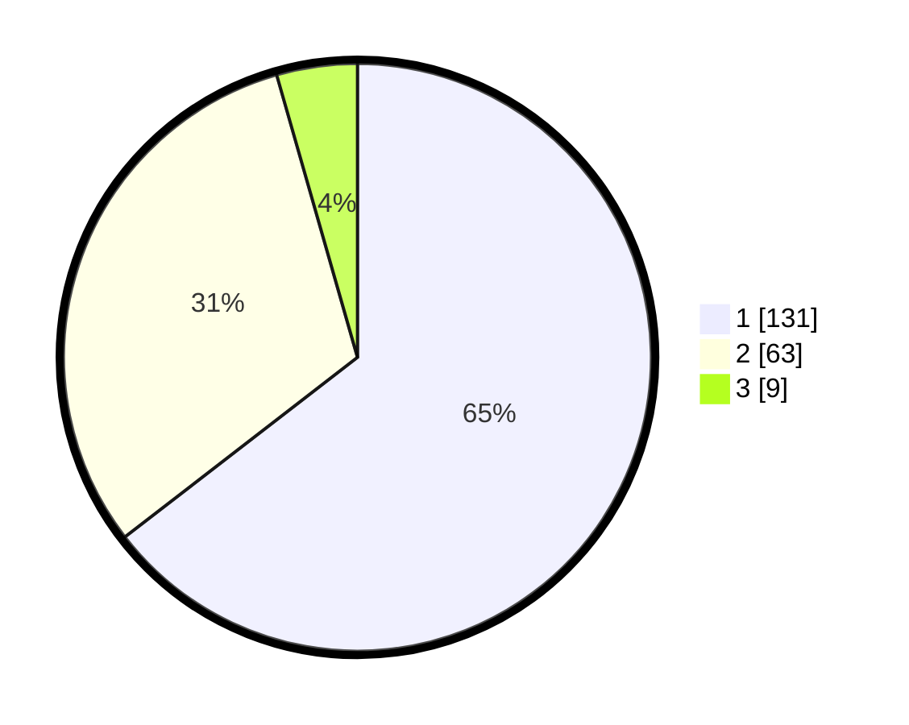

# Hasil

## Grafik

## Tabel

| No. | Nama Paslon    | Suara | Suara (raw) | Persentase |
|:--- |:-------------- | -----:| -----------:| ----------:|
| 1   | ANIES MUHAIMIN | 131   | [131][p-1]  | 64,53      |
| 2   | PRABOWO GIBRAN | 63    | [63][p-2]   | 31,03      |
| 3   | GANJAR MAHFUD  | 9     | [9][p-3]    | 4,43       |

[p-1]: https://github.com/gigit-pemilu/pemilu-2024-12-sumatera-utara/blob/main/pilpres/hitung-suara/sub/12-sumatera-utara/sub/13-mandailing-natal/sub/02-panyabungan-utara/sub/2020-tanjung-mompang/sub/002-tps/sub/paslon-1.txt
[p-2]: https://github.com/gigit-pemilu/pemilu-2024-12-sumatera-utara/blob/main/pilpres/hitung-suara/sub/12-sumatera-utara/sub/13-mandailing-natal/sub/02-panyabungan-utara/sub/2020-tanjung-mompang/sub/002-tps/sub/paslon-2.txt
[p-3]: https://github.com/gigit-pemilu/pemilu-2024-12-sumatera-utara/blob/main/pilpres/hitung-suara/sub/12-sumatera-utara/sub/13-mandailing-natal/sub/02-panyabungan-utara/sub/2020-tanjung-mompang/sub/002-tps/sub/paslon-3.txt

## Foto C Plano

https://sirekap-obj-formc.kpu.go.id/17d9/pemilu/ppwp/12/13/02/20/20/1213022020002-20240215-051007--29df7cf7-cc7b-4cf9-a40b-a358d74c0b1b.jpg

https://sirekap-obj-formc.kpu.go.id/17d9/pemilu/ppwp/12/13/02/20/20/1213022020002-20240215-051506--836b86b9-0ff1-4f2d-8e69-723e663064c6.jpg

https://sirekap-obj-formc.kpu.go.id/17d9/pemilu/ppwp/12/13/02/20/20/1213022020002-20240215-025001--3207595b-b085-4cdf-a733-f46bfb4afa71.jpg

## Metadata

| Key        | Value               |
| ---------- | ------------------- |
| Time Stamp | 2024-02-15 22:30:27 |

