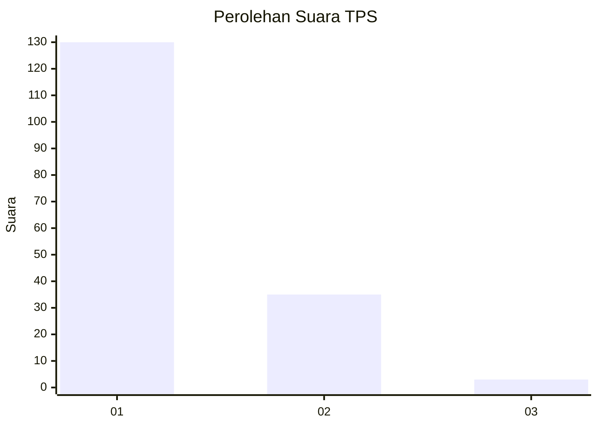
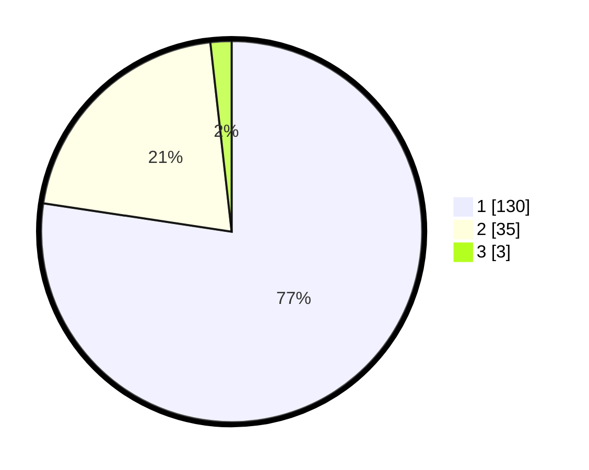

# Hasil

## Grafik

## Tabel

| No. | Nama Paslon    | Suara | Suara (raw) | Persentase |
|:--- |:-------------- | -----:| -----------:| ----------:|
| 1   | ANIES MUHAIMIN | 130   | [130][p-1]  | 77,38      |
| 2   | PRABOWO GIBRAN | 35    | [35][p-2]   | 20,83      |
| 3   | GANJAR MAHFUD  | 3     | [3][p-3]    | 1,79       |

[p-1]: https://github.com/gigit-pemilu/pemilu-2024-12-sumatera-utara/blob/main/pilpres/hitung-suara/sub/12-sumatera-utara/sub/13-mandailing-natal/sub/03-panyabungan-timur/sub/1002-gunung-baringin/sub/001-tps/sub/paslon-1.txt
[p-2]: https://github.com/gigit-pemilu/pemilu-2024-12-sumatera-utara/blob/main/pilpres/hitung-suara/sub/12-sumatera-utara/sub/13-mandailing-natal/sub/03-panyabungan-timur/sub/1002-gunung-baringin/sub/001-tps/sub/paslon-2.txt
[p-3]: https://github.com/gigit-pemilu/pemilu-2024-12-sumatera-utara/blob/main/pilpres/hitung-suara/sub/12-sumatera-utara/sub/13-mandailing-natal/sub/03-panyabungan-timur/sub/1002-gunung-baringin/sub/001-tps/sub/paslon-3.txt

## Foto C Plano

https://sirekap-obj-formc.kpu.go.id/7a9b/pemilu/ppwp/12/13/03/10/02/1213031002001-20240215-035650--af92f6ee-f890-45c0-ad5f-c2e951ba8479.jpg

https://sirekap-obj-formc.kpu.go.id/7a9b/pemilu/ppwp/12/13/03/10/02/1213031002001-20240215-040153--73b6dac0-c872-44dd-9c25-a8f051db6024.jpg

## Metadata

| Key        | Value               |
| ---------- | ------------------- |
| Time Stamp | 2024-02-15 22:40:13 |

