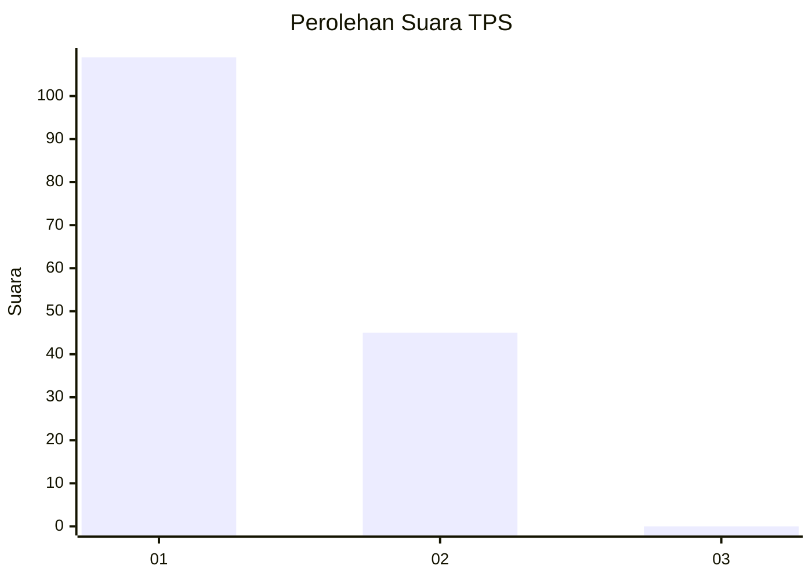
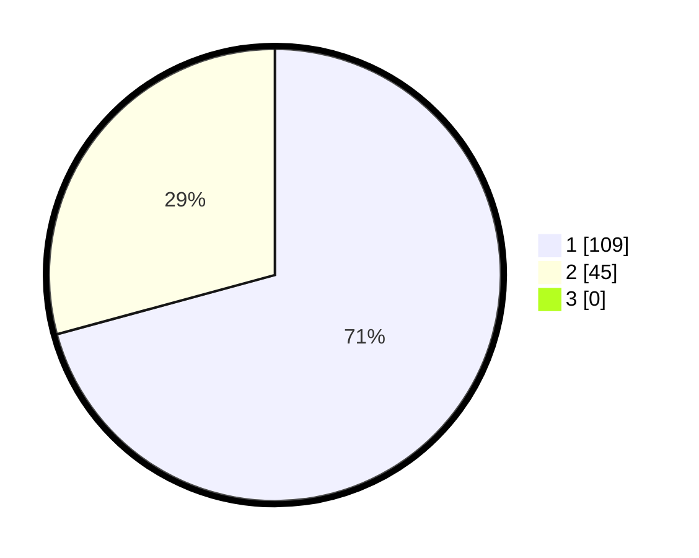

# Hasil

## Grafik

## Tabel

| No. | Nama Paslon    | Suara | Suara (raw) | Persentase |
|:--- |:-------------- | -----:| -----------:| ----------:|
| 1   | ANIES MUHAIMIN | 109   | [109][p-1]  | 70,78      |
| 2   | PRABOWO GIBRAN | 45    | [45][p-2]   | 29,22      |
| 3   | GANJAR MAHFUD  | 0     | [0][p-3]    | 0,00       |

[p-1]: https://github.com/gigit-pemilu/pemilu-2024-12-sumatera-utara/blob/main/pilpres/hitung-suara/sub/12-sumatera-utara/sub/13-mandailing-natal/sub/03-panyabungan-timur/sub/1002-gunung-baringin/sub/002-tps/sub/paslon-1.txt
[p-2]: https://github.com/gigit-pemilu/pemilu-2024-12-sumatera-utara/blob/main/pilpres/hitung-suara/sub/12-sumatera-utara/sub/13-mandailing-natal/sub/03-panyabungan-timur/sub/1002-gunung-baringin/sub/002-tps/sub/paslon-2.txt
[p-3]: https://github.com/gigit-pemilu/pemilu-2024-12-sumatera-utara/blob/main/pilpres/hitung-suara/sub/12-sumatera-utara/sub/13-mandailing-natal/sub/03-panyabungan-timur/sub/1002-gunung-baringin/sub/002-tps/sub/paslon-3.txt

## Foto C Plano

https://sirekap-obj-formc.kpu.go.id/6c09/pemilu/ppwp/12/13/03/10/02/1213031002002-20240214-155303--7581569c-b746-4fa1-94d5-f75d6b94b9e3.jpg

https://sirekap-obj-formc.kpu.go.id/6c09/pemilu/ppwp/12/13/03/10/02/1213031002002-20240214-155655--175b1fb4-60ab-487a-88fa-a634a046b033.jpg

https://sirekap-obj-formc.kpu.go.id/6c09/pemilu/ppwp/12/13/03/10/02/1213031002002-20240214-155906--aa2ab71c-9815-496f-9461-4a6602e9279b.jpg

## Metadata

| Key        | Value               |
| ---------- | ------------------- |
| Time Stamp | 2024-02-14 21:46:01 |

